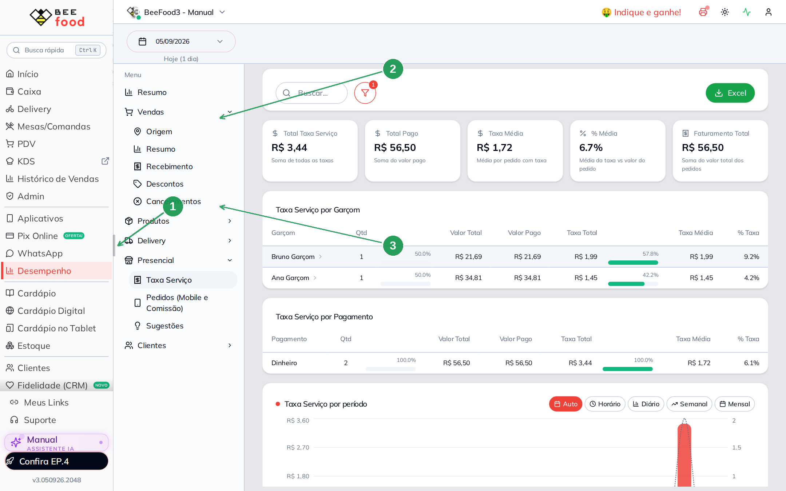
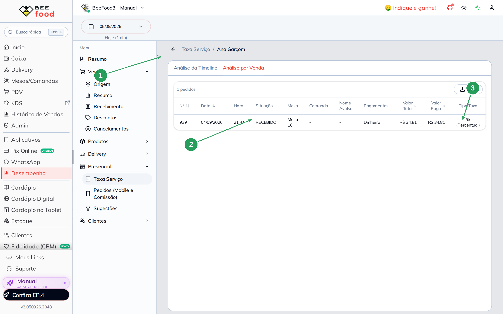
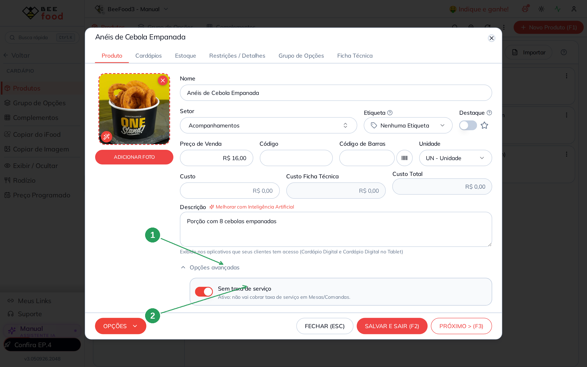
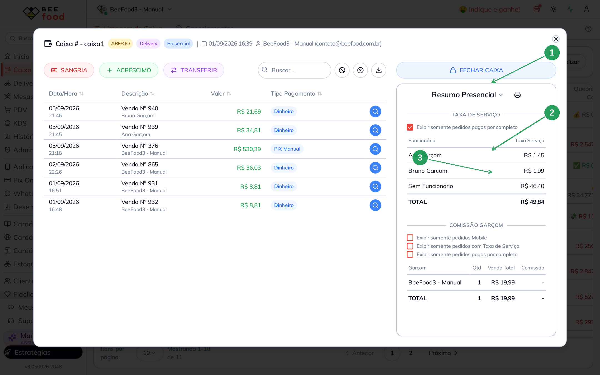

# Relatório de taxa de serviço

Este manual mostra a **gorjeta da mesa** (taxa de serviço) por garçom — e por que ela
**não** é a comissão.

A taxa padrão (ligar e colocar 10%) já foi configurada no
[Taxa e obrigatoriedades de mesa](https://ajuda.beefood.com.br/mesas-taxas-obrigatorias).
Aqui você **lê o resultado**.

A comissão (o % do funcionário em cada produto) é o
[Relatório de comissão do garçom](https://ajuda.beefood.com.br/relatorio-comissao-garcom).

> As imagens têm **setas numeradas** (1, 2, 3…). Cada número indica o campo ou botão
> correspondente na tela.

---

## Taxa ≠ comissão

| | **Taxa de serviço** (este manual) | **Comissão** |
|---|---|---|
| O que é | Gorjeta da conta (em geral 10%) | % do garçom sobre o **item** |
| Onde se configura | Parâmetro da loja + switch no pedido | Cadastro do **funcionário** |
| O relatório agrupa | **Por venda** | **Por item** |
| Produto “Sem taxa de serviço” | Sai da **base da gorjeta** | Continua gerando comissão |

No exemplo: a Ana lançou Chicken Deluxe (R$ 14,50) + Anéis de Cebola Empanada (R$ 19,20).
A comissão dela foi 10% dos **dois** itens (R$ 3,37). A taxa foi 10% **só do lanche**
(R$ 1,45), porque o anel está marcado sem taxa. Por isso a coluna **% Taxa** da Ana
aparece **4,2%** sobre o total da conta — não 10%.

---

## 1. Filtre o dia

**Desempenho → Presencial → Taxa Serviço**.

O padrão também é 30 dias. Abra o calendário, escolha **Hoje** (ou início e fim) e
**Confirmar** — o mesmo gesto do relatório de comissão.

| Nº | Item | O que fazer |
|----|------|-------------|
| 1 | O botão da data | Não deixe 30 dias se o caixa está aberto há semanas. |
| 2 | **Hoje** | Isola o movimento do dia. |
| 3 | **Confirmar** | Aplica o período. |

O filtro de situação já vem em **RECEBIDO**.

---

## 2. Ler o relatório

| Nº | Item | O que é |
|----|------|---------|
| 1 | **Presencial → Taxa Serviço** | O relatório da gorjeta. |
| 2 | Os cinco KPIs | Total Taxa Serviço, Total Pago, Taxa Média, **% Média**, Faturamento Total. |
| 3 | **Taxa Serviço por Garçom** | Clique no nome para abrir as vendas. |

Números do exemplo (duas mesas recebidas em dinheiro):

| Garçom | Vendas | Valor total | Taxa | % Taxa |
|--------|-------:|------------:|-----:|-------:|
| Bruno Garçom | 1 | R$ 21,69 | R$ 1,99 | 9,2% |
| Ana Garçom | 1 | R$ 34,81 | R$ 1,45 | 4,2% |
| **Total** | **2** | **R$ 56,50** | **R$ 3,44** | — |

O Bruno ficou perto de 10% (o 9,2% é o efeito do desconto de 1% da forma Dinheiro sobre
o valor pago). A Ana ficou em 4,2% porque **parte da conta não entra na base** — o
produto sem taxa, abaixo.

Há também **Taxa Serviço por Pagamento** (aqui: tudo em Dinheiro) e o tipo da taxa
(**% Percentual** ou **R$ Fixo**).

Clique na Ana → aba **Análise por Venda**: uma linha por conta, não por produto.

| Nº | Item | O que conferir |
|----|------|----------------|
| 1 | **Taxa Serviço / Ana Garçom** | O detalhe dela. |
| 2 | **Situação RECEBIDO** e **Mesa 16** | A conta que gerou a gorjeta. |
| 3 | **Tipo Taxa % (Percentual)** | Neste exemplo a casa usa percentual, não valor fixo. |

---

## 3. Produto sem taxa de serviço (rápido)

No cadastro do produto, **Opções avançadas → Sem taxa de serviço**. Ligado, aquele item
**não entra na base da gorjeta** em mesa/comanda. Continua vendendo e **continua
gerando comissão** se o garçom estiver identificado.

| Nº | Item | O que fazer |
|----|------|-------------|
| 1 | **Opções avançadas** | Abra o bloco no cadastro do produto. |
| 2 | **Sem taxa de serviço** | Ligue. O texto vira: *não vai cobrar taxa de serviço em Mesas/Comandas.* |

Foi assim que os Anéis saíram da gorjeta da Ana e a % Taxa dela caiu para 4,2%.

---

## 4. Atalho no caixa: Resumo Presencial

No caixa aberto, **Resumo → Resumo Presencial**. A seção **Taxa de Serviço** só aparece
para quem tem **Função Gerente**. Quem não é gerente vê a comissão, não a gorjeta
agrupada.

A lista é do **caixa inteiro** (se ele abriu há dias, entra venda antiga — no exemplo
há um **Sem Funcionário R$ 46,40** de movimento anterior). Os dois lançamentos da Ana
e do Bruno aparecem nas linhas com o nome deles.

O checkbox **Exibir somente pedidos pagos por completo** esconde conta ainda aberta.

| Nº | Item | O que é |
|----|------|---------|
| 1 | **Resumo Presencial** | O seletor do painel. |
| 2 | **Taxa de Serviço** | Só gerente. Ana **R$ 1,45**, Bruno **R$ 1,99**. |
| 3 | **Comissão Garçom** | O atalho do outro relatório. No exemplo **não** listou Ana/Bruno — só uma venda antiga, sem %. |

A conferência fina da comissão continua em
Desempenho → Pedidos (Mobile e Comissão).

---

## Perguntas rápidas

**A comissão cai quando ligo Sem taxa de serviço?** Não. Só a gorjeta ignora o item.

**Por que a % não deu 10% redondo?** Produto sem taxa na mesma conta, desconto da forma
de pagamento, ou taxa em R$ fixo em vez de %.

**Quem não é gerente não vê a taxa no caixa?** Correto. A seção Taxa de Serviço do
Resumo Presencial exige Função Gerente. O relatório de Desempenho segue a permissão
da tela.
