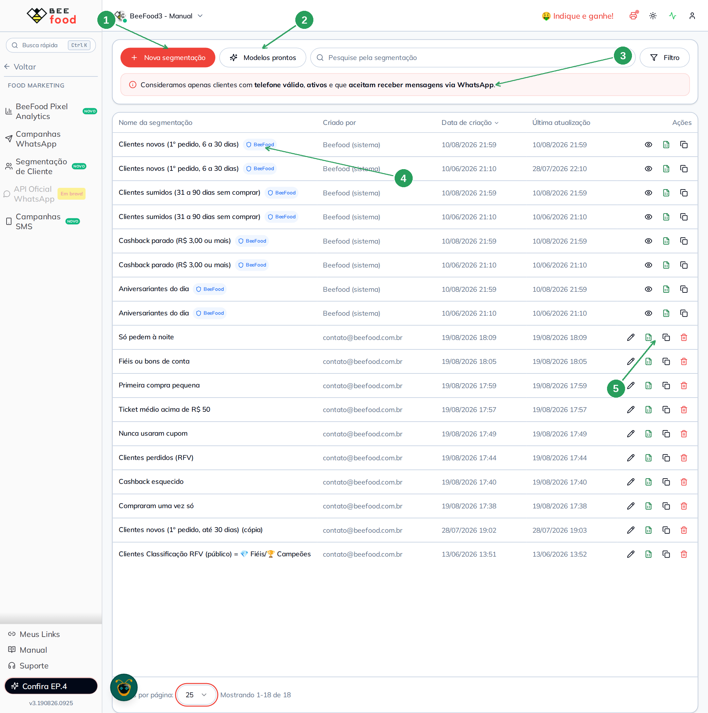
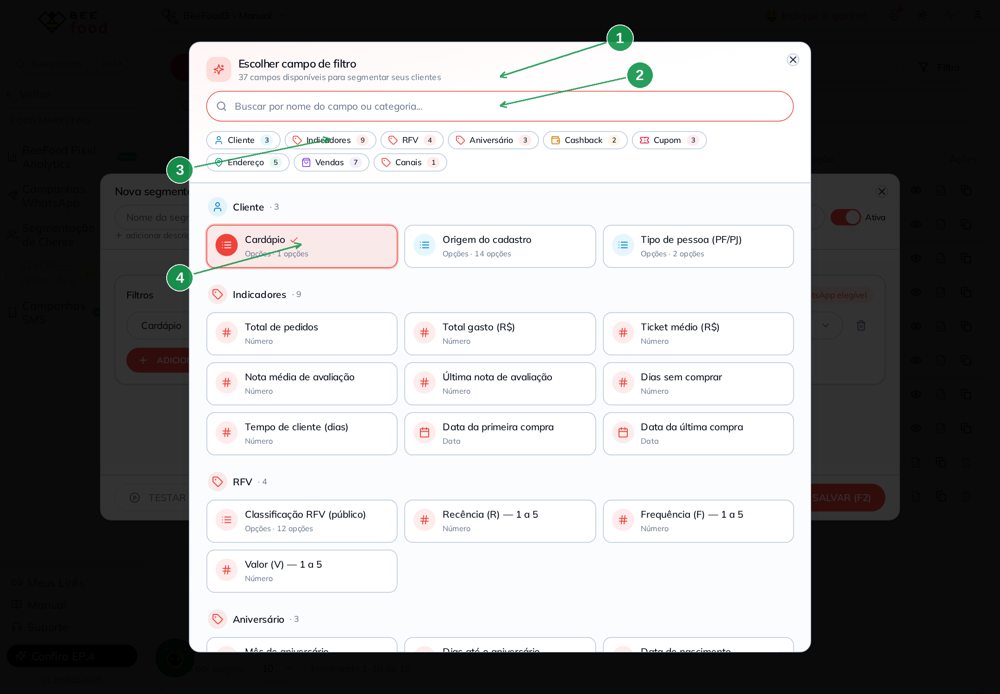
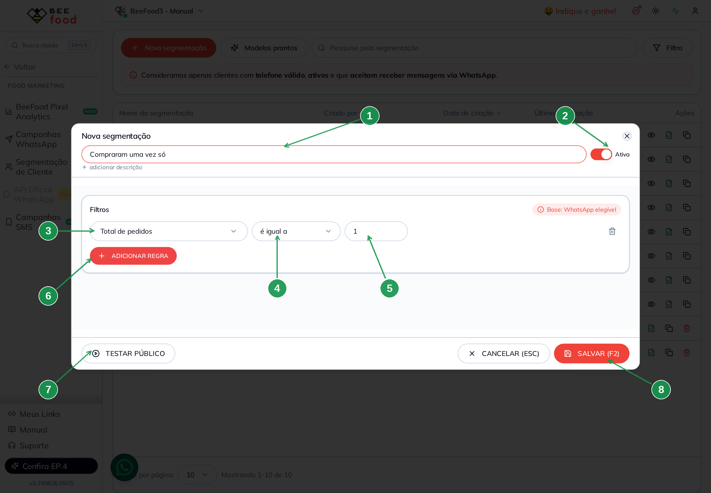
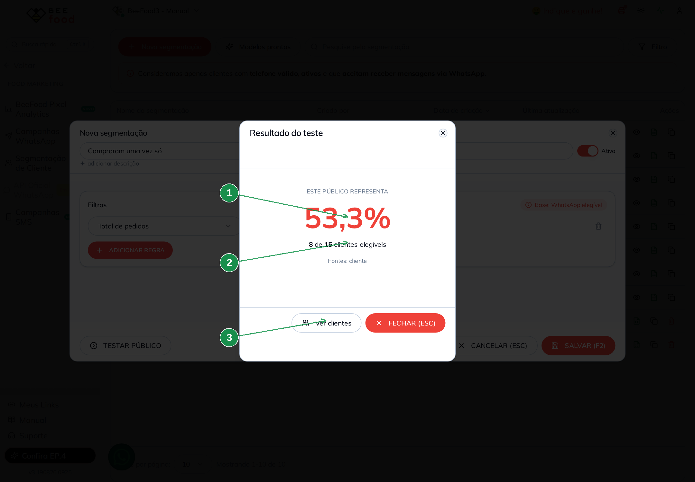
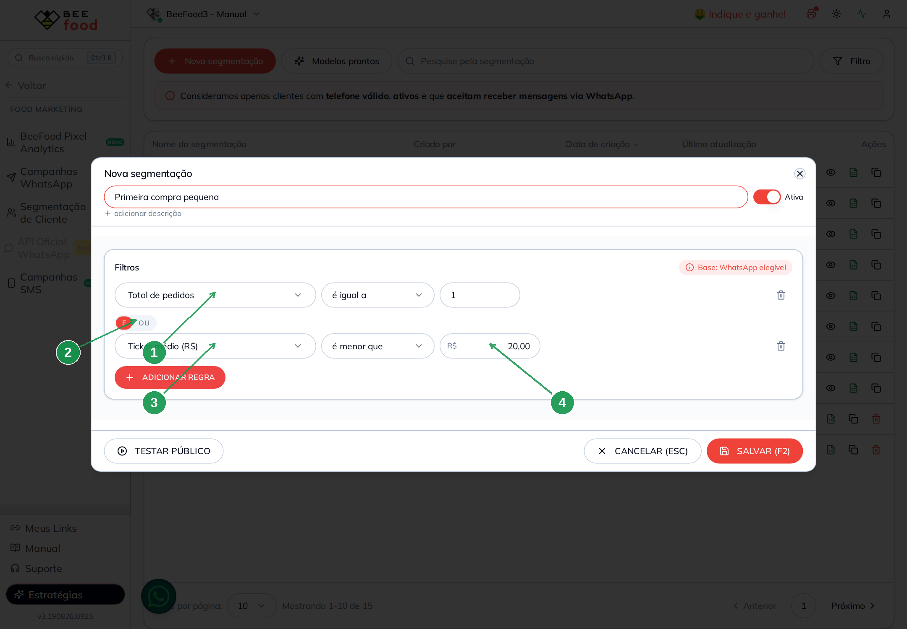
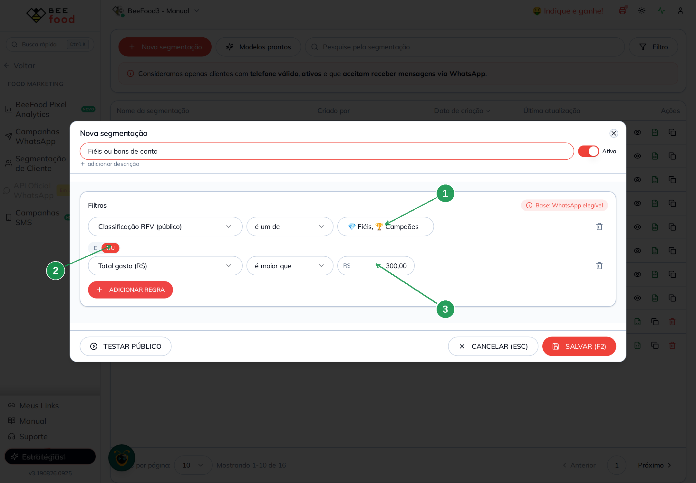
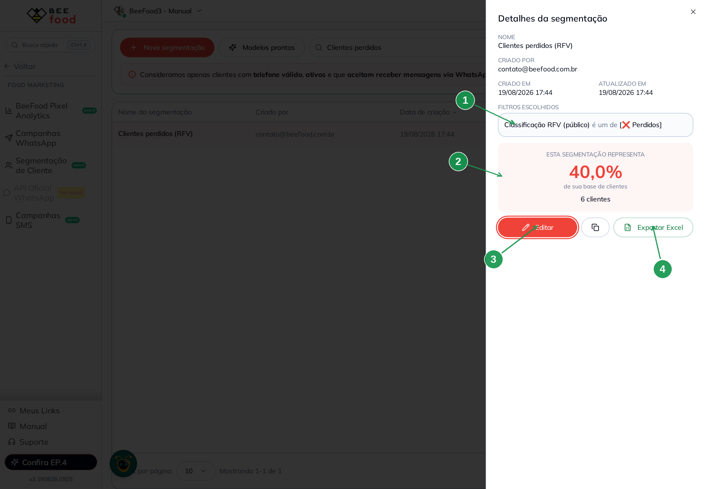
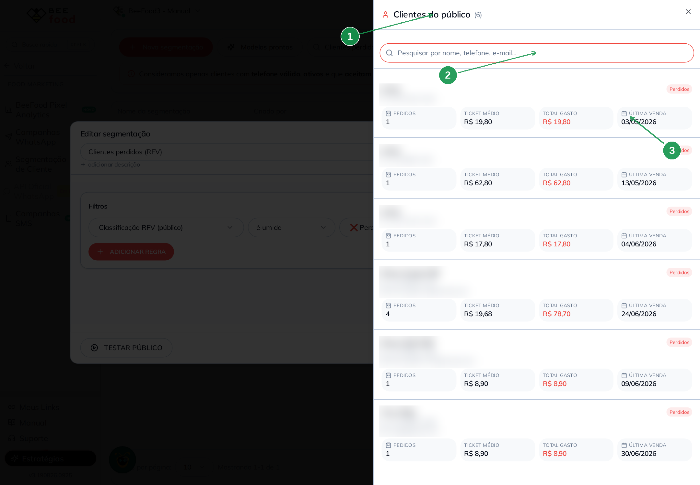
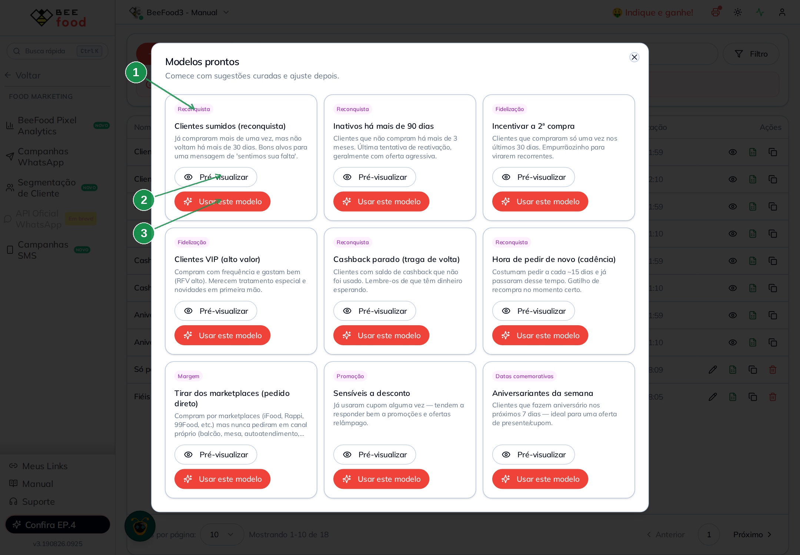

# Manual — Segmentação de Clientes

Este manual ensina a **separar sua base de clientes em grupos** e a usar esses grupos para
enviar a mensagem certa para a pessoa certa.

Você vai aprender a:

1. Entender **o que é uma segmentação** e por que ela não é uma lista comum
2. Criar a **primeira segmentação** do zero
3. **Combinar filtros** com E / OU
4. **Testar** o tamanho do público antes de usar
5. Aproveitar os **modelos prontos** e os públicos da BeeFood
6. Montar **oito segmentações prontas** para o dia a dia do restaurante

> As imagens têm **setas com números** (1, 2, 3...). No texto, cada número indica exatamente o
> campo ou botão correspondente na tela.

---

## Por que segmentar

Mandar a mesma mensagem para todo mundo é o caminho mais rápido para o cliente bloquear seu
WhatsApp. Quem pediu ontem não precisa de um "sentimos sua falta". Quem some há três meses não
se convence com "confira nosso cardápio".

Segmentar é separar a base em grupos que fazem sentido: quem sumiu, quem sempre volta, quem tem
cashback esquecido, quem só pede à noite. Para cada grupo, uma conversa diferente — e uma taxa
de resposta muito melhor.

---

## O conceito mais importante: é uma receita, não uma lista

Quando você cria uma segmentação, o BeeFood **não guarda os nomes dos clientes**. Ele guarda as
**regras**. Toda vez que você usa aquela segmentação, o sistema refaz a conta e busca quem se
encaixa **naquele momento**.

Isso muda a forma de pensar:

- Uma segmentação de "clientes sumidos" se atualiza sozinha. Quem voltar a comprar sai do grupo;
  quem sumir entra.
- O número de clientes **muda com o tempo**, e isso é o esperado.
- Você cria a segmentação **uma vez** e usa por meses.

### Quem entra na conta: a base elegível

Antes de qualquer filtro seu, o BeeFood já separa quem pode receber mensagem. Só entram os
clientes que atendem às três condições ao mesmo tempo:

1. têm **telefone válido** cadastrado,
2. estão **ativos**,
3. **aceitam receber mensagens** pelo WhatsApp.

É por isso que a tela mostra, por exemplo, "6 de 15 clientes elegíveis": o 15 não é o total de
clientes do restaurante, é o total de clientes **que podem receber mensagem**. Quem não aceita
receber mensagem nunca entra numa segmentação, mesmo que se encaixe nas regras.

---

## A tela

Você chega por **Food Marketing → Segmentação de Cliente**.

| Nº | Item | O que é |
|----|------|---------|
| 1 | **Nova segmentação** | Cria uma do zero. |
| 2 | **Modelos prontos** | Abre sugestões já montadas pela BeeFood. |
| 3 | O aviso da base | Lembra as três condições da base elegível. |
| 4 | Selo **BeeFood** | Marca os públicos prontos do sistema. Eles não podem ser editados nem excluídos — só copiados. |
| 5 | Ações da linha | Editar, exportar para Excel, duplicar e excluir. Nos públicos com selo BeeFood, o lápis vira uma lupa: dá para ver, não para mudar. |

---

## Criando a primeira segmentação

Vamos montar a mais simples e uma das mais úteis: **quem comprou uma vez só**.

### 1. Escolha o filtro

Clique em **Nova segmentação**. A tela de escolha do filtro abre sozinha.

| Nº | Item | O que fazer |
|----|------|-------------|
| 1 | O contador | Mostra quantos filtros existem — hoje são **37**. |
| 2 | **Buscar por nome do campo ou categoria** | O caminho mais rápido. Digite "pedidos", "cashback", "bairro". |
| 3 | As categorias | Os filtros vêm agrupados: Cliente, Indicadores, RFV, Aniversário, Cashback, Cupom, Endereço, Vendas e Canais. O número ao lado é quantos filtros a categoria tem. |
| 4 | O cartão do filtro | Clique para escolher. Abaixo do nome, o tipo de informação: Número, Data, Opções ou Texto. |

Para este exemplo, escolha **Total de pedidos**, na categoria Indicadores.

### 2. Monte a regra

| Nº | Campo | O que fazer |
|----|-------|-------------|
| 1 | **Nome da segmentação \*** | Dê um nome que você entenda daqui a três meses. Se deixar em branco, o sistema inventa um a partir das regras. |
| 2 | **Ativa** | Deixe ligado. Segmentação desligada não aparece na hora de montar campanha. |
| 3 | O filtro | O que você escolheu no passo anterior. Clique para trocar. |
| 4 | O operador | Como comparar: **é igual a**, **é maior que**, **está entre**, e assim por diante. |
| 5 | O valor | Contra o que comparar. Aqui, `1`. |
| 6 | **ADICIONAR REGRA** | Acrescenta outra condição (veremos adiante). |
| 7 | **TESTAR PÚBLICO** | Mostra quantos clientes caem na regra, antes de salvar. |
| 8 | **SALVAR (F2)** | Grava a segmentação. |

> **Cuidado com os campos em reais.** Os campos de dinheiro — Total gasto, Ticket médio, Saldo
> de cashback — preenchem **da direita para a esquerda**, começando pelos centavos. Digitar
> `50` resulta em **R$ 0,50**. Para R$ 50,00, digite `5000` ou `50,00`. Confira sempre o valor
> depois de digitar.

### 3. Teste antes de salvar

Clique em **TESTAR PÚBLICO**.

| Nº | Item | O que é |
|----|------|---------|
| 1 | O percentual | Quanto da base elegível caiu na regra. |
| 2 | A contagem | Quantos clientes de quantos elegíveis. |
| 3 | **Ver clientes** | Abre a lista de quem se encaixou (veja adiante). |

O teste serve para não descobrir tarde demais que a regra estava errada. Público de zero pessoa
quase sempre é regra apertada demais; público com a base inteira quase sempre é regra frouxa.

Depois de conferir, feche o teste e clique em **SALVAR (F2)**.

---

## Combinando filtros: E ou OU

Uma regra só raramente basta. Clicando em **ADICIONAR REGRA**, aparece um seletor entre as
condições.

### E — precisa cumprir todas

| Nº | Item | O que é |
|----|------|---------|
| 1 | Primeira condição | Total de pedidos é igual a 1. |
| 2 | O seletor **E / OU** | Com **E** marcado, o cliente precisa cumprir as duas. |
| 3 | Segunda condição | Ticket médio é menor que R$ 20,00. |
| 4 | O valor em reais | Repare no formato: **20,00**, não "20". |

Esta segmentação encontra quem comprou **uma vez só e gastou pouco** — provavelmente experimentou
e não se animou a voltar.

### OU — basta cumprir uma

| Nº | Item | O que é |
|----|------|---------|
| 1 | Filtro de opções | Alguns filtros deixam escolher vários valores de uma vez. Aqui, duas classificações. |
| 2 | **OU** marcado | Basta cumprir uma das duas condições para entrar. |
| 3 | Valor em reais | Total gasto acima de R$ 300,00. |

Esta pega seus melhores clientes por dois caminhos: os bem classificados **ou** os que já
gastaram muito.

> **O E / OU vale para a lista inteira.** Ele não é escolhido por linha: ao mudar para OU, todas
> as condições passam a valer com OU. Não é possível montar "isto E aquilo, OU aquele outro" numa
> mesma segmentação — nesse caso, crie duas segmentações separadas.

---

## Depois de salvar

Clique no nome da segmentação na lista para abrir o painel de detalhes.

| Nº | Item | O que é |
|----|------|---------|
| 1 | **FILTROS ESCOLHIDOS** | As regras escritas em português, para conferência rápida. |
| 2 | O tamanho | O percentual e o número de clientes, recalculados na hora. |
| 3 | **Editar** | Volta para a tela de regras. |
| 4 | **Exportar Excel** | Baixa a lista com nome, telefone, e-mail, classificação, quantidade de pedidos, ticket médio, total gasto e última venda. |

### Ver quem está no público

Pelo botão **Ver clientes**, no resultado do teste:

| Nº | Item | O que é |
|----|------|---------|
| 1 | O total | Quantos clientes entraram. |
| 2 | A busca | Procure por nome, telefone ou e-mail dentro do público. |
| 3 | Os números de cada cliente | Pedidos, ticket médio, total gasto e data da última venda. |

> Os dados pessoais estão borrados nesta imagem do manual. Na sua tela eles aparecem normalmente.

---

## Modelos prontos: comece sem montar nada

Se você não sabe por onde começar, clique em **Modelos prontos**.

| Nº | Item | O que fazer |
|----|------|-------------|
| 1 | A categoria | Reconquista, Fidelização, Margem, Promoção ou Datas comemorativas. |
| 2 | **Pré-visualizar** | Mostra quantos clientes o modelo pegaria, sem criar nada. |
| 3 | **Usar este modelo** | Cria uma segmentação sua, já com as regras montadas. A partir daí é só sua: pode editar à vontade. |

São nove modelos. Estas são as regras exatas de cada um:

| Modelo | O que ele filtra |
|--------|------------------|
| **Clientes sumidos (reconquista)** | 2 pedidos ou mais **e** 30 dias ou mais sem comprar |
| **Inativos há mais de 90 dias** | 90 dias ou mais sem comprar |
| **Incentivar a 2ª compra** | exatamente 1 pedido **e** no máximo 30 dias sem comprar |
| **Clientes VIP (alto valor)** | frequência 4 ou 5 **e** valor monetário 4 ou 5 |
| **Cashback parado (traga de volta)** | tem qualquer saldo de cashback |
| **Hora de pedir de novo (cadência)** | costuma pedir a cada 15 dias ou menos **e** já passou de 18 dias |
| **Tirar dos marketplaces** | comprou em marketplace **e** nunca em canal próprio |
| **Sensíveis a desconto** | já usou cupom alguma vez |
| **Aniversariantes da semana** | faz aniversário nos próximos 7 dias |

### Os públicos com selo BeeFood

Além dos modelos, existem quatro públicos fixos, sempre presentes na lista, que alimentam as
campanhas automáticas:

| Público | O que filtra |
|---------|--------------|
| **Clientes novos (1º pedido, 6 a 30 dias)** | primeira compra, entre 6 e 30 dias atrás |
| **Clientes sumidos (31 a 90 dias sem comprar)** | 2 pedidos ou mais, parados entre 31 e 90 dias |
| **Cashback parado (R$ 3,00 ou mais)** | saldo de R$ 3,00 para cima |
| **Aniversariantes do dia** | faz aniversário hoje |

Eles não podem ser editados nem apagados. Se quiser uma versão sua com outros números, use o
botão **duplicar** — a cópia é totalmente editável.

> Repare que as faixas não se sobrepõem: "novos" vai até 30 dias e "sumidos" começa em 31. É
> proposital, para o mesmo cliente não receber duas mensagens automáticas no mesmo dia.

---

## Oito segmentações para copiar

Cada exemplo abaixo traz o problema que resolve, a receita exata e quantos clientes pegou na
base de teste (15 clientes elegíveis). No seu restaurante os números serão outros.

### 1. Compraram uma vez só

**O problema:** metade da sua base costuma ser gente que experimentou e nunca voltou. É o maior
desperdício de um restaurante.

| Filtro | Operador | Valor |
|--------|----------|-------|
| Total de pedidos | é igual a | 1 |

**Resultado no teste:** 8 clientes (53,3%).

**O que fazer:** um cupom de segunda compra com prazo curto. A ideia não é dar desconto para
sempre, é criar o hábito de voltar.

### 2. Primeira compra pequena

**O problema:** dentro do grupo acima, tem quem pediu só uma bebida ou uma sobremesa. Essa
pessoa não conheceu a sua comida de verdade.

| Filtro | Operador | Valor | |
|--------|----------|-------|---|
| Total de pedidos | é igual a | 1 | **E** |
| Ticket médio (R$) | é menor que | 20,00 | |

**Resultado no teste:** 4 clientes (26,7%).

**O que fazer:** ofereça o carro-chefe da casa com uma condição especial. O objetivo é a pessoa
provar o que você faz de melhor.

### 3. Clientes perdidos

**O problema:** o BeeFood classifica cada cliente sozinho, cruzando há quanto tempo comprou, com
que frequência e quanto gastou. Quem cai em **Perdidos** está no fim da linha.

| Filtro | Operador | Valor |
|--------|----------|-------|
| Classificação RFV (público) | é um de | ❌ Perdidos |

**Resultado no teste:** 6 clientes (40%).

**O que fazer:** é a hora da oferta mais agressiva do seu calendário. Se não funcionar aqui, não
funciona em lugar nenhum — e pelo menos você limpa a base.

> **Sobre as classificações:** são doze, de 🏆 Campeões a ❌ Perdidos, e o sistema calcula
> sozinho. Vale explorar as outras: 🔥 Em Risco e ❄️ Hibernando pegam quem está saindo, e
> 🚨 Não Posso Perder marca cliente bom que está esfriando.

### 4. Cashback esquecido

**O problema:** cliente com saldo parado é dinheiro que ele já conquistou e esqueceu. Lembrar é
quase sempre bem recebido — não parece propaganda, parece favor.

| Filtro | Operador | Valor |
|--------|----------|-------|
| Possui saldo de cashback | sim | |

**Resultado no teste:** 6 clientes (40%).

**O que fazer:** "você tem R$ X esperando". Se quiser evitar avisar por causa de centavos, troque
o filtro por **Saldo de cashback (R$) é maior que 5,00**.

### 5. Ticket médio acima de R$ 50

**O problema:** você provavelmente trata todo mundo igual, inclusive quem gasta o dobro da média.

| Filtro | Operador | Valor |
|--------|----------|-------|
| Ticket médio (R$) | é maior que | 50,00 |

**Resultado no teste:** 4 clientes (26,7%).

**O que fazer:** novidades em primeira mão, reserva garantida no fim de semana, um brinde de vez
em quando. Não precisa ser desconto — quem gasta bem costuma valorizar mais o tratamento.

### 6. Nunca usaram cupom

**O problema:** existe quem pede sempre e nunca pechinchou. Dar desconto para essa pessoa é
jogar margem fora.

| Filtro | Operador | Valor |
|--------|----------|-------|
| Já usou cupom de desconto | não | |

**Resultado no teste:** 13 clientes (86,7%).

**O que fazer:** use ao contrário — **exclua** este grupo das promoções e concentre o desconto em
quem realmente responde a ele. Para achar os sensíveis a desconto, troque o operador para **sim**.

### 7. Só pedem à noite

**O problema:** o almoço está vazio e você tem uma base inteira que só conhece o seu jantar.

| Filtro | Operador | Valor | |
|--------|----------|-------|---|
| Períodos do dia que comprou | é um de | Noite | **E** |
| Períodos do dia que comprou | não é nenhum de | Manhã, Tarde | |

**Resultado no teste:** 3 clientes (20%).

**O que fazer:** apresente o cardápio executivo do almoço. Essa pessoa já gosta da sua comida —
só não sabe que você abre mais cedo.

> Repare no truque: o mesmo filtro aparece duas vezes, uma incluindo e outra excluindo. É assim
> que se monta "só isso e mais nada". Sem a segunda linha, entraria também quem pede em todos os
> horários.

### 8. Fiéis ou bons de conta

**O problema:** seus melhores clientes se destacam por caminhos diferentes — uns pela constância,
outros pelo valor. Uma regra só deixa metade de fora.

| Filtro | Operador | Valor | |
|--------|----------|-------|---|
| Classificação RFV (público) | é um de | 💎 Fiéis, 🏆 Campeões | **OU** |
| Total gasto (R$) | é maior que | 300,00 | |

**Resultado no teste:** 3 clientes (20%).

**O que fazer:** é o público do seu programa de vantagens, do convite para a degustação, do
lançamento do prato novo.

---

## Outros filtros que valem conhecer

Os 37 filtros estão em nove categorias. Estes costumam render boas ideias:

| Categoria | Filtro | Serve para |
|-----------|--------|------------|
| Indicadores | **Dias sem comprar** | Montar faixas de reativação (30, 60, 90 dias). |
| Indicadores | **Tempo de cliente (dias)** | Falar com quem acompanha você desde o começo. |
| Vendas | **Produtos comprados** | Avisar quem já pediu determinado prato quando ele volta ao cardápio. |
| Vendas | **Categoria favorita** | Separar quem prefere pizza de quem prefere hambúrguer. |
| Vendas | **Dias da semana que comprou** | Encher a terça com quem só aparece no sábado. |
| Vendas | **Cadência média entre pedidos** | Descobrir de quanto em quanto tempo cada um costuma pedir. |
| Canais | **Canais onde comprou** | Chamar para o pedido direto quem só compra por marketplace. |
| Endereço | **Bairro** / **Distância (km)** | Ação local, panfletagem ou frete promocional por região. |
| Aniversário | **Dias até o aniversário** | Chegar antes da data, não no dia. |
| Cliente | **Cardápio** | Separar por loja, quando você tem mais de uma. |

> **Como os filtros de lista funcionam.** Filtros como Canais, Produtos e Bairro guardam
> **tudo** o que o cliente já fez. Se ele comprou pelo iFood e também no balcão, ele entra tanto
> em "comprou pelo iFood" quanto em "comprou no balcão". Para dizer "só por um canal e mais
> nenhum", use duas linhas, como no exemplo 7.

---

## E depois? Onde o público é usado

Uma segmentação salva e **Ativa** fica disponível para:

- **Campanhas de WhatsApp** — escolha a segmentação ao montar a lista de destinatários. Quando
  usar mais de uma, clientes repetidos são removidos pelo telefone.
- **Campanhas de SMS** — mesma ideia.
- **Campanhas Inteligentes (automações)** — as automáticas usam os públicos com selo BeeFood.
- **Exportação para Excel** — pelo botão da lista ou do painel de detalhes.

Segmentação com o botão **Ativa** desligado continua salva, mas não aparece na hora de montar
campanha. É uma forma de guardar sem apagar.

---

## Dicas finais

- **Teste sempre antes de salvar.** Leva cinco segundos e evita mandar campanha para ninguém.
- **Um nome que se explique.** "Sumidos 60 dias" é melhor que "Segmentação 3".
- **Comece por um modelo pronto.** Use, teste, e só depois ajuste os números.
- **Público de zero pessoa não é erro do sistema.** Quase sempre é uma regra a mais do que
  precisava, ou um valor em reais digitado errado.
- **Não tente ser exato demais.** Segmentação boa é a que separa grupos com conversas diferentes,
  não a que acerta o cliente perfeito.
- **Revise de vez em quando.** As regras continuam valendo, mas o seu restaurante muda.

---

### Referências internas (não publicar)

Estudo, evidências e mapeamento técnico: `MEMORIA.md` e `fluxo-codigo.md` desta pasta.
