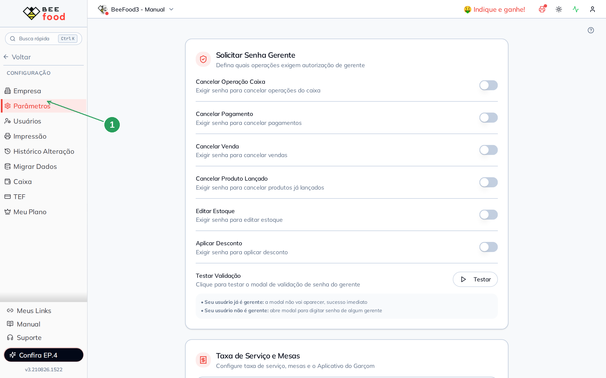
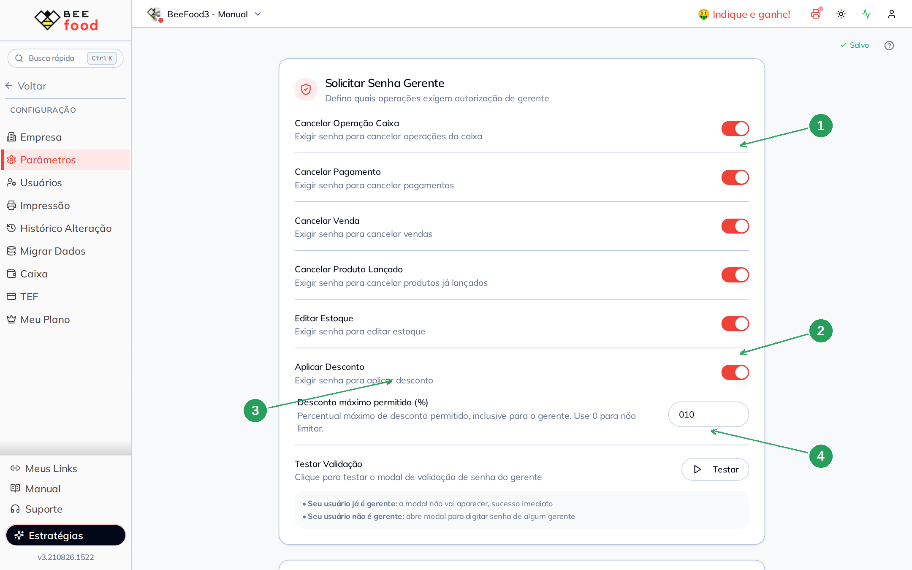
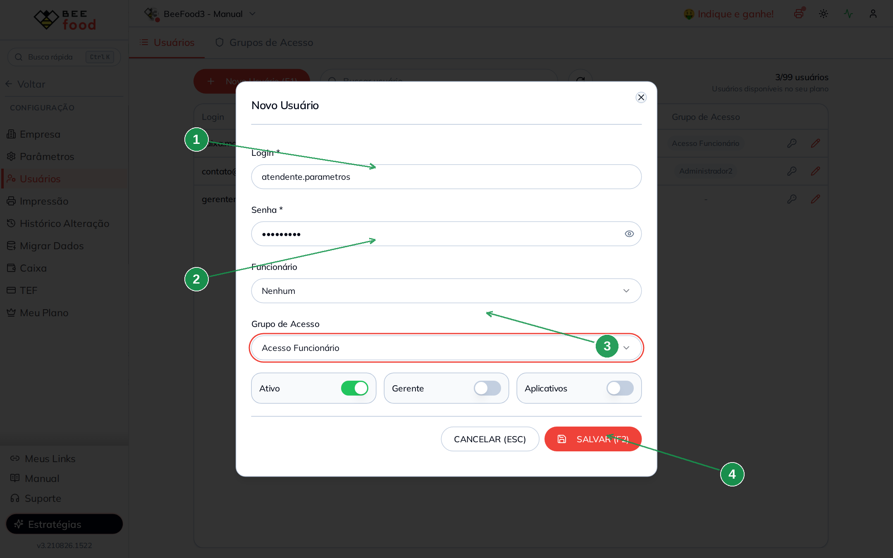
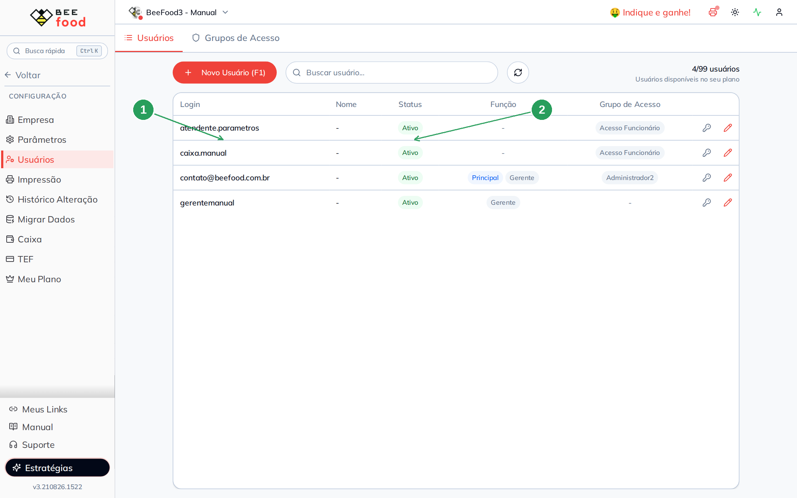
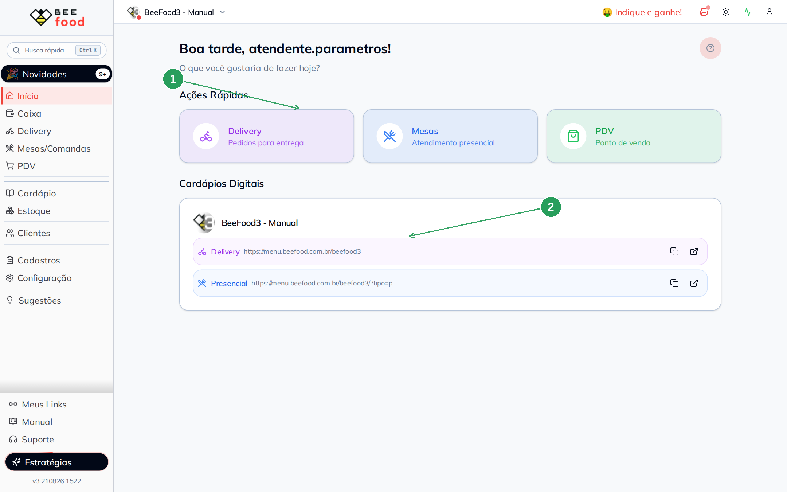
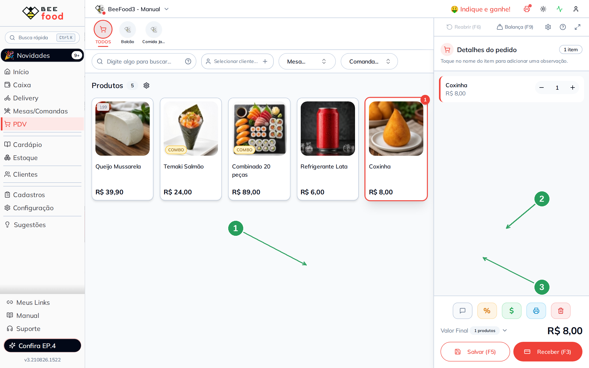
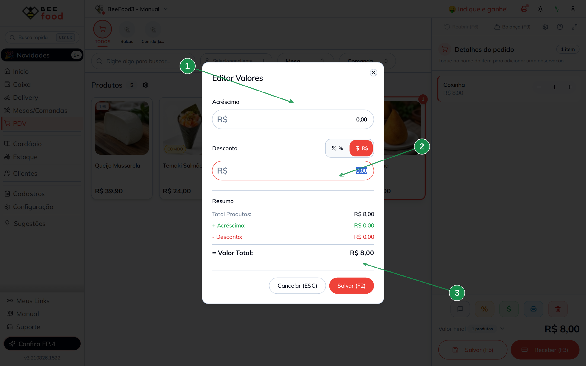
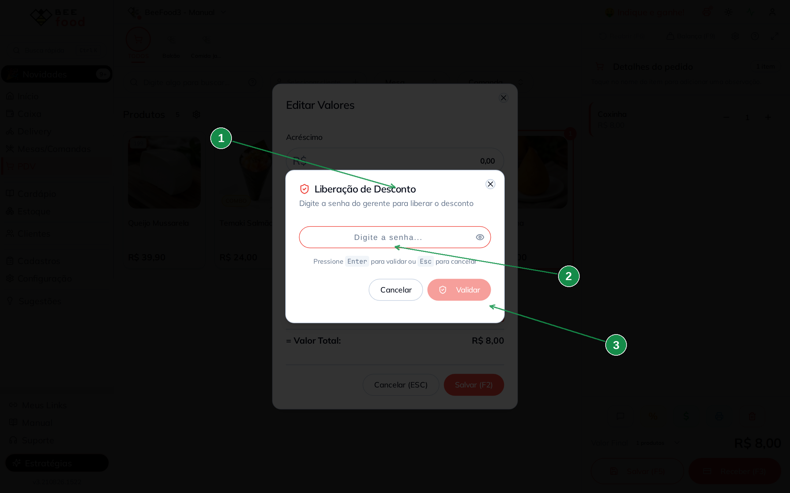
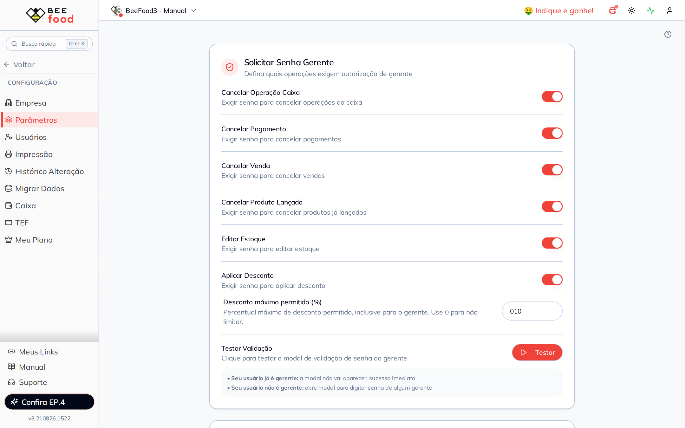

# Manual — Senha do gerente

Este manual mostra **quais operações pedem a senha do gerente**, como ligar cada uma e
**como testar de verdade** com um usuário que não é gerente.

> As imagens têm **setas numeradas** (1, 2, 3…). Cada número indica o campo ou botão
> correspondente na tela.

---

## O que esta senha faz

O BeeFood deixa você exigir a senha de um **gerente** antes de operações sensíveis: cancelar
caixa, pagamento, venda ou produto, editar estoque e aplicar desconto.

Quem já é gerente **não vê o modal** — o sistema autoriza na hora. Por isso o teste só vale
com um usuário **sem** a função Gerente.

A alteração **grava sozinha** (~500 ms). Não existe botão Salvar nesta tela.

---

## Onde fica

No menu lateral: **Configuração → Parâmetros**. O primeiro card é **Solicitar Senha Gerente**.

| Nº | Item | O que fazer |
|----|------|-------------|
| 1 | **Parâmetros** | Em Configuração, no menu lateral. |

---

## Ligar as operações e o teto de desconto

Ligue só o que a sua operação precisa. Neste exemplo ligamos as **seis** e definimos um
**desconto máximo de 10%** — o teto vale **inclusive para o gerente**.

| Nº | Item | O que fazer |
|----|------|-------------|
| 1 | Os switches | Cada um exige senha naquela operação. |
| 2 | **Aplicar Desconto** | Sem este, o teto e o modal de senha no desconto não entram. |
| 3 | **Desconto máximo permitido (%)** | `10` = teto de 10%. `0` = sem limite. |
| 4 | **Testar** | No usuário gerente o modal **não abre** (sucesso imediato). |

| Switch | Quando pede senha |
|--------|-------------------|
| Cancelar Operação Caixa | Cancelar sangria, acréscimo ou outra operação do caixa |
| Cancelar Pagamento | Estornar um pagamento já lançado |
| Cancelar Venda | Cancelar a venda inteira |
| Cancelar Produto Lançado | Tirar um item **já gravado** do pedido |
| Editar Estoque | Alterar quantidade no estoque |
| Aplicar Desconto | Qualquer desconto (depois do teto) |

---

## Criar um usuário que não é gerente

O login do dono (`contato@…`) é gerente — com ele o modal nunca aparece. Crie um usuário
novo em **Configuração → Usuários → + Novo Usuário (F1)**.

| Nº | Item | Valor deste exemplo |
|----|------|---------------------|
| 1 | **Login** | um login novo da loja (aqui: `atendente.parametros`) |
| 2 | **Grupo de Acesso** | **Acesso Funcionário** (com PDV liberado) |
| 3 | **Gerente** | **desligado** — é o que faz o modal abrir |
| 4 | **SALVAR (F2)** | Grava o usuário |

Na lista ele aparece **Ativo**, sem o selo Gerente:

| Nº | Item | O que conferir |
|----|------|----------------|
| 1 | O login novo | Sem badge **Gerente**. |
| 2 | **Grupo** | Acesso Funcionário. |

---

## Entrar como o atendente

Saia e entre com o login novo. A home cumprimenta pelo nome — é a prova de que não é o
gerente.

| Nº | Item | O que conferir |
|----|------|----------------|
| 1 | A saudação | O nome do login novo. |
| 2 | Atalho **PDV** | É por aqui que vamos testar o desconto. |

---

## Prova no PDV — o desconto pede a senha

1. Abra o **PDV** (caixa precisa estar aberto).
2. Lance um produto (aqui: **Coxinha** R$ 8,00).
3. Toque no ícone **%** do rodapé do pedido — abre **Editar Valores**.

| Nº | Item | O que fazer |
|----|------|-------------|
| 1 | O produto | Qualquer item serve. |
| 2 | O total | Confira o valor antes do desconto. |
| 3 | O ícone **%** | Abre acréscimo e desconto. |

No modal, escolha **%** ou **R$** e informe o desconto. **Salvar (F2)**.

| Nº | Item | O que fazer |
|----|------|-------------|
| 1 | **Editar Valores** | Acréscimo em R$ e desconto em % ou R$. |
| 2 | O campo **Desconto** | Digite o percentual ou o valor. |
| 3 | **Salvar (F2)** | Dispara o teto e, se passar, a senha. |

Se o desconto **passa do teto** (no exemplo, acima de 10%), o sistema **recusa** — inclusive
para o gerente. Não abre senha: o teto é regra da loja, não permissão de pessoa.

Se o desconto **está dentro do teto** e **Aplicar Desconto** está ligado, abre
**Liberação de Desconto**:

| Nº | Item | O que fazer |
|----|------|-------------|
| 1 | O título | *Liberação de Desconto*. |
| 2 | O campo da senha | Senha de **algum gerente** da loja — não a do atendente. |
| 3 | **Validar** | Enter confirma. Esc cancela o desconto. |

Com a senha correta o desconto entra no pedido. Sem ela, o valor não muda.

---

## Testar no próprio Parâmetros

No card existe o botão **Testar**. Logado como **gerente**, o modal **não abre**: o sistema
autoriza na hora (a própria tela avisa isso). Logado como o atendente, o mesmo botão abre o
modal de senha — o mesmo da prova do PDV.

---

## Resumo do caminho

1. **Configuração → Parâmetros** → ligue os switches que a loja precisa.
2. Se for usar desconto, preencha o **teto %** (0 = sem limite).
3. Crie um usuário **sem** Gerente para testar.
4. No PDV, lance um item → **%** → desconto dentro do teto → senha do gerente.
5. Desconto acima do teto é recusado para todo mundo.

---

## Perguntas frequentes

**O modal não abre no meu usuário.** Você é gerente. Teste com outro login, sem a função
Gerente.

**Pede motivo antes da senha.** O parâmetro **Motivo de cancelamento** (card Geral) também
entra no fluxo de desconto. É o manual **Parâmetros gerais**.

**Mudei o switch e o PDV não mudou.** A tela grava sozinha. Peça para o atendente **sair e
entrar de novo** — o aplicativo guarda uma cópia da configuração no navegador.

**Qual senha eu digito?** A de um usuário marcado como Gerente. Não documente a senha no
treinamento da equipe — cada loja usa a sua.

---

## Manuais relacionados

- **Parâmetros gerais** — motivo ao cancelar e código do operador
- **Restrições de caixa** — a função Gerente também esconde a aba Cancelamentos do caixa
