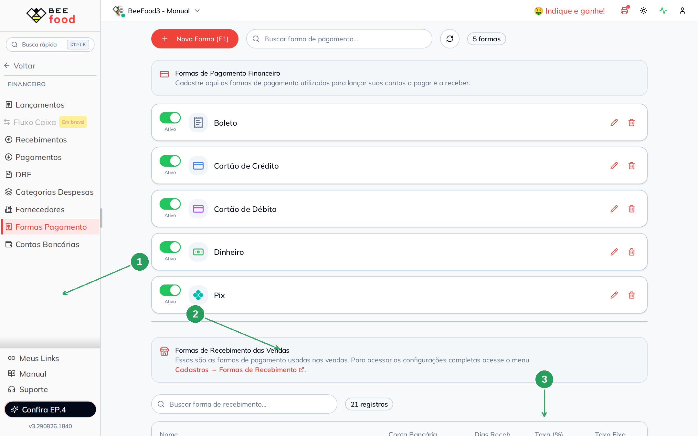
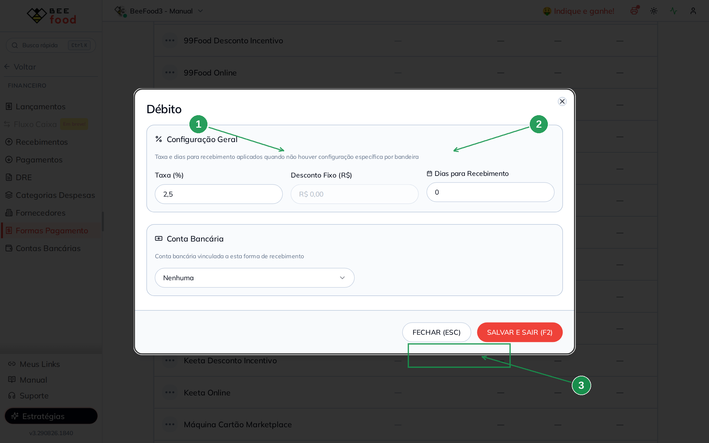
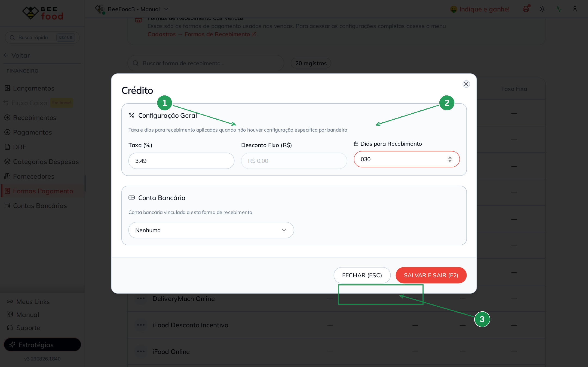
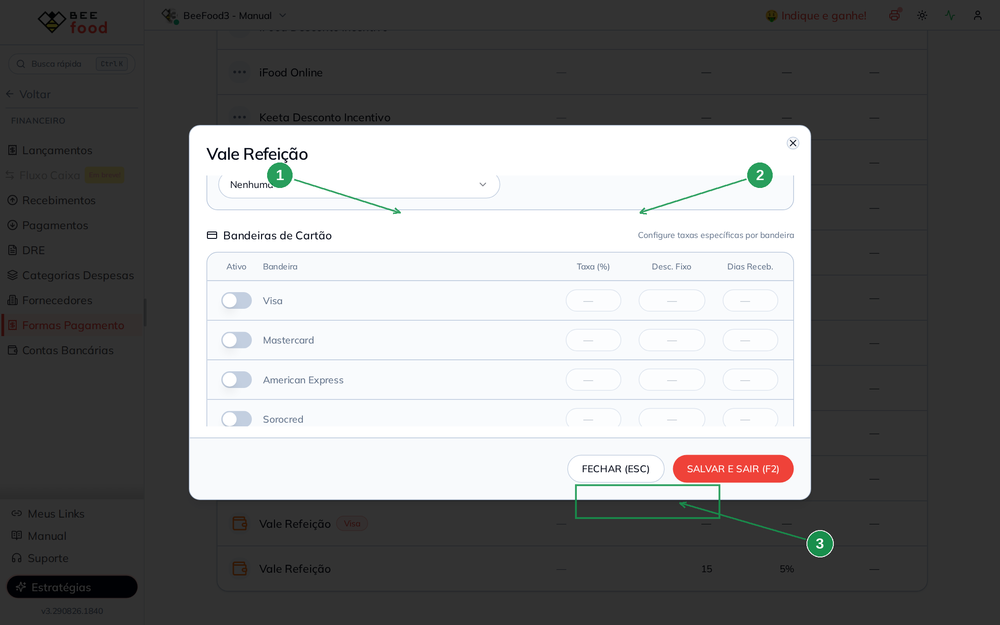
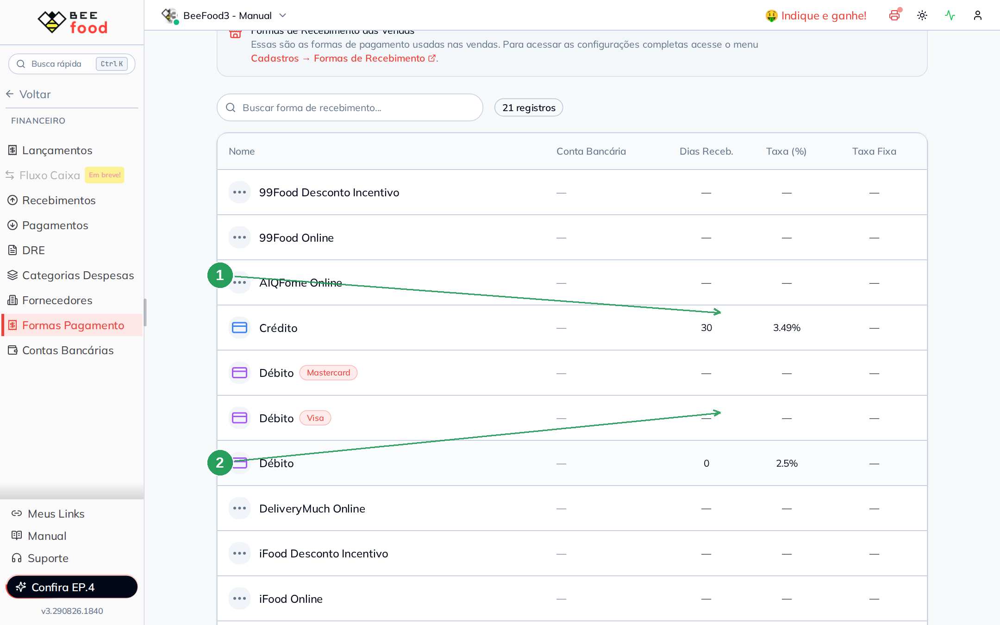
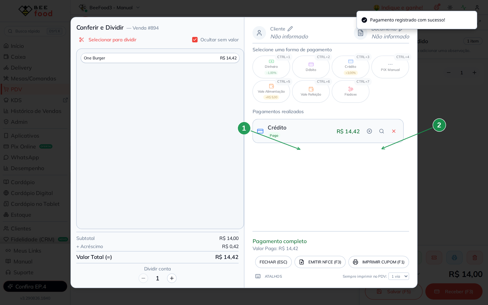
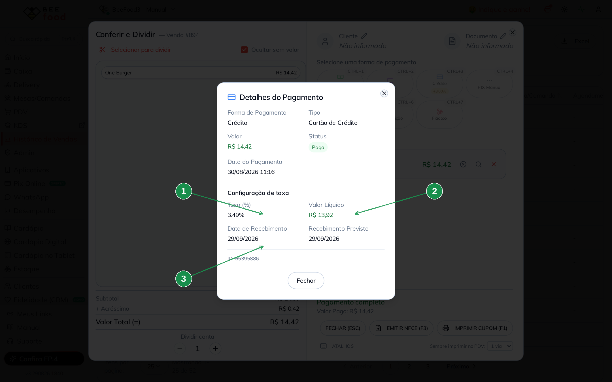
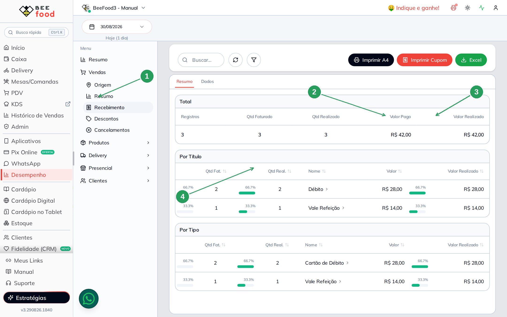
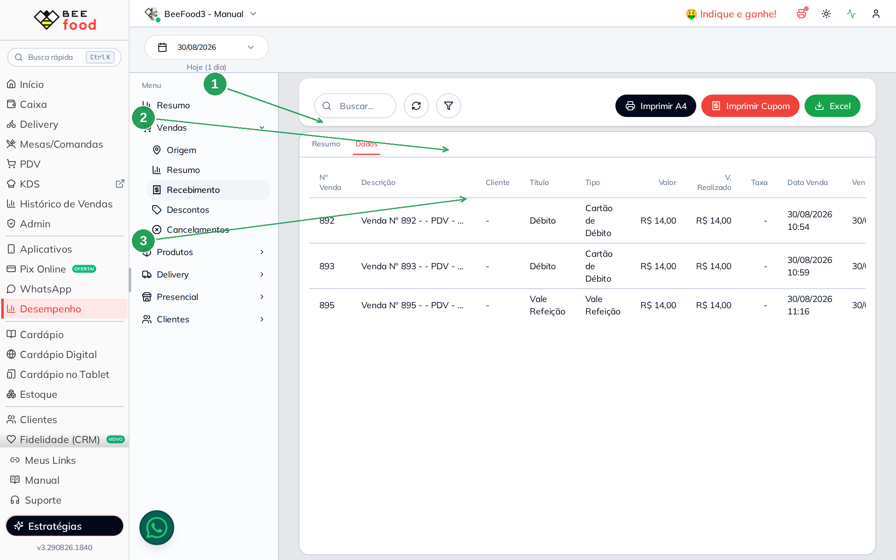

# Taxas das formas de recebimento (faturado e realizado)

A taxa da **maquininha** ou do **vale** não é desconto para o cliente. O
cliente paga o valor cheio. A taxa é o que a operadora fica — e o
restaurante recebe o **líquido**, às vezes **no mesmo dia**, às vezes
**depois**.

Neste manual: configurar **débito (2,50% no mesmo dia)**, **crédito
(3,49% em 30 dias)** e **vale refeição (5% em 15 dias)**; fazer **uma
venda em cada forma**; ver o detalhe do pagamento com taxa; e ler
**faturado** e **realizado** no relatório do dia.

> As imagens têm **setas com números** (1, 2, 3…). No texto, cada número
> indica o campo ou botão correspondente na tela.

---

## Antes de começar

1. Acesso a **Financeiro → Formas Pagamento**.
2. Caixa **aberto** para vender no PDV.
3. Esta taxa **não** é o desconto/acréscimo do cardápio digital nem o
   ajuste que aparece no botão do PDV (Dinheiro −1%, Crédito +3%). Aquilo
   muda o preço da venda. Aqui muda **o que entra na conta**.

A tela tem **SALVAR E SAIR (F2)**. Não é auto-save.

---

## Parte 1 — Onde fica

No menu: **Financeiro → Formas Pagamento** (1). O topo da página é outra
coisa: formas para **contas a pagar e a receber** (Boleto, Pix…). A taxa
da venda fica no **final da página**, em **Formas de Recebimento das
Vendas** (2). Colunas: **Dias Receb.** e **Taxa (%)** (3).

Clique na **linha** da forma para abrir a configuração. A tela avisa:
o cadastro completo continua em **Cadastros → Formas de Recebimento**.

| Nº | Campo | O que faz |
|----|--------|-----------|
| 1. | **Formas Pagamento** | Dentro de Financeiro |
| 2. | **Formas de Recebimento das Vendas** | Taxa e prazo da maquininha / vale |
| 3. | **Dias Receb.** e **Taxa (%)** | Quando o dinheiro cai e quanto a operadora fica |

---

## Parte 2 — Três taxas que fazem sentido

Os números abaixo são típicos de restaurante no Brasil. Use os da **sua**
operadora.

### Débito — 2,50% e 0 dias (mesmo dia)

Clique em **Débito**. Em **Configuração Geral** (vale quando não há
bandeira específica):

- **Taxa (%)** (1) — **2,50**
- **Dias para Recebimento** (2) — **0** (cai no mesmo dia)
- **SALVAR E SAIR (F2)** (3)

**Desconto Fixo (R$)** fica vazio se você usa percentual. Os dois não
somam: ou taxa % ou valor fixo.

| Nº | Campo | O que faz |
|----|--------|-----------|
| 1. | **Taxa (%)** | Quanto a operadora desconta. **2,50** |
| 2. | **Dias para Recebimento** | **0** = recebido no dia da venda |
| 3. | **SALVAR E SAIR (F2)** | Grava. Fechar descarta |

Bandeiras (Visa, Mastercard…) no final do modal: só preencha se aquela
bandeira tiver taxa ou prazo **diferente** da geral.

### Crédito — 3,49% e 30 dias

Mesmos campos. Taxa **3,49** (1) e **30** dias (2). Grave em **SALVAR E
SAIR (F2)** (3).

### Vale Refeição (VR) — 5% e 15 dias

Taxa **5,00** (1) e **15** dias (2). Grave (3).

### Como fica a tabela

Na lista, a linha **sem badge de bandeira** é a configuração geral.

No exemplo: **Crédito** com 30 dias e 3,49% (1); **Débito** com 0 dias e
2,5% (2). Vale Refeição (5% / 15 dias) fica mais abaixo na lista — a
busca no topo filtra pelo nome.

| Nº | Campo | O que mostra |
|----|--------|--------------|
| 1. | **Crédito** | 30 dias · 3,49% |
| 2. | **Débito** | 0 dias · 2,5% |

---

## Parte 3 — Conta das datas (faturado × realizado)

**Faturado** = o que o cliente pagou, no **dia da venda**.
**Realizado** = o líquido que cai na conta, no **dia da venda + dias**.

Exemplo redondo: venda de **R$ 100,00** no dia **30/08/2026**.

| Forma | Taxa | Dias | Faturado | Realizado (líquido) | Data faturado | Data realizado |
|-------|------|------|----------|---------------------|---------------|----------------|
| Débito | 2,50% | 0 | R$ 100,00 | R$ 97,50 | 30/08/2026 | 30/08/2026 |
| Crédito | 3,49% | 30 | R$ 100,00 | R$ 96,51 | 30/08/2026 | 29/09/2026 |
| Vale Refeição | 5,00% | 15 | R$ 100,00 | R$ 95,00 | 30/08/2026 | 14/09/2026 |

No débito com **0 dias** os dois valores aparecem **no mesmo dia** — por
isso ele é o melhor para conferir o relatório hoje. No crédito e no vale
o faturado entra hoje e o realizado só na data da última coluna.

Conta do líquido: `valor × (1 − taxa/100)`. Débito: 100 × 0,975 =
**97,50**. Crédito: 100 × 0,9651 = **96,51**. Vale: 100 × 0,95 =
**95,00**.

---

## Parte 4 — Uma venda em cada forma

No **PDV**, o mesmo item (**One Burger R$ 14,00**) em cada forma:

- **Débito** — o cliente paga **R$ 14,00**
- **Crédito** — o botão do PDV pode somar o acréscimo do cadastro
  (**+3%**). No exemplo o total vira **R$ 14,42**. Isso **não** é a
  taxa da operadora
- **Vale Refeição** — o cliente paga **R$ 14,00**

**Receber (F3)** → forma → **CONFIRMAR (ENTER/F1)**. Se pedir bandeira,
pode confirmar sem escolher (usa a geral).

No crédito, o pagamento aparece em **Pagamentos realizados** como
**Crédito — Pago** (1). A **lupa** (2) abre o detalhe.

| Nº | Campo | O que faz |
|----|--------|-----------|
| 1. | **Crédito · Pago** | Pagamento registrado (R$ 14,42) |
| 2. | **Lupa** | Abre o detalhe (taxa, líquido e datas) |

Quando a taxa já está no pagamento, o detalhe mostra o bloco
**Configuração de taxa**:

- **Taxa (%)** (1) — **3,49**
- **Valor Líquido** (2) — o realizado: **R$ 13,92**
  (`14,42 × (1 − 3,49/100)`)
- **Data de Recebimento** e **Recebimento Previsto** (3) — **29/09/2026**
  (venda + 30 dias)

O **+0,42** do PDV é o acréscimo do cadastro. A **3,49%** é o que a
operadora fica.

| Nº | Campo | O que mostra |
|----|--------|--------------|
| 1. | **Taxa (%)** | Percentual da operadora (3,49%) |
| 2. | **Valor Líquido** | O que entra na conta (R$ 13,92) |
| 3. | **Datas** | Recebimento e previsto — 29/09/2026 |

A lupa também existe no **Histórico de Vendas**: ícone de cartão da
linha → lupa do pagamento.

---

## Parte 5 — Relatório: faturado e realizado

Menu **Desempenho** (não é o Financeiro da barra). No menu interno do
relatório: **Vendas → Recebimento** (1).

A aba **Resumo** tem **Qtd Faturado**, **Qtd Realizado**, **Valor Pago**
(faturado) (2) e **Valor Realizado** (3). Abaixo, uma linha por forma
(4). No dia do exemplo: **Débito** (R$ 28,00 — duas vendas de R$ 14,00)
e **Vale Refeição** (R$ 14,00).

O **crédito** desta venda **não entra na lista do dia**: o recebimento
é **29/09/2026** (veja o detalhe). Faturado é o dia da venda; realizado
é o dia + os dias da forma.

| Nº | Campo | O que mostra |
|----|--------|--------------|
| 1. | **Recebimento** | Dentro de Vendas |
| 2. | **Valor Pago** | Soma faturada (o cliente pagou) |
| 3. | **Valor Realizado** | Soma líquida |
| 4. | **Por forma** | Débito e Vale Refeição no dia |

A aba **Dados** lista cada pagamento. **Valor** é o faturado; **V.
Realizado** é o líquido. **Data da venda** e **Vencimento** no débito
D+0 caem no **mesmo dia** (2). O vale do dia também aparece (3).

| Nº | Campo | O que mostra |
|----|--------|--------------|
| 1. | **Aba Dados** | Um pagamento por linha |
| 2. | **Débito D+0** | Venda e vencimento no mesmo dia (30/08) |
| 3. | **Vale Refeição** | A terceira venda do dia |

Outro lugar, se quiser só o financeiro: **Financeiro → Recebimentos**,
filtro **Previsto e Realizado**, abas Tipo e Datas. O relatório de
**Desempenho → Recebimento** é o que separa faturado e realizado da
venda.

---

## O que esta taxa não é

- **Desconto do cardápio digital** (outra tela, outro manual): barateia
  ou encarece o pedido para o cliente.
- **Ajuste no botão do PDV** (Dinheiro −1%, Crédito +3%): também mexe no
  total da venda.
- **Taxa de serviço da mesa**: gorjeta, outro parâmetro.

Aqui: **operadora**. O cliente não vê. O relatório de recebimento vê.
