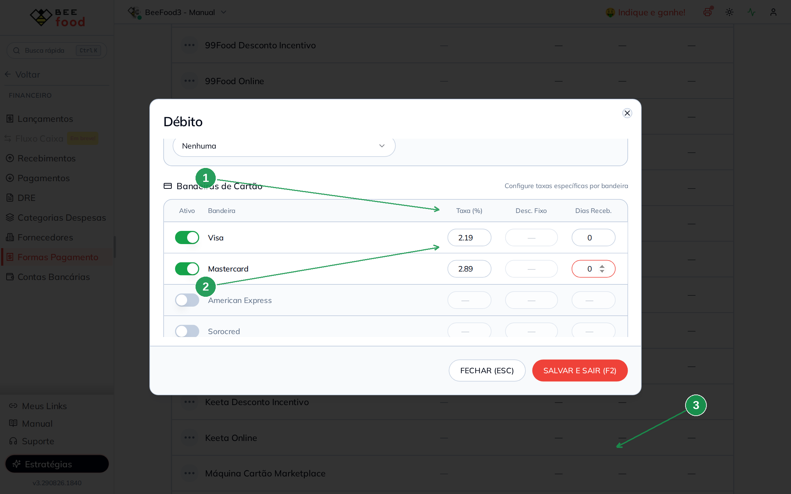

# Taxas das formas de recebimento (faturado e realizado)

A taxa da **maquininha** ou do **vale** não é desconto para o cliente. O
cliente paga o valor cheio. A taxa é o que a operadora fica — e o
restaurante recebe o **líquido**, às vezes **no mesmo dia**, às vezes
**depois**.

Neste manual: configurar **débito** (geral **2,50%** no mesmo dia, **Visa
2,19%** e **Mastercard 2,89%**), **crédito (3,49% em 30 dias)** e **vale
refeição (5% em 15 dias)**; vender no débito **duas vezes na Visa** e
**uma na Mastercard**; ver o detalhe com taxa; e ler **faturado** e
**realizado** no relatório do dia.

> As imagens têm **setas com números** (1, 2, 3…). No texto, cada número
> indica o campo ou botão correspondente na tela.

---

## Antes de começar

1. Acesso a **Financeiro → Formas Pagamento**.
2. Caixa **aberto** para vender no PDV.
3. Esta taxa **não** é o desconto/acréscimo do cardápio digital nem o
   ajuste que aparece no botão do PDV (Dinheiro −1%, Crédito +3%). Aquilo
   muda o preço da venda. Aqui muda **o que entra na conta**.

A tela tem **SALVAR E SAIR (F2)**. Não é auto-save.

Não deixe bandeira **ativa sem taxa**. O sistema trata a linha vazia
como regra daquela bandeira — e a configuração geral **não vale** para
ela.

---

## Parte 1 — Onde fica

No menu: **Financeiro → Formas Pagamento** (1). O topo da página é outra
coisa: formas para **contas a pagar e a receber** (Boleto, Pix…). A taxa
da venda fica no **final da página**, em **Formas de Recebimento das
Vendas** (2). Colunas: **Dias Receb.** e **Taxa (%)** (3).

Clique na **linha** da forma para abrir a configuração. A tela avisa:
o cadastro completo continua em **Cadastros → Formas de Recebimento**.

| Nº | Campo | O que faz |
|----|--------|-----------|
| 1. | **Formas Pagamento** | Dentro de Financeiro |
| 2. | **Formas de Recebimento das Vendas** | Taxa e prazo da maquininha / vale |
| 3. | **Dias Receb.** e **Taxa (%)** | Quando o dinheiro cai e quanto a operadora fica |

---

## Parte 2 — Três taxas que fazem sentido

Os números abaixo são típicos de restaurante no Brasil. Use os da **sua**
operadora.

### Débito — geral 2,50% e 0 dias (mesmo dia)

Clique em **Débito**. Em **Configuração Geral** (vale quando **não** há
bandeira específica, ou a bandeira está desligada):

- **Taxa (%)** (1) — **2,50**
- **Dias para Recebimento** (2) — **0** (cai no mesmo dia)
- **SALVAR E SAIR (F2)** (3)

**Desconto Fixo (R$)** fica vazio se você usa percentual. Os dois não
somam: ou taxa % ou valor fixo.

| Nº | Campo | O que faz |
|----|--------|-----------|
| 1. | **Taxa (%)** | Quanto a operadora desconta. **2,50** |
| 2. | **Dias para Recebimento** | **0** = recebido no dia da venda |
| 3. | **SALVAR E SAIR (F2)** | Grava. Fechar descarta |

### Débito — taxa por bandeira (Visa e Mastercard)

No final do mesmo modal: **Bandeiras de Cartão**. Só ligue a bandeira
se ela tiver taxa ou prazo **diferente** da geral. Preencha os três
campos (taxa, desconto fixo se for o caso, dias) **antes** de salvar.

No exemplo:

- **Visa** (1) — **2,19%** e **0** dias
- **Mastercard** (2) — **2,89%** e **0** dias
- **SALVAR E SAIR (F2)** (3)

Bandeira ligada e taxa vazia vira “fantasma”: o pagamento daquela
bandeira **não herda** a geral.

| Nº | Campo | O que faz |
|----|--------|-----------|
| 1. | **Visa** | Taxa própria. **2,19** · 0 dias |
| 2. | **Mastercard** | Taxa própria. **2,89** · 0 dias |
| 3. | **SALVAR E SAIR (F2)** | Grava geral e bandeiras juntos |

### Crédito — 3,49% e 30 dias

Mesmos campos da geral. Taxa **3,49** (1) e **30** dias (2). Grave em
**SALVAR E SAIR (F2)** (3). Sem bandeira ligada.

### Vale Refeição (VR) — 5% e 15 dias

Taxa **5,00** (1) e **15** dias (2). Grave (3). Deixe as bandeiras
**desligadas** se a taxa for a mesma para todas.

### Como fica a tabela

Na lista, a linha **sem badge** é a geral. Cada bandeira ligada vira
uma linha com o nome no badge.

No exemplo, busca **Débito**: **Mastercard 2,89%** (1), **Visa 2,19%**
(2) e a geral **2,5%** (3). Todas com **0** dias.

| Nº | Campo | O que mostra |
|----|--------|--------------|
| 1. | **Débito · Mastercard** | 0 dias · 2,89% |
| 2. | **Débito · Visa** | 0 dias · 2,19% |
| 3. | **Débito** (sem badge) | 0 dias · 2,5% — as outras bandeiras |

---

## Parte 3 — Conta das datas (faturado × realizado)

**Faturado** = o que o cliente pagou, no **dia da venda**.
**Realizado** = o líquido que cai na conta, no **dia da venda + dias**.

Exemplo redondo: venda de **R$ 100,00** no dia **30/08/2026**.

| Forma | Taxa | Dias | Faturado | Realizado (líquido) | Data faturado | Data realizado |
|-------|------|------|----------|---------------------|---------------|----------------|
| Débito (geral) | 2,50% | 0 | R$ 100,00 | R$ 97,50 | 30/08/2026 | 30/08/2026 |
| Débito Visa | 2,19% | 0 | R$ 100,00 | R$ 97,81 | 30/08/2026 | 30/08/2026 |
| Débito Mastercard | 2,89% | 0 | R$ 100,00 | R$ 97,11 | 30/08/2026 | 30/08/2026 |
| Crédito | 3,49% | 30 | R$ 100,00 | R$ 96,51 | 30/08/2026 | 29/09/2026 |
| Vale Refeição | 5,00% | 15 | R$ 100,00 | R$ 95,00 | 30/08/2026 | 14/09/2026 |

No débito com **0 dias** os dois valores aparecem **no mesmo dia** — por
isso ele é o melhor para conferir o relatório hoje. No crédito e no vale
o faturado entra hoje e o realizado só na data da última coluna.

Conta do líquido: `valor × (1 − taxa/100)`. Visa: 100 × 0,9781 =
**97,81**. Mastercard: 100 × 0,9711 = **97,11**. Crédito: 100 × 0,9651 =
**96,51**. Vale: 100 × 0,95 = **95,00**.

---

## Parte 4 — Venda por bandeira e o detalhe da taxa

No **PDV**, o mesmo item (**One Burger R$ 14,00**). **Receber (F3)** →
**Débito** → escolha a **bandeira** → **CONFIRMAR (ENTER/F1)**.

Se a bandeira está configurada, **preencha a bandeira** na venda. Faça
**duas vendas Visa** (mesma taxa) e **uma Mastercard**.

O pagamento aparece em **Pagamentos realizados** como **Débito — Pago**
com a bandeira (1). A **lupa** (2) abre o detalhe.

| Nº | Campo | O que faz |
|----|--------|-----------|
| 1. | **Débito · Visa · Pago** | Pagamento registrado (R$ 14,00) |
| 2. | **Lupa** | Abre o detalhe (taxa, líquido e datas) |

Quando a taxa está no pagamento, o detalhe mostra **Configuração de
taxa**. No **Visa**:

- **Taxa (%)** (1) — **2,19**
- **Valor Líquido** (2) — **R$ 13,69** (`14,00 × 0,9781`)
- **Data de Recebimento** e **Recebimento Previsto** (3) — **30/08/2026**
  (D+0, o mesmo dia)

No **Mastercard** (mesma lupa, outra venda): taxa **2,89%**, líquido
**R$ 13,60**, datas também **30/08/2026**.

| Nº | Campo | O que mostra |
|----|--------|--------------|
| 1. | **Taxa (%)** | A da bandeira (2,19% no Visa) |
| 2. | **Valor Líquido** | O que entra na conta (R$ 13,69) |
| 3. | **Datas** | Recebimento e previsto — iguais no D+0 |

A lupa também existe no **Histórico de Vendas**: ícone de cartão da
linha → lupa do pagamento.

No **crédito**, o PDV pode somar o acréscimo do cadastro (**+3%**). Isso
**não** é a taxa da operadora. A taxa do crédito (3,49% em 30 dias)
aparece no mesmo bloco, com recebimento em **29/09/2026**. No **vale**,
a taxa **5%** e o líquido **R$ 13,30**, com recebimento em
**14/09/2026**.

---

## Parte 5 — Relatório: faturado e realizado

Menu **Desempenho** (não é o Financeiro da barra). No menu interno do
relatório: **Vendas → Recebimento** (1).

A aba **Resumo** tem **Valor Pago** (faturado) (2) e **Valor Realizado**
(3). Quando existe taxa no pagamento, as duas colunas **diferem**. No
débito do dia: **R$ 42,00** pago e **R$ 40,98** realizado (4) — duas
Visas (2,19% cada) e uma Mastercard (2,89%).

Crédito e vale com recebimento em outro dia **não entram** na lista
deste dia.

| Nº | Campo | O que mostra |
|----|--------|--------------|
| 1. | **Recebimento** | Dentro de Vendas |
| 2. | **Valor Pago** | Soma faturada (o cliente pagou) |
| 3. | **Valor Realizado** | Soma líquida |
| 4. | **Débito** | 42,00 faturado · 40,98 realizado |

A aba **Dados** (1) lista cada pagamento. **Valor** é o faturado; **V.
Realizado** é o líquido; **Taxa** é a da bandeira. As duas Visas
**−2,19%** (2 e 4) e a Mastercard **−2,89%** (3), todas com venda e
vencimento no **mesmo dia**.

| Nº | Campo | O que mostra |
|----|--------|--------------|
| 1. | **Aba Dados** | Lista do dia — um pagamento por linha |
| 2. | **Visa** | 14,00 → 13,69 · taxa −2,19% |
| 3. | **Mastercard** | 14,00 → 13,60 · taxa −2,89% |
| 4. | **Visa de novo** | Mesma bandeira, mesma taxa −2,19% |

Outro lugar, se quiser só o financeiro: **Financeiro → Recebimentos**,
filtro **Previsto e Realizado**, abas Tipo e Datas. O relatório de
**Desempenho → Recebimento** é o que separa faturado e realizado da
venda.

---

## O que esta taxa não é

- **Desconto do cardápio digital** (outra tela, outro manual): barateia
  ou encarece o pedido para o cliente.
- **Ajuste no botão do PDV** (Dinheiro −1%, Crédito +3%): também mexe no
  total da venda.
- **Taxa de serviço da mesa**: gorjeta, outro parâmetro.

Aqui: **operadora**. O cliente não vê. O relatório de recebimento vê.
