# TEF PayGo (Client PayGo) — instalar no Windows e cadastrar no BeeFood

A **TEF PayGo** recebe cartão no BeeFood Windows a partir da versão **2.1.4.9**, com o
**Client PayGo** na máquina e o cadastro no sistema novo: **Configuração → TEF → Novo TEF PayGo (F2)**.

O card **Aplicativos → TEF PayGo** é só contratação (quantidade). O cadastro fica em
**Configuração → TEF**.

PayGo **não** usa StoneCode nem porta de pinpad no modal do BeeFood — só **título** e **vias**.
A instalação técnica (PDC, senha, IP) acontece no **Client PayGo / menu Administrativo**.

---

## Boas práticas (Windows)

- **Drivers oficiais do pinpad.** O driver padrão do Windows pode falhar na transação.
  - Gertec: [gertec.com.br/download-center](https://www.gertec.com.br/download-center/)
  - Ingenico: instalador USB oficial do fabricante
- Usuário **administrador** do Windows para instalar.
- Liberar no antivírus:
  - `C:\ProgramData\PayGo\PGWebLib\warsaw_64\warsaw.dll`
  - `C:\ProgramData\PayGo\PGWebLib\warsaw_32\warsaw.dll`
  - `C:\ProgramData\PayGo\Atualizacoes`
  - `C:\ProgramData\PayGo\Data`
  - `C:\Program Files (x86)\PayGo`
  - `C:\Users\SeuUsuarioDaMaquina\Desktop\PayGo.lnk`
- Runtime **C++** e **.NET** atualizados (as atualizações do Windows costumam resolver).

---

## Pré-requisitos

O cliente precisa do código **PDC (check-out)** — é o ponto de captura da instalação.

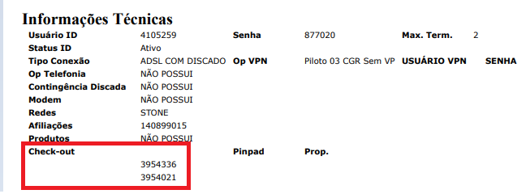

Dados usados na instalação:

- **Senha técnica:** `314159`
- **Nome/IP servidor (produção):** `pos-transac.pgweb.io:31735`
- **Homologação (se for o caso):** `pos-transac-sb.tpgweb.io:31735`

Cada caixa tem o **seu** PDC. Dois caixas = dois PDCs.

---

## Parte 1 — Instalar o Client PayGo no computador

Apesar da comunicação por DLL, o **Client PayGo** precisa estar instalado: ele atualiza
a DLL e protege contra fraude.

1. Instale o **Client PayGo** (versão de referência do artigo original: **5.1.47.2**).
2. No canto superior direito, selecione a chave:

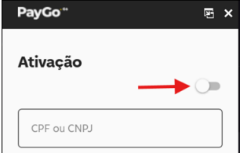

3. Informe o **CNPJ do cliente final** e o **ponto de captura (N. Checkout / PDC)**:

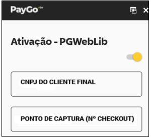

4. Na aplicação, chame o TEF no **Menu Administrativo**:

**CONFIGURAÇÃO** → Menu Administrativo TEF → **Configuração**

- Quando pedir ID, informe o PDC
- Em **Nome/IP servidor**, use produção ou homologação (endereços acima)

**INSTALAÇÃO** → Menu Administrativo TEF → **Instalação**

- Informe o CNPJ do cliente
- A mensagem **TRANSACAO AUTORIZADA** e o comprovante com as redes confirmam que o
  terminal está apto a transacionar

---

## Parte 2 — Etapa de CONFIGURAÇÃO (Administrativo)

### 1. Abrir Configuração no Administrativo TEF

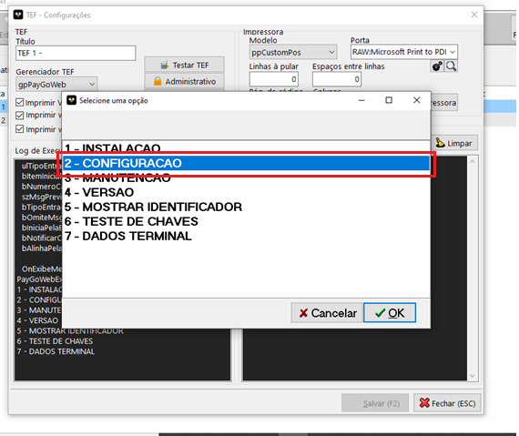

### 2. Senha técnica

Informe **314159**.

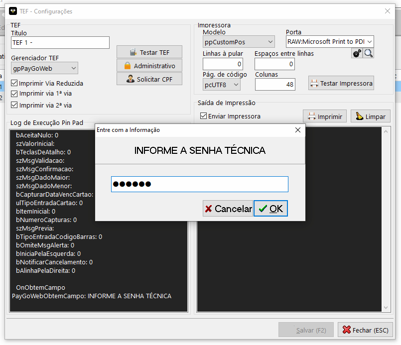

### 3. ID do ponto de captura

Informe o **PDC (check-out)** daquele caixa.

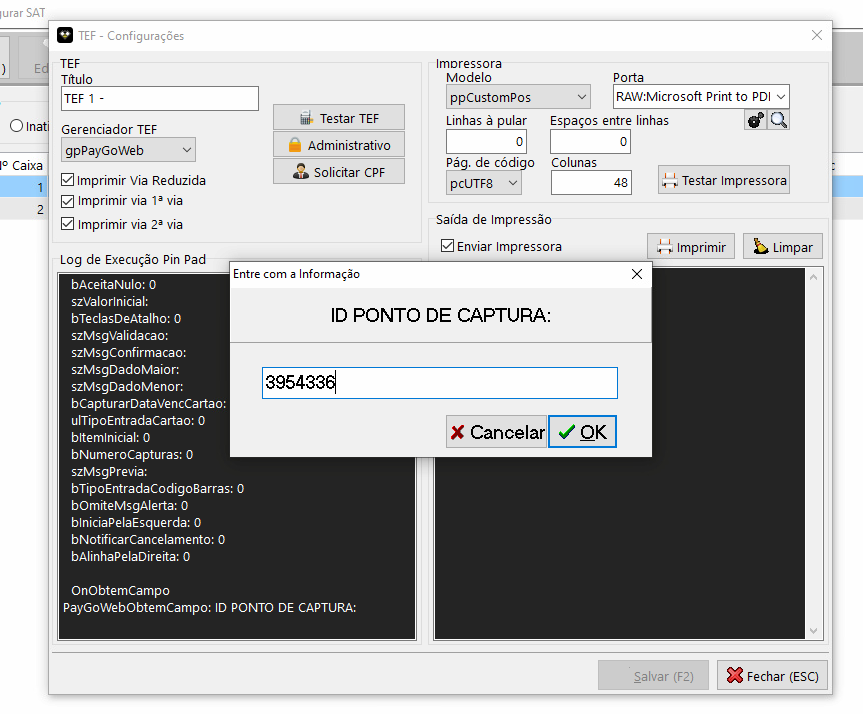

### 4. Nome/IP do servidor

Informe `pos-transac.pgweb.io:31735` (produção).

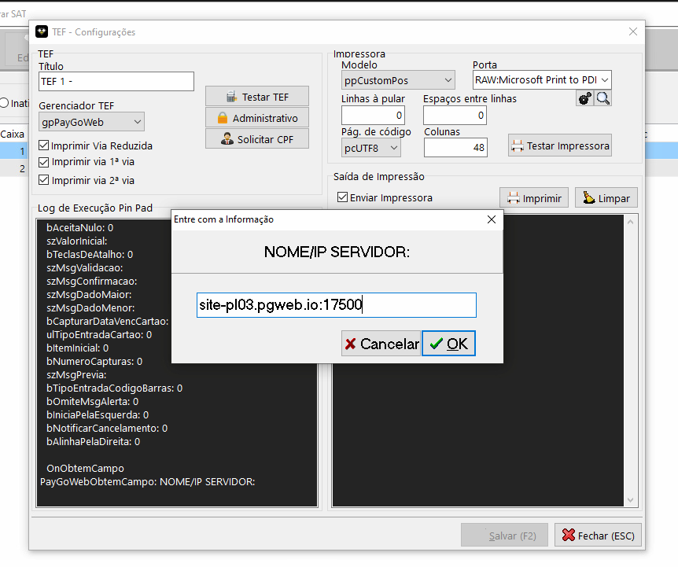

Aguarde alguns segundos até finalizar.

---

## Parte 3 — Etapa de INSTALAÇÃO (Administrativo)

### 1. Administrativo → Instalação

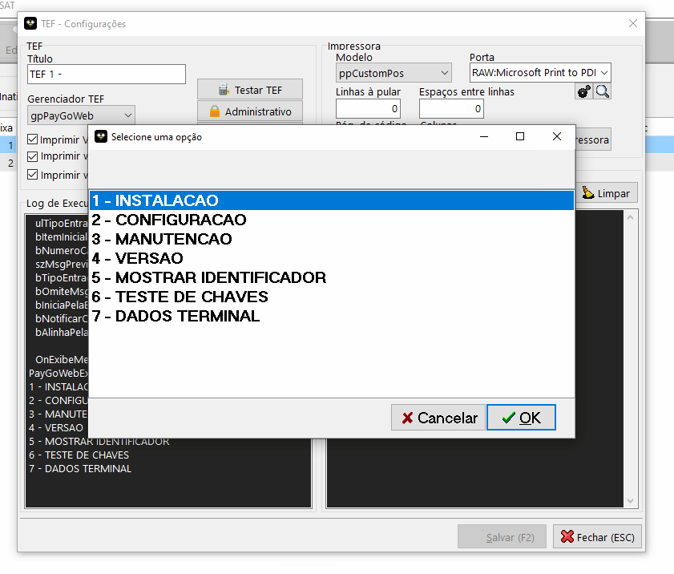

### 2. Senha técnica de novo

Informe **314159**.

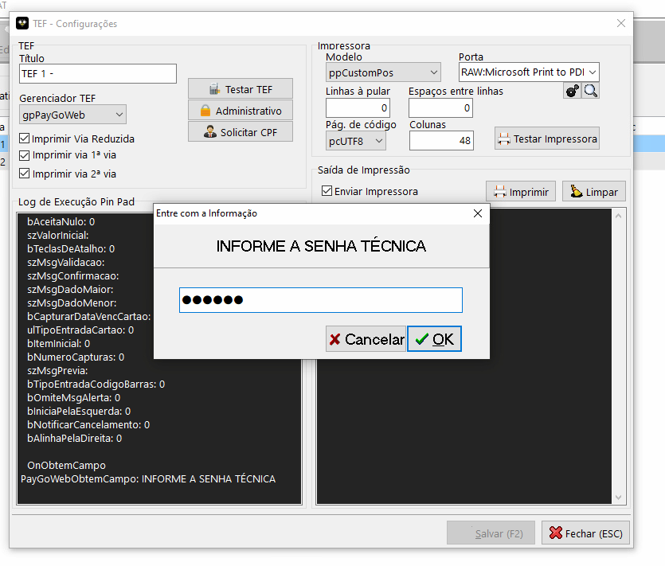

### 3. CNPJ do cliente

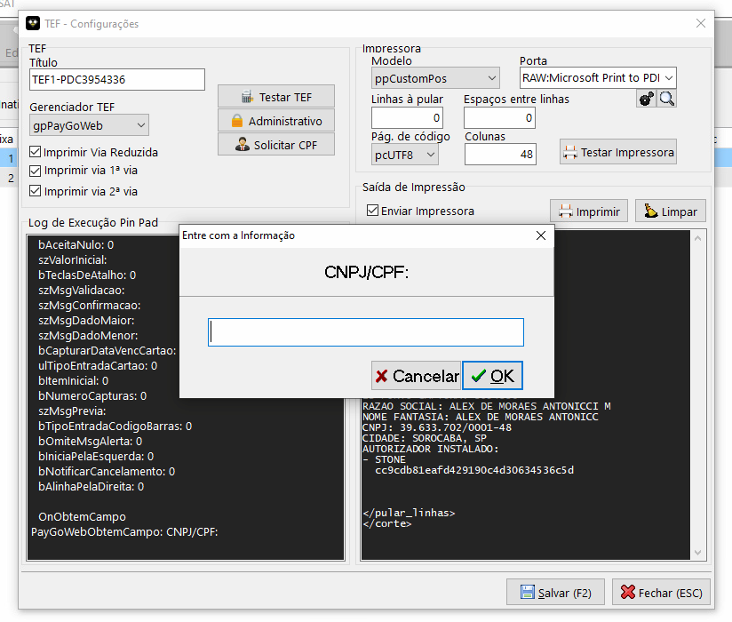

### 4. Aguardar o processamento

Pode demorar. No painel esquerdo aparecem os dados da instalação e do cliente.
Se der erro, tire um print para o suporte / ACBr.

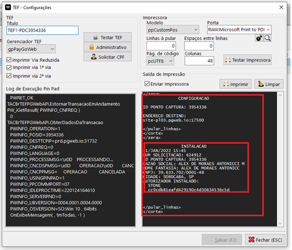

---

## Parte 4 — BeeFood: cadastrar o TEF PayGo

No BeeFood web, vá em **Configuração → TEF** e clique em **Novo TEF PayGo (F2)** (1).

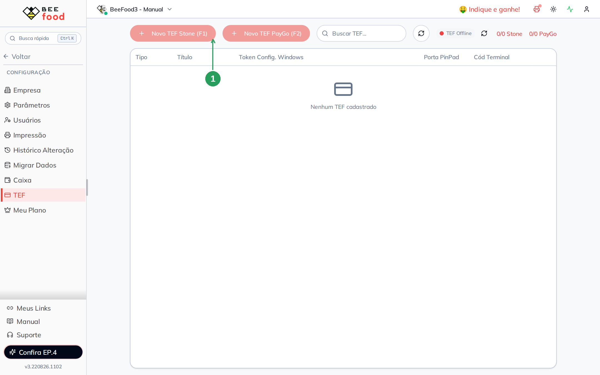

No modal **Novo TEF PayGo** preencha:

| Campo | O que informar |
|-------|----------------|
| **Título** | Use o **código PDC** no título (ex.: PayGo PDC 12345) — facilita a manutenção |
| Vias | Via consumidor / via estabelecimento / via reduzida |
| **SALVAR (F2)** | Grava o cadastro |

Não há campos StoneCode nem Porta PinPad no PayGo.

Se o botão estiver desabilitado, o limite contratado de TEF PayGo está zerado. Contrate
pelo card **Aplicativos → TEF PayGo**.

---

## Problemas comuns

A TEF dispara no recebimento do cartão. Se travar:

- **Sistema trava e a TEF não funciona:** reinicie o computador.
- **ERRO DE AUTENTICACAO DO PONTO DE CAPTURA:** reset + reinstalação (abaixo).

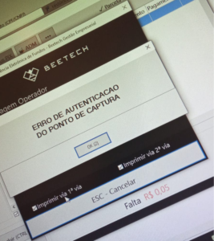

### Reset, configuração e reinstalação

O reset é pedido no Discord do **Projeto ACBr**, canal **ACBR TEF**, grupo **tef-produção**.
Se você não tem acesso, peça no suporte BeeFood (equipe expert) com:

- CNPJ do cliente
- Nº PDC do cliente
- Motivo: **Reset para reinstalação**

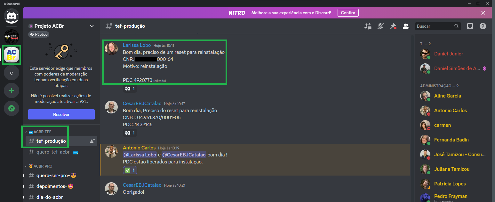

Depois que o ACBr confirmar o reset, refaça **Configuração** e **Instalação** (Partes 2 e 3).

### Troca do pinpad

1. Com o PDC da TEF trocada, peça no canal TEF do ACBr a liberação da instalação
   (CNPJ + PDC).
2. Apague a pasta TEF dos arquivos do sistema.
3. Abra o sistema e rode **ADM → Manutenção** e **ADM → Instalação**.

---

## Precisa de ajuda?

Fale com o **suporte BeeFood** informando: nome da loja, **CNPJ**, **PDC**, versão do
Windows / BeeFood e um print do erro (sem dados de cartão).

---

*Última atualização: agosto/2026 — BeeFood · TEF PayGo (Client PayGo)*
