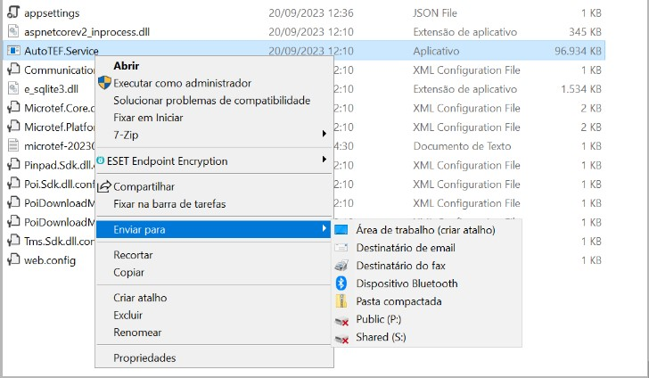
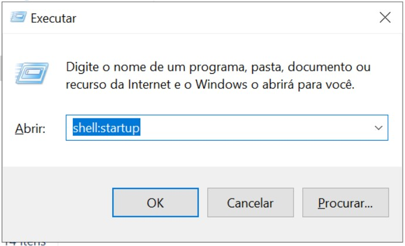
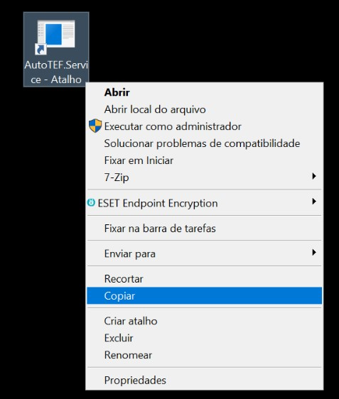
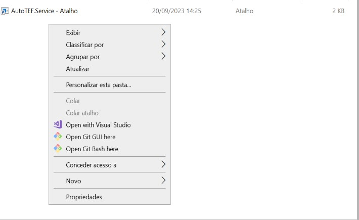
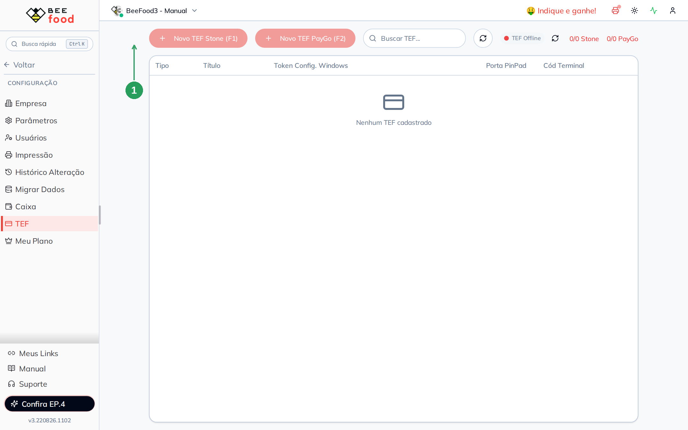
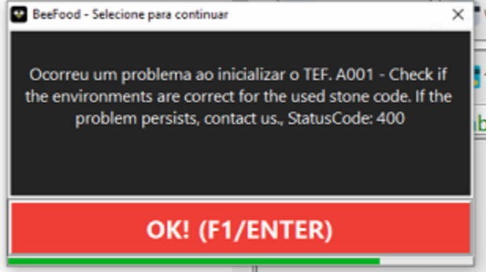

# TEF Stone (AutoTEF) — configurar no Windows e no BeeFood

Com a **TEF Stone (AutoTEF)** você recebe cartão no BeeFood (Windows e Autoatendimento)
direto na Stone. Este manual instala o **Slim** no Windows e mostra **onde cadastrar**
a TEF no sistema novo: **Configuração → TEF**.

O cadastro **não** é no card Aplicativos → AutoTEF Stone (esse card é só contratação).
O cadastro fica em **Configuração → TEF → Novo TEF Stone (F1)**.

---

## Dispositivos suportados

- Ingenico LANE 3000
- Ingenico LANE 3600
- Gertec PPC930
- Verifone P200
- Ingenico IPP320
- PAX Q25

---

## Parte 1 — Windows: Slim Stone em `C:\autotef`

O Slim da Stone precisa ficar **sempre em execução** no Windows.

1. Instale o [ASP.NET Core Runtime .NET 6](https://learn.microsoft.com/pt-br/dotnet/core/install/windows?tabs=net70).
2. Baixe o [AutoTEF Slim v1.8 – SDK V4.3 CrossPlataform – PROD](https://ajuda.beefood.com.br/wp-content/uploads/2025/04/AutoTEF-Slim-v1.8-SDK-V4.3-CrossPlataform-PROD.zip).
3. Crie a pasta `C:\autotef` e extraia o zip nela.
4. Na primeira instalação, execute **AutoTEF.Setup.dll** como **Administrador**.
5. Para iniciar o Slim, execute **AutoTEF.Service.exe** como **Administrador**.

Não é necessário configurar mais nada no pinpad além do que a Stone já homologou.

---

## Parte 2 — Windows: iniciar o Slim automaticamente

### Passo 1. Criar um atalho

Na pasta do Slim, clique com o botão direito em **AutoTEF.Service.exe** e use
**Enviar para → Área de trabalho (criar atalho)**.

### Passo 2. Abrir a pasta Inicializar

Pressione **Windows + R**, digite `shell:startup` e clique em **OK**. Deixe essa janela aberta.

### Passo 3. Copiar o atalho

Copie o atalho criado na área de trabalho.

### Passo 4. Colar em Inicializar

Cole o atalho na pasta **Inicializar** que abriu no Passo 2.

Reinicie o computador. O Slim deve subir sozinho.

---

## Parte 3 — BeeFood: cadastrar a TEF Stone

### Passo 5. Abrir Configuração → TEF

No BeeFood web, vá em **Configuração → TEF**. Esta é a tela nova onde a TEF fica salva.

Clique em **Novo TEF Stone (F1)** (1).

No modal **Novo TEF Stone** preencha:

| Campo | O que informar |
|-------|----------------|
| **Título** | Nome fácil de achar (ex.: TEF Stone - Caixa 1) |
| **Código Terminal** | StoneCode / código do terminal que a Stone passou |
| **Porta PinPad** | Porta do pinpad no Windows (ex.: `COM6`) |
| Vias | Via consumidor / via estabelecimento / via reduzida, conforme a operação |
| **SALVAR (F2)** | Grava o cadastro |

Se o botão **Novo TEF Stone (F1)** estiver desabilitado, o limite contratado de TEF Stone
está zerado ou já foi atingido. Contrate (ou aumente a quantidade) pelo card
**Aplicativos → AutoTEF Stone** e fale com o suporte.

O Windows ainda usa o **Token Config. Windows** que aparece na lista depois de salvar —
esse token liga o Slim da máquina ao cadastro do BeeFood.

---

## Erro A001 — trocar TEF por AutoTEF na Stone

Se o Slim mostrar:

**A001 – Check if the environments are correct for the used stone code. IF the problem
persists, contact us. StatusCode: 400**

O StoneCode está no produto **TEF**, e o BeeFood usa **AutoTEF (MicroPOS)**. Peça à Stone
a alteração do produto **TEF → AutoTEF / MicroPOS** em um destes canais:

- Telefone: **0800-326-0506** e **3004-9680**
- WhatsApp: **(11) 3004-9680** (salve o número com DDD)
- Chat: aplicativo ou site da Stone
- E-mail: canal de relacionamento da Stone (peça **habilitação do MicroPOS / AutoTEF**)

Não adianta reinstalar o Slim enquanto a Stone não mudar o produto do StoneCode.

---

## Problemas comuns

| Sintoma | O que verificar |
|---------|-----------------|
| Slim não abre | Rodou **como Administrador**? `.NET 6` instalado? Pasta é `C:\autotef`? |
| Some depois de reiniciar | O atalho está em `shell:startup`? |
| Botão Novo TEF Stone apagado | Limite `0/0 Stone` — falta contratação |
| Erro A001 | Peça AutoTEF / MicroPOS à Stone (acima) |

---

## Precisa de ajuda?

Fale com o **suporte BeeFood** informando: nome da loja, **CNPJ**, modelo do pinpad,
StoneCode (sem dados de cartão) e um print do erro, se houver.

---

*Última atualização: agosto/2026 — BeeFood · TEF Stone (AutoTEF)*
