# Totem de Autoatendimento: como pôr o totem no ar e configurar

O totem é o cliente fazendo o pedido sozinho: ele escolhe no cardápio, se
identifica, paga e leva a senha. Do lado do balcão o pedido cai na cozinha
como qualquer outro.

Quem faz o totem funcionar é **uma tela só do painel**: **Aplicativos → Totem
de Autoatendimento**, com cinco abas. É ali que você decide se o cliente pode
comer no local, se o cupom sai impresso, quais pagamentos o aparelho aceita,
que cara ele tem — e é dali que sai a **URL** que se abre no aparelho.

Este manual mostra cada aba **em par com a tela do cliente**: a chave no painel
e o efeito no totem, lado a lado. Fecha com a regra que mais gera dúvida: a
**foto do setor**, que muda o layout do cardápio do aparelho.

> As imagens têm **setas numeradas** (1, 2, 3…). Cada número indica o campo ou
> botão correspondente na tela.

---

## Antes de começar

- O totem é **contratado** por aparelho. Com o totem contratado, o card em
  Aplicativos abre a tela de configuração; sem contrato, ele abre a
  apresentação do produto — fale com o **suporte BeeFood** para contratar.
- O totem **não é aplicativo para instalar**: é um endereço de internet que
  você abre no navegador do aparelho (seção 6). Serve qualquer máquina com
  Windows, Edge ou Chrome e tela de toque.
- Quem cadastra o cardápio é o **Cardápio** de sempre. O totem mostra os
  setores e produtos marcados como **Presencial** (seção 7).
- Para pagar com cartão ou Pix pela maquininha, o totem precisa de **pinpad
  TEF** ligado no aparelho. **Dinheiro** funciona sem nenhum equipamento: o
  pedido vai para a cozinha e o cliente paga no caixa.

---

## 1. Onde fica a configuração do totem

**Aplicativos.** Na faixa **Presencial**, o card **Totem — Autoatendimento
presencial** (1) abre a configuração.

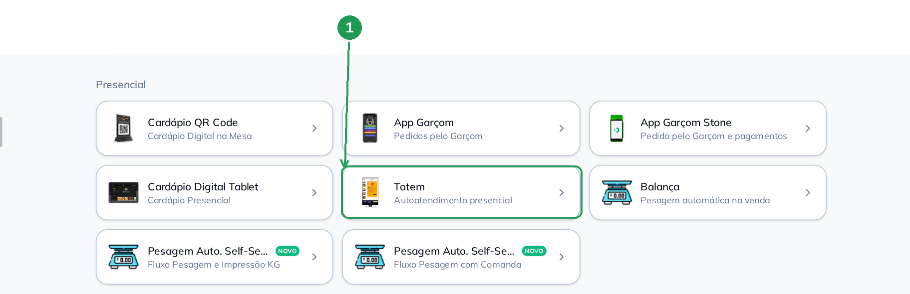

| Nº | Item | O que fazer |
|----|------|-------------|
| 1. | **Card Totem** | Clique para abrir a **Configuração do Totem de Autoatendimento**, com as cinco abas. |

---

## 2. Aba Configuração — como o pedido funciona

É a aba mais longa, e ela decide o comportamento do aparelho. Duas coisas
valem para a tela inteira:

- **Não existe botão Salvar.** Cada chave grava sozinha na hora do clique — o
  rodapé só tem **FECHAR (ESC)**. Os campos de **texto** (senha e mensagem
  final) gravam pouco depois de você parar de digitar.
- O cabeçalho mostra **quantos totens você tem contratados** (1) — aqui, cinco.

### 2.1 Meio de consumo e impressão

No alto ficam as duas decisões que mais mudam o pedido: onde o cliente vai
comer e o que sai no papel. Na aba **Configuração** (2), marque em **Meio de
Consumo** (3) se o totem oferece *Comer aqui*, *Para viagem* ou os dois — se
você marcar só um, o totem nem pergunta. Em **Impressão** (4) ficam o cupom do
pedido, a senha e a impressora que o totem usa.

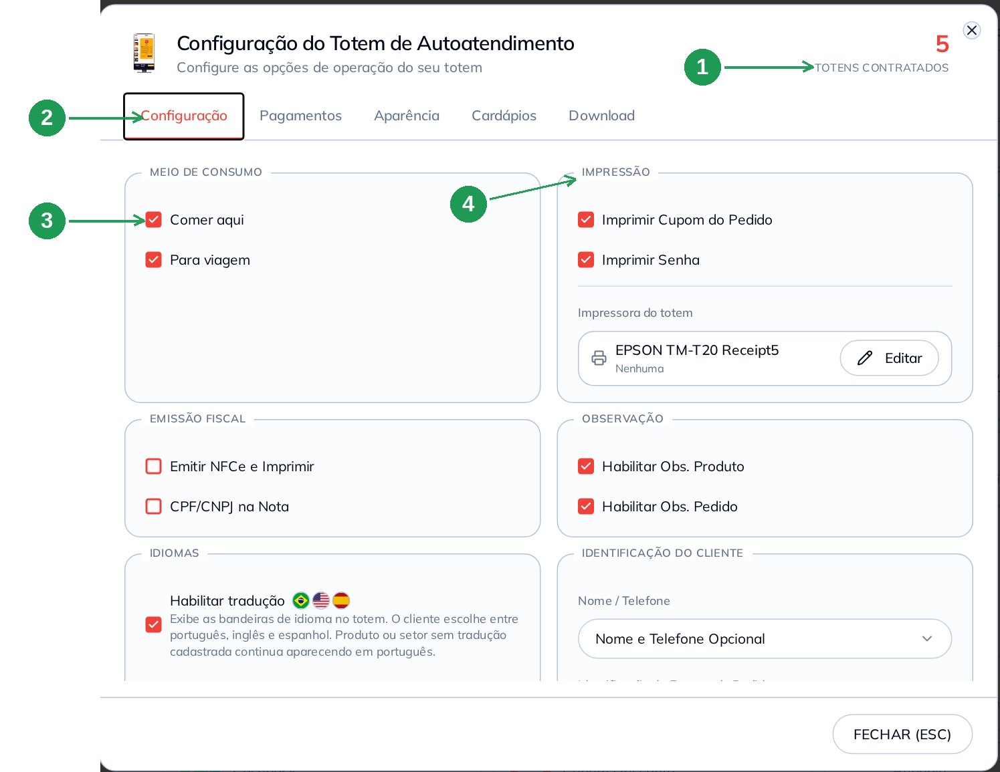

| Nº | Item | O que fazer |
|----|------|-------------|
| 1. | **Totens contratados** | Quantidade do seu contrato. Cada aparelho usa a mesma configuração. |
| 2. | **Abas** | Configuração, Pagamentos, Aparência, Cardápios e Download. |
| 3. | **Meio de Consumo** | Marque *Comer aqui* e/ou *Para viagem*. Com os dois marcados, o totem pergunta ao cliente antes de fechar o pedido. |
| 4. | **Impressão** | *Imprimir Cupom do Pedido* e *Imprimir Senha* ligam a impressão no aparelho. Em **Impressora do totem** você escolhe a impressora cadastrada no BeeImpressão. |

> Sem impressora ligada no aparelho, o totem tenta imprimir, avisa o erro na
> tela e **mesmo assim manda o pedido para a cozinha** (seção 8). Se a sua
> operação não tem impressora no totem, desmarque as duas opções.

### 2.2 Nota fiscal, observação, idioma e identificação do cliente

Rolando a aba aparecem quatro grupos. **Emissão Fiscal** (1) liga a NFC-e no
próprio totem; **Observação** (2) permite ao cliente escrever recado no produto
e no pedido; **Idiomas** (3) mostra as bandeirinhas de inglês e espanhol; e
**Identificação do Cliente** define se o totem pede nome e telefone (4) e se
pede **número da mesa ou do pager** (5).

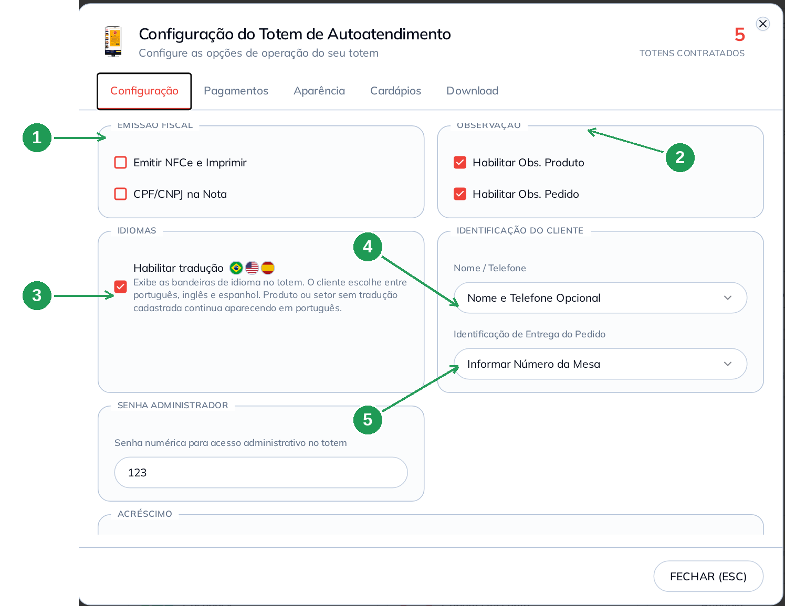

| Nº | Item | O que fazer |
|----|------|-------------|
| 1. | **Emissão Fiscal** | *Emitir NFCe e Imprimir* faz o totem emitir a nota na hora; *CPF/CNPJ na Nota* faz o aparelho pedir o documento ao cliente. Desmarcados, a venda sai sem nota pelo totem. |
| 2. | **Observação** | *Habilitar Obs. Produto* e *Habilitar Obs. Pedido* liberam o campo de recado ("sem cebola") no aparelho. |
| 3. | **Habilitar tradução** | Mostra as bandeiras de português, inglês e espanhol. Item sem tradução cadastrada continua em português. |
| 4. | **Nome / Telefone** | Cinco opções: *Nenhum*, *Nome Opcional*, *Nome e Telefone Opcional*, *Nome Obrigatório* e *Nome e Telefone Obrigatório*. **Telefone é o que liga o pedido ao cliente** — é ele que traz cashback e cupom com login. |
| 5. | **Identificação de Entrega do Pedido** | *Desativado*, *Informar Número do Pager* ou *Informar Número da Mesa*. Escolhido, o totem pede o número antes de fechar e ele aparece no pedido do painel. |

### 2.3 Senha do administrador, acréscimo e mensagem final

No fim da aba ficam três campos de texto. A **Senha Administrador** (1) é o
código numérico que libera o menu de manutenção no aparelho; o **Acréscimo**
(2) escolhe um produto que o totem soma ao pedido conforme o meio de consumo
(taxa de embalagem, por exemplo); e a **Mensagem Final** (3) é o texto que o
cliente lê na tela de pedido concluído.

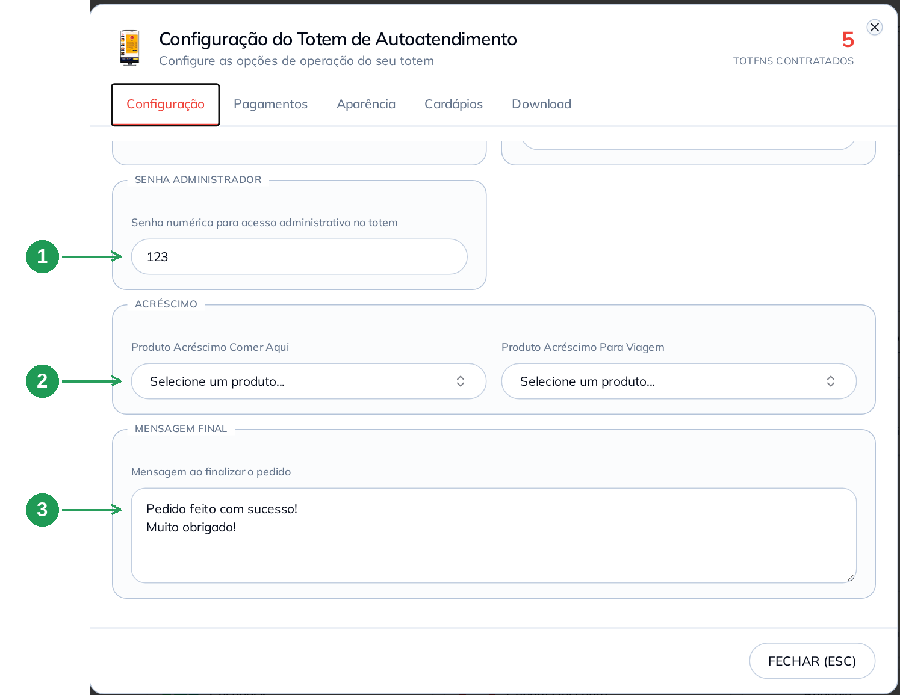

| Nº | Item | O que fazer |
|----|------|-------------|
| 1. | **Senha numérica** | Guarde-a: é o que abre o acesso administrativo no totem. Quando o campo nunca foi preenchido, o sistema sugere o código da sua empresa — só vale depois que você digita uma senha. |
| 2. | **Produto Acréscimo** | Opcional. Um produto para *Comer Aqui* e outro para *Para Viagem*, somado ao pedido pelo próprio totem. Deixe em *Selecione um produto…* para não cobrar nada. |
| 3. | **Mensagem ao finalizar o pedido** | O texto da tela de agradecimento. Pode ter duas linhas. Grava sozinho pouco depois de você parar de digitar. |

---

## 3. Aba Pagamentos — o que o cliente pode usar para pagar

São seis meios, e cada um ligado aponta para uma **forma de recebimento** do
seu cadastro — é assim que a venda entra certa no caixa e nos relatórios.

Marque o meio (1) e escolha a forma correspondente (2). Nos meios de
maquininha, a engrenagem (3) abre as **bandeiras e taxas** daquela forma.

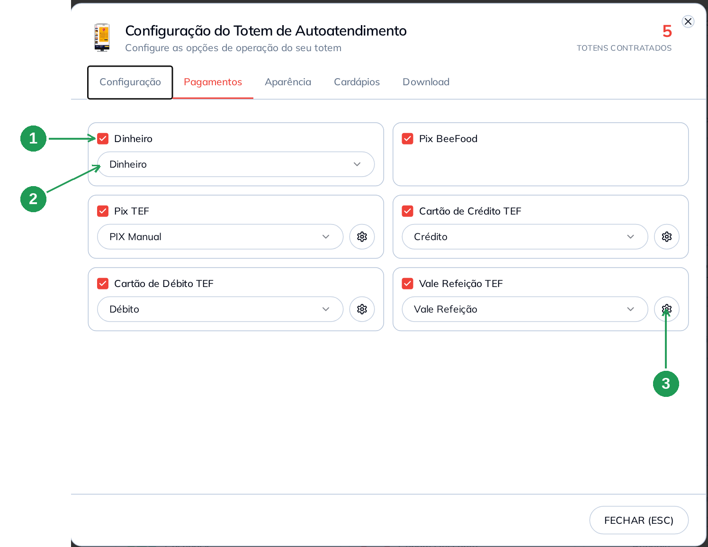

| Nº | Item | O que fazer |
|----|------|-------------|
| 1. | **Dinheiro** | Ligado, o cliente fecha o pedido no totem e paga no caixa. É o único meio que **não precisa de pinpad**. |
| 2. | **Forma de recebimento** | Aponte cada meio para a forma do seu cadastro (aqui, *Dinheiro*). Sem forma escolhida, o meio não aparece no aparelho. |
| 3. | **Engrenagem (TEF)** | Só nos meios de maquininha: abre bandeiras e taxas da forma escolhida. |

Os outros cinco são **Pix BeeFood** (o Pix pago na hora, pela operadora
BeeFood), **Pix TEF**, **Cartão de Crédito TEF**, **Cartão de Débito TEF** e
**Vale Refeição TEF** — os quatro de TEF precisam do pinpad ligado no aparelho.

### Como o cliente vê

O totem mostra o valor a pagar (1) e um cartão por meio ligado. Embaixo do
nome aparece o **desconto da forma de pagamento**, quando ela tem um: aqui,
*Dinheiro* com 1% (2) e *Pix* com 5% (3), cada um já com o valor recalculado.

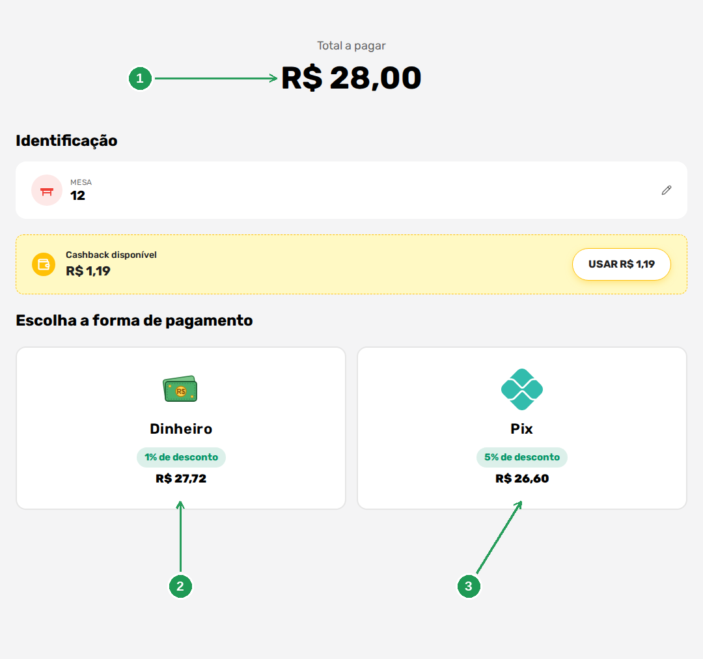

| Nº | Item | O que faz |
|----|------|-----------|
| 1. | **Total a pagar** | O valor do pedido antes do desconto da forma. |
| 2. | **Dinheiro** | O desconto de 1% vem do cadastro da forma em **Cadastros → Formas Recebimento**. |
| 3. | **Pix** | O desconto de 5% vem de **Cardápio Digital → Pagamento Online → PIX Online**. |

> Esses percentuais **não são configurados no totem**. O aparelho só aplica o
> que já está no cadastro da forma de pagamento — o mesmo desconto que o
> cardápio digital usa.

---

## 4. Aba Aparência — a cara do aparelho

Aqui ficam o tema e a cor (1), o **logotipo** que aparece no topo do cardápio
(2), a **capa**, que é a imagem de fundo principal do totem (3), e os
**slides/vídeos** da tela de espera (4).

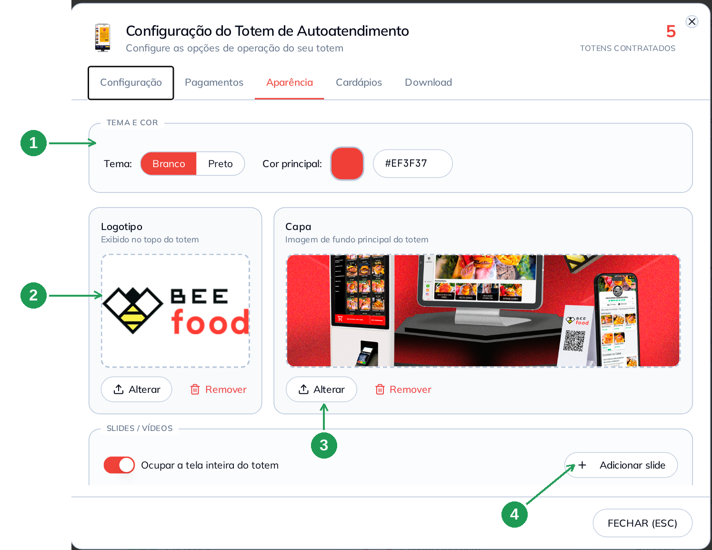

| Nº | Item | O que fazer |
|----|------|-------------|
| 1. | **Tema e cor** | Tema *Branco* ou *Preto* e a **cor principal**, que pinta os botões do aparelho. |
| 2. | **Logotipo** | Exibido no topo do totem. Use **Alterar** para subir e **Remover** para tirar. |
| 3. | **Capa** | A imagem de fundo principal. Aparece no topo do cardápio do aparelho. |
| 4. | **Adicionar slide** | Imagens e vídeos que rodam na tela de espera. A chave *Ocupar a tela inteira do totem* faz o slide preencher o aparelho inteiro. |

Para vídeo a própria tela avisa o formato: **MP4 H.264, até 1080×1920, 4 a 6
Mbps**. **HEVC/H.265 e 4K não funcionam no totem** — o vídeo simplesmente não
roda.

### Como o cliente vê

Sem slide cadastrado, a tela de espera é o botão **FAÇA SEU PEDIDO** (1) na
cor principal, e as bandeiras de idioma (2) embaixo dele quando a tradução
está ligada.

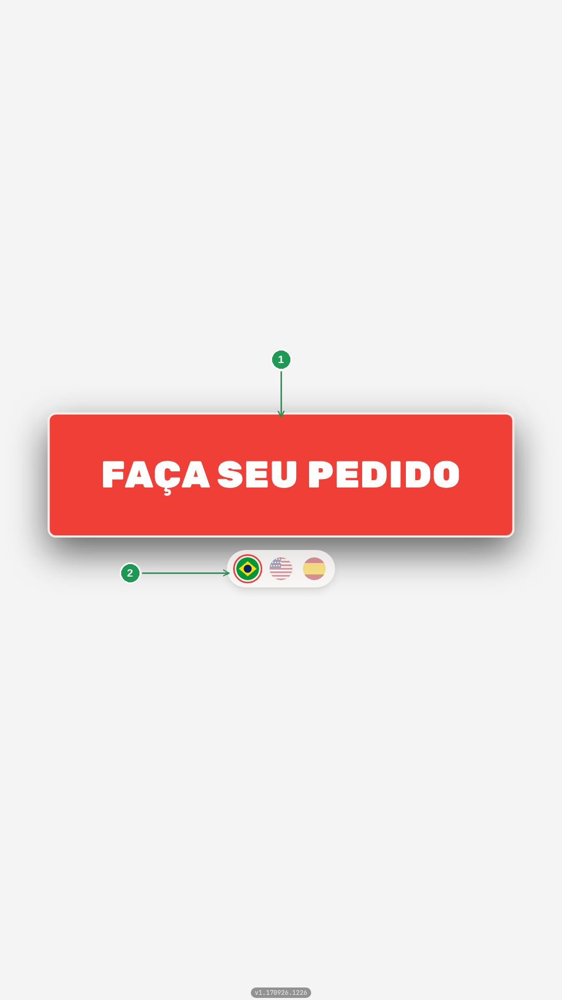

| Nº | Item | O que faz |
|----|------|-----------|
| 1. | **FAÇA SEU PEDIDO** | O primeiro toque do cliente. A cor sai de *Tema e cor*. |
| 2. | **Bandeiras** | Só aparecem com **Habilitar tradução** marcado (seção 2.2). |

Com slide cadastrado, é o slide que ocupa a espera — e o botão volta assim que
o cliente toca na tela.

---

## 5. Aba Cardápios — totem que vende por mais de uma loja

Serve para quem tem **mais de uma filial**: você escolhe quais cardápios das
outras lojas ficam disponíveis no aparelho. O cardápio da **loja principal
está sempre ativo** e não pode ser desligado.

Numa loja só, a aba mostra a loja principal com a etiqueta *Principal* e a
frase *"Nenhum outro cardápio disponível"* — nada a fazer nela.

Filial sem **Cardápio Digital habilitado** aparece na lista apagada, com o
aviso *Cardápio Digital não habilitado*: ela não pode entrar no totem enquanto
o cardápio dela não for liberado.

Com dois cardápios ligados, o aparelho ganha uma tela nova: ele passa a
**perguntar ao cliente em qual cardápio ele quer pedir**, ou mostra os dois numa
tela só. Esse é o assunto do manual **Mais de um cardápio no mesmo totem**.

---

## 6. Aba Download — pôr o totem no ar

Deixe as quatro abas anteriores prontas antes desta: o aparelho lê a
configuração ao abrir.

A aba entrega o endereço do **seu** totem (1) — ele já vem com o código da sua
loja e o token do aparelho. O botão **Copiar** (2) copia a URL, e os dois
botões de download (3) geram um atalho `.cmd` que abre o totem em **modo
kiosk** (tela cheia, sem barra de navegador).

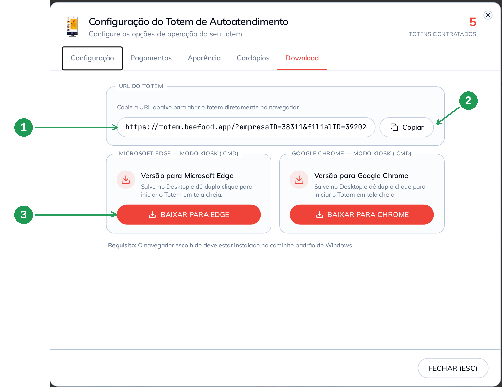

| Nº | Item | O que fazer |
|----|------|-------------|
| 1. | **URL DO TOTEM** | O endereço do aparelho. Cole no navegador do totem para abrir o autoatendimento. |
| 2. | **Copiar** | Copia a URL inteira. É o jeito mais seguro — o endereço tem o token da loja. |
| 3. | **BAIXAR PARA EDGE / CHROME** | Baixa o atalho `.cmd`. Salve no **Desktop** do totem e dê **duplo clique** para abrir em tela cheia. |

O requisito está escrito na tela: **o navegador escolhido deve estar instalado
no caminho padrão do Windows**. O `.cmd` também deixa o navegador preparado
para o fechamento do totem pela tela de administração.

> **Trate a URL como senha.** Quem tem o endereço abre o cardápio do seu totem
> e consegue lançar pedido. Não publique e não mande em grupo.

Precisa saber em que versão o aparelho está? O **número da versão** fica no pé
da tela do totem — é o dado que o suporte pede.

---

## 7. A foto do setor muda o layout do cardápio

Esta é a decisão de cadastro que só aparece no totem, e é a dúvida que mais
chega no suporte.

### 7.1 Sem foto no setor: coluna de texto

Quando os setores **não têm foto**, a coluna da esquerda do totem é uma
**listagem de texto** (1) — só os nomes, um embaixo do outro.

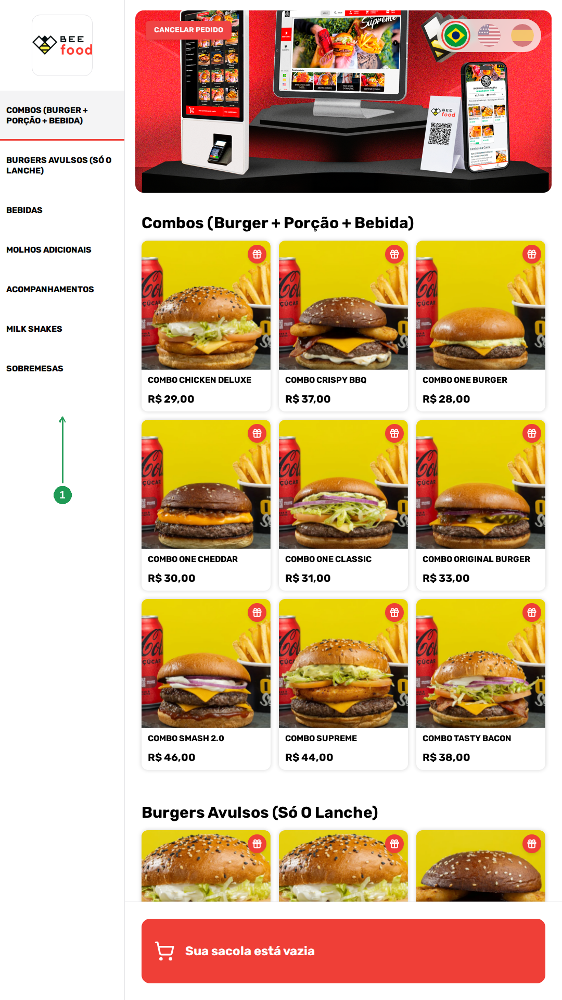

| Nº | Item | O que faz |
|----|------|-----------|
| 1. | **Coluna de setores** | Lista de nomes. É o layout de quem não subiu foto de setor. |

### 7.2 Onde a foto do setor é cadastrada

**Cardápio → Produtos.** Nos três pontinhos do setor, escolha **Editar**. O
botão **ADICIONAR FOTO** (1) é o que muda o totem — a própria legenda embaixo
dele diz que a foto é para exibição no autoatendimento.

Confira também a chave **Presencial** (2): é ela que faz o setor aparecer no
totem. E, com mais de um cardápio, o campo **Cardápios** (3) define em quais o
setor entra.

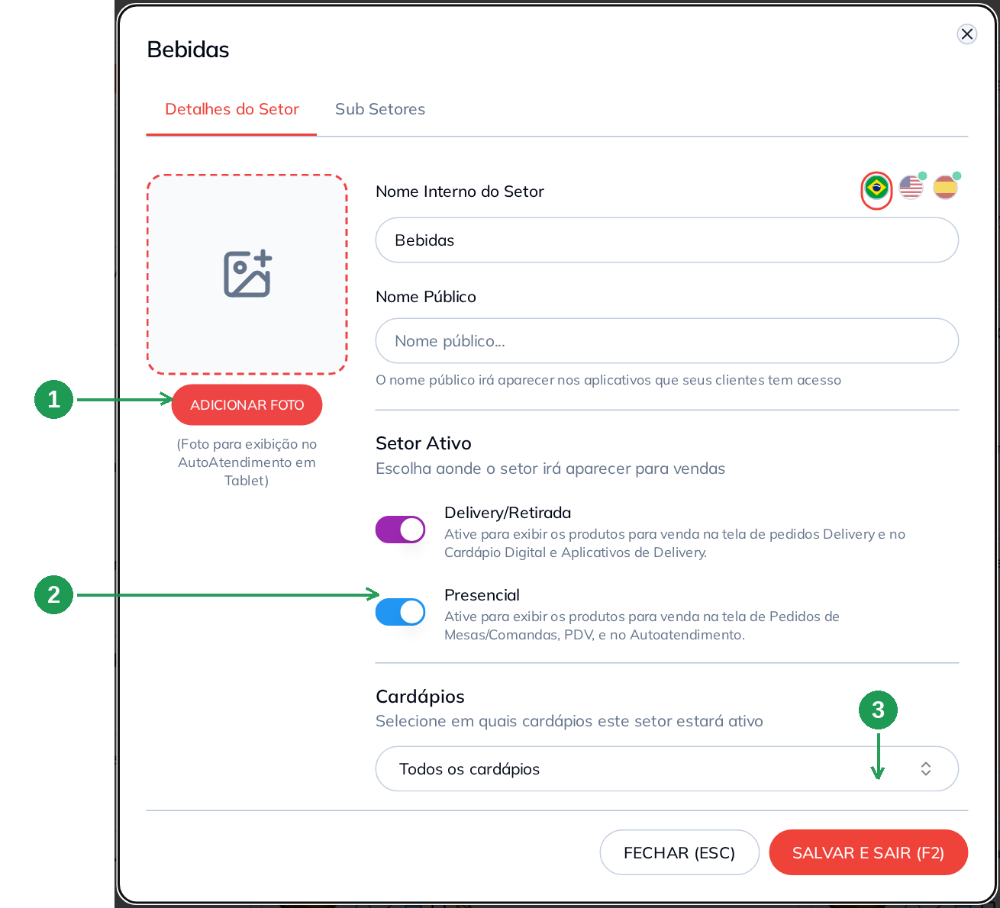

| Nº | Item | O que fazer |
|----|------|-------------|
| 1. | **ADICIONAR FOTO** | Abre a janela da imagem do setor. É esta foto que o totem usa na coluna da esquerda. |
| 2. | **Presencial** | Precisa estar ligado para o setor aparecer no totem, no PDV e em Mesas/Comandas. |
| 3. | **Cardápios** | Em qual cardápio o setor está ativo. *Todos os cardápios* vale para o totem também. |

Na janela da foto você pode **arrastar uma imagem sua** (1) — PNG, JPG ou WebP,
até 5 MB — ou pegar uma pronta no **Banco de imagens**, buscando pelo nome (2).
Escolhida a imagem, grave com **SALVAR** (3) e depois **SALVAR E SAIR (F2)** no
cadastro do setor.

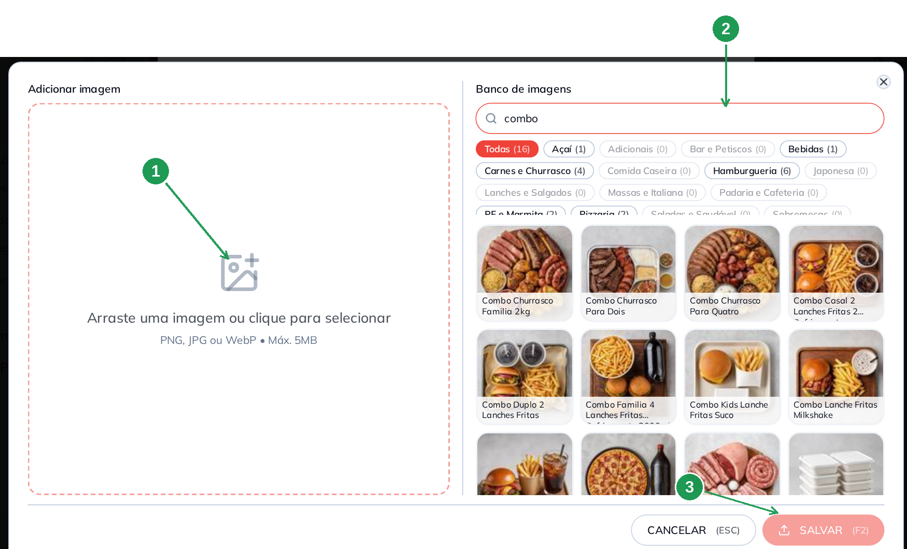

| Nº | Item | O que fazer |
|----|------|-------------|
| 1. | **Arrastar ou clicar** | Sobe uma imagem sua. PNG, JPG ou WebP, até 5 MB. |
| 2. | **Banco de imagens** | Busque por *combo*, *hambúrguer*, *refrigerante*… e clique na foto para escolher. |
| 3. | **SALVAR** | Grava a foto no setor. Depois é preciso **SALVAR E SAIR (F2)** no cadastro. |

### 7.3 Com foto no setor: tira de miniaturas

Com os setores fotografados, a mesma coluna vira uma **tira de miniaturas** com
o nome embaixo de cada foto (1). É o mesmo cardápio da seção 7.1 — o que mudou
foi só a foto no cadastro dos sete setores.

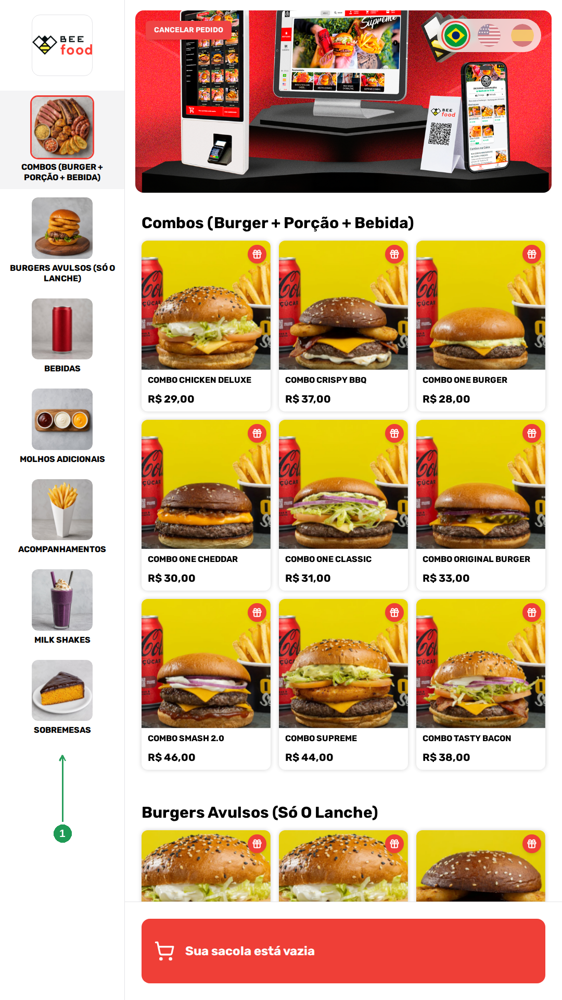

| Nº | Item | O que faz |
|----|------|-----------|
| 1. | **Coluna com miniaturas** | Cada setor vira foto com o nome embaixo. Só aparece assim quando o setor tem foto cadastrada. |

**A regra prática: ou todos os setores têm foto, ou nenhum.** Basta **um** setor
com foto para a coluna inteira virar miniatura — e aí o setor que ficou sem foto
entra com o **logotipo da loja** no lugar da miniatura dele. Não fica um buraco
na coluna, fica o seu logotipo repetido, o que também não ajuda o cliente a
achar o setor.

E atenção a uma diferença: **foto de produto não muda layout nenhum**. A grade
de três colunas continua igual, e o produto sem foto aparece como **cartão com
o ícone de imagem quebrada** — feio, não "lista simples". No totem, produto sem
foto é pior do que setor sem foto.

---

## 8. O pedido concluído: mensagem final e senha

Fechado o pagamento, o totem mostra o andamento, a **mensagem final** que você
escreveu (2) e a **senha do pedido** (3), que é o número que o cliente leva
para retirar. A tela volta sozinha para a espera em poucos segundos.

Nesta foto o passo *Imprimindo comprovante do pedido* deu **erro** (1), porque
a loja de teste não tem impressora ligada no aparelho — e o pedido foi para a
cozinha de todo jeito.

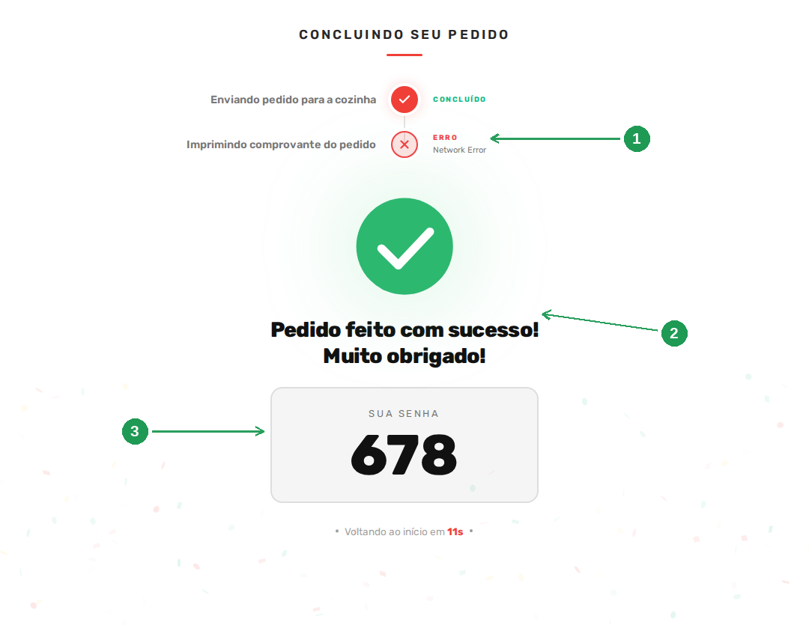

| Nº | Item | O que faz |
|----|------|-----------|
| 1. | **Erro de impressão** | Aparece quando não há impressora respondendo. Só a impressão falha: o pedido já foi enviado. |
| 2. | **Mensagem final** | O texto da seção 2.3. Troque-o para falar como a sua loja fala. |
| 3. | **SUA SENHA** | O número do pedido para o cliente chamar. Sai impresso quando *Imprimir Senha* está marcado. |

O que acontece depois disso — o pedido no Delivery, no Histórico e nos
relatórios — está no manual **O pedido do totem no painel**.

---

## Problemas comuns

| Sintoma | O que verificar |
|---------|-----------------|
| O card do Totem abre uma tela de apresentação, não a configuração | A loja não tem totem contratado. Fale com o suporte |
| Mudei um campo e não achei o botão Salvar | Não existe. A tela grava a cada clique; os campos de texto gravam pouco depois de você parar de digitar |
| Um setor não aparece no totem | A chave **Presencial** do setor está desligada, ou o setor não está no cardápio usado pelo aparelho |
| A coluna de setores está sem as fotos | Falta foto no cadastro do setor (seção 7.2). Sem foto em nenhum setor, a coluna é de texto por regra |
| Um setor aparece com o logotipo da loja no lugar da foto | Aquele setor está sem foto e outros da mesma coluna têm (seção 7.3). Cadastre a foto dele |
| Aparece o ícone de imagem quebrada nos produtos | É produto **sem foto**. Cadastre a foto do produto no Cardápio |
| O totem não oferece cartão nem Pix da maquininha | Os meios TEF exigem pinpad ligado no aparelho e forma de recebimento escolhida na aba Pagamentos |
| Apareceu desconto que eu não pedi na tela de pagamento | É o desconto da **forma de pagamento**: veja **Cadastros → Formas Recebimento** e **Cardápio Digital → Pagamento Online** |
| O totem avisa erro ao imprimir | A impressora do aparelho não respondeu. O pedido foi enviado: confira a impressora em **Impressão** ou desmarque a impressão |
| O cliente não vê as bandeiras de idioma | **Habilitar tradução** desmarcado na aba Configuração |
| O totem não pede mesa | **Identificação de Entrega do Pedido** está em *Desativado* |
| O aparelho continua com a configuração antiga | Feche e abra o totem: ele lê a configuração ao abrir |
| Abri a URL e veio o cardápio de outra loja | A URL tem o código da loja e o token. Copie de novo pela aba **Download**, no botão **Copiar** |

---

## Perguntas frequentes

**Preciso instalar algum programa no totem?**
Não. O totem é um endereço que abre no navegador. O arquivo `.cmd` da aba
Download só serve para abrir esse endereço em tela cheia, no modo kiosk.

**Posso usar o mesmo endereço em dois totens?**
A URL é da loja, e a quantidade de aparelhos é a do seu contrato. Precisando de
mais totens, fale com o suporte.

**O totem funciona sem maquininha?**
Sim, com **Dinheiro** ligado na aba Pagamentos. O cliente fecha o pedido e paga
no caixa.

**O totem emite nota fiscal?**
Emite, com **Emitir NFCe e Imprimir** marcado na aba Configuração. Desmarcado,
a venda do totem sai sem nota — você emite depois, pelo painel.

**Como eu troco a cor e o logotipo do aparelho?**
Na aba **Aparência**: tema, cor principal, logotipo e capa.

**Posso rodar vídeo na tela de espera?**
Sim, em **Aparência → Slides / Vídeos**. Use MP4 H.264, até 1080×1920, 4 a 6
Mbps. HEVC/H.265 e 4K não rodam.

**Para que serve a senha do administrador?**
Ela libera o acesso administrativo na própria tela do totem. É numérica e fica
na aba Configuração.

**A foto do produto muda o layout do totem?**
Não. Só a **foto do setor** muda a coluna da esquerda. Produto sem foto
continua na grade, com o ícone de imagem quebrada.

**Onde o cliente informa a mesa?**
No próprio totem, quando **Identificação de Entrega do Pedido** está em
*Informar Número da Mesa*. O número vai com o pedido para o painel.

**O cliente é obrigado a informar o telefone?**
Depende de **Nome / Telefone**, na aba Configuração. Vale lembrar que é o
telefone que traz o **cashback** e os cupons que exigem identificação.

**O cupom de desconto funciona no totem?**
Sim, com o canal *Totem* ligado no cupom. O manual **Cupom e cashback no
totem** mostra como.

---

## Manuais relacionados

| Manual | O que traz |
|--------|------------|
| **Mais de um cardápio no mesmo totem** | A aba Cardápios em detalhe: o cliente escolhendo o cardápio, os dois juntos numa tela e o pedido misto |
| **Cupom e cashback no totem** | O canal *Totem* no cupom, a modalidade *Pedidos via Totem* no cashback e o que o cliente vê |
| **O pedido do totem no painel** | A venda do totem no Delivery, no Histórico e no Desempenho por origem |
| **Tradução do cardápio presencial** | Como escrever o cardápio em inglês e espanhol para o totem |
| **Manual do Cardápio — Fundamentos** | Cadastro de setor e de produto, inclusive a foto |
| **Formas de Recebimento** | O desconto e o acréscimo por forma de pagamento |

---

## Precisa de ajuda?

Fale com o **suporte BeeFood** informando: nome da loja, **CNPJ** e a **versão
do totem** que aparece no pé da tela do aparelho.

---

*Última atualização: setembro/2026 — BeeFood · Totem de Autoatendimento*
