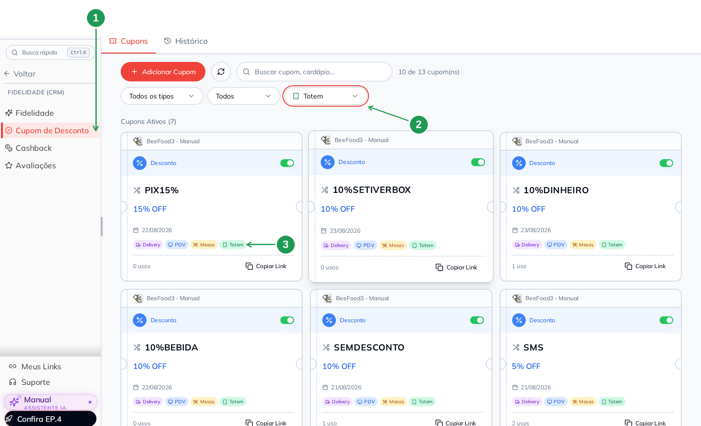
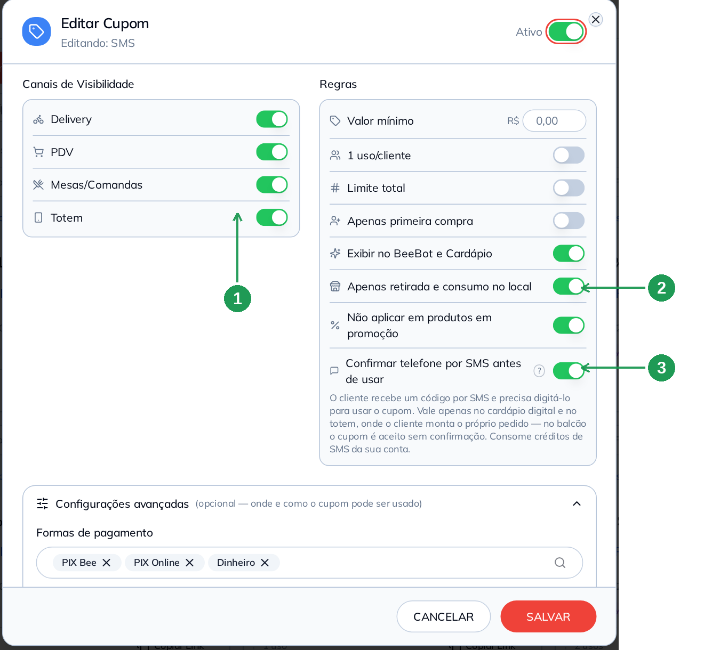
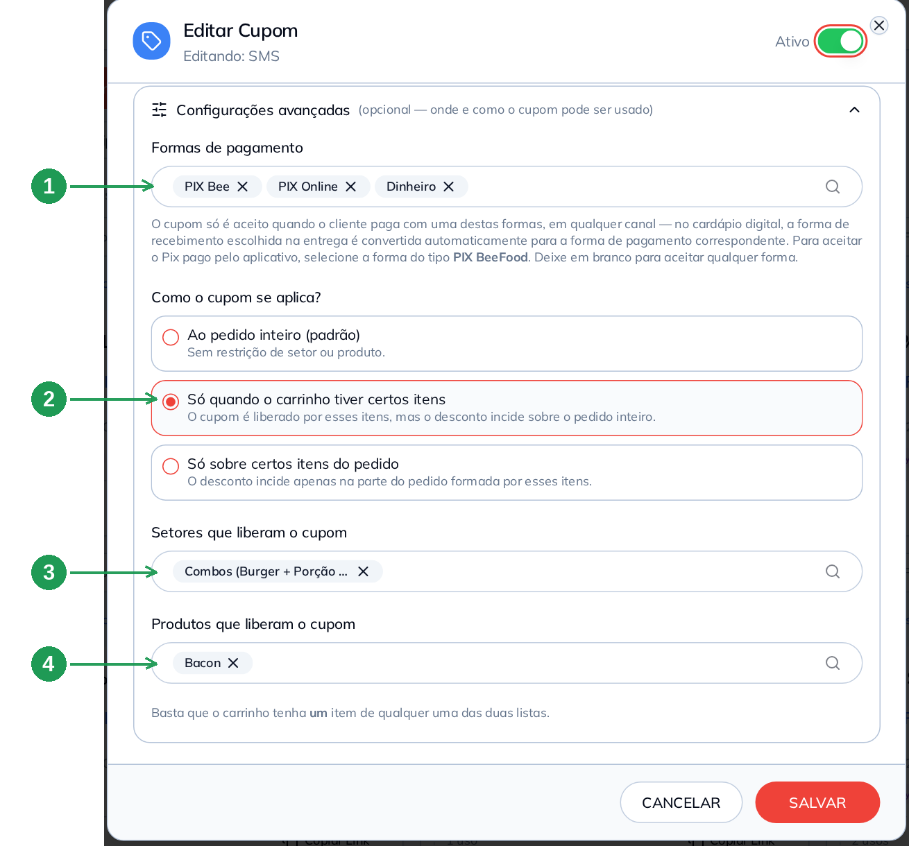
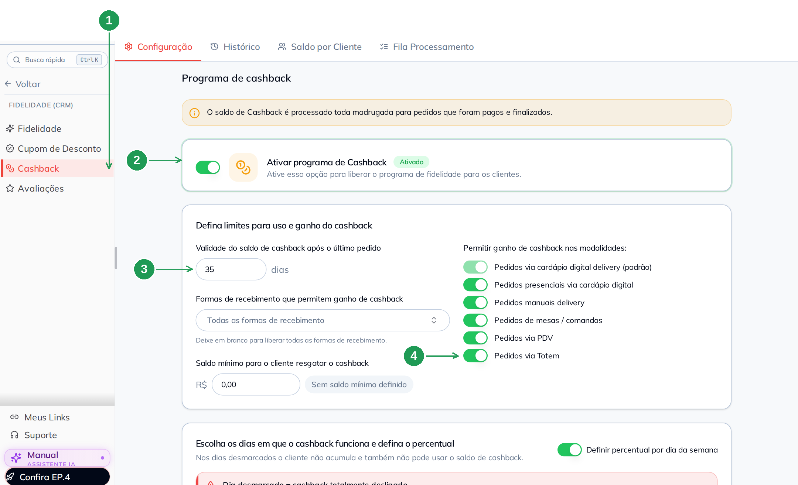
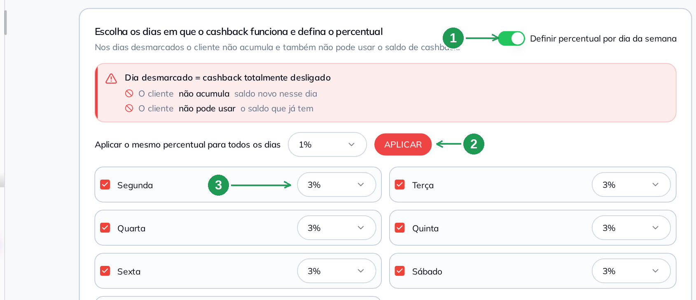
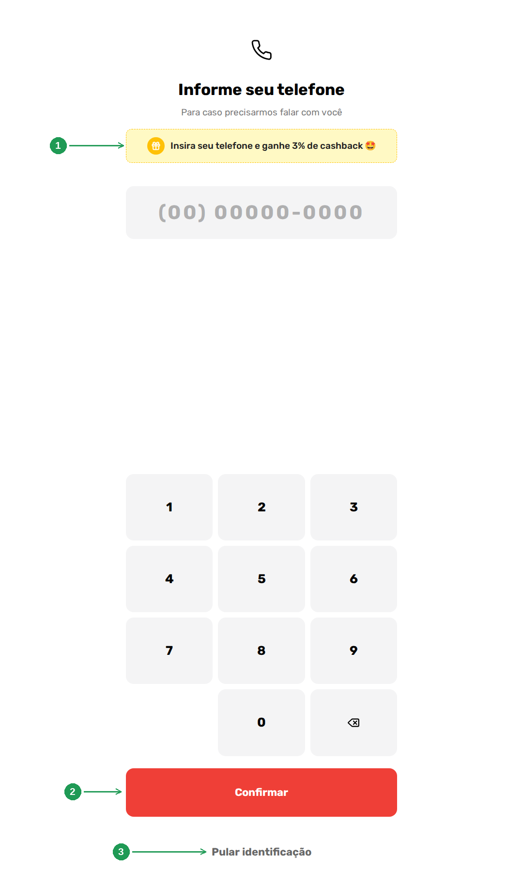
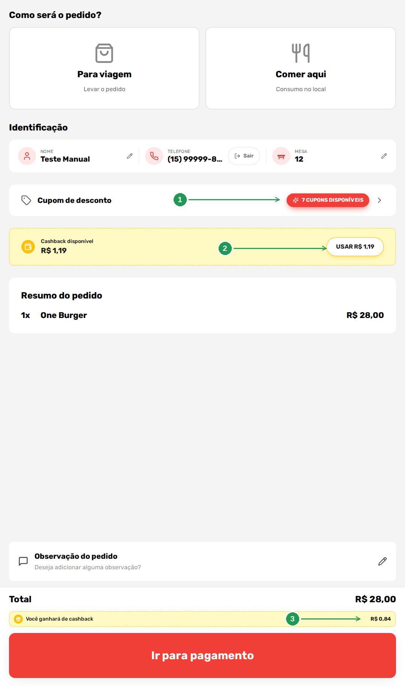
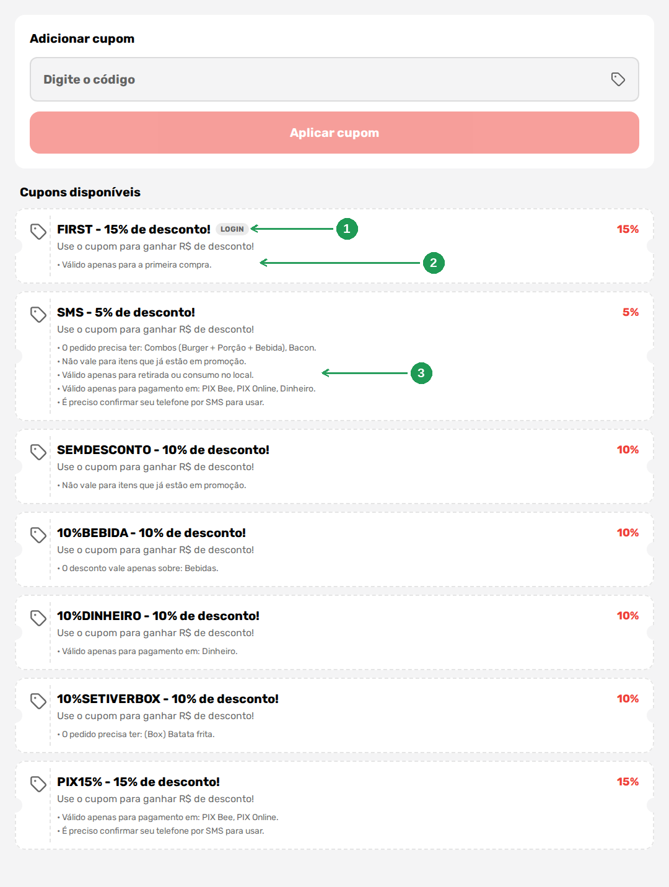

# Cupom e cashback no totem: como o CRM aparece na tela do autoatendimento

O totem **não tem cadastro de cupom nem de cashback**. Ele lê o que o seu CRM
já tem — e é isso que torna a configuração simples: você liga duas chaves, e o
aparelho monta a tela sozinho.

São estas duas:

| Onde | Chave |
|------|-------|
| **Fidelidade (CRM) → Cupom de Desconto**, dentro do cupom | canal **Totem** |
| **Fidelidade (CRM) → Cashback** | modalidade **Pedidos via Totem** |

O resto é consequência. Cada regra que você marca no cupom vira **uma frase na
tela do cliente**, com as palavras do próprio sistema; e o percentual de
cashback do dia vira a oferta que o totem faz antes de o cliente digitar o
telefone.

> As imagens têm **setas numeradas** (1, 2, 3…). Cada número indica o campo ou
> botão correspondente na tela.

---

## Antes de começar

- O totem precisa estar **contratado e configurado** — é o manual **Totem de
  Autoatendimento: pôr no ar e configurar**.
- **Identificação do cliente ligada no totem.** Cupom com login e cashback só
  funcionam quando o cliente informa o **telefone**: em *Aplicativos → Totem de
  Autoatendimento → Configuração → Identificação do Cliente*, use uma opção com
  **Nome e Telefone**.
- Cupom **Frete Grátis** não vale no totem (nem no PDV, nem em Mesas): o canal
  fica desligado e travado, porque não há frete em pedido feito no balcão.

---

## 1. O cupom só aparece no totem com o canal Totem ligado

**Fidelidade (CRM) → Cupom de Desconto** (1). O terceiro filtro da lista é o de
**canal**: escolha **Totem** (2) para ver exatamente o que o aparelho vai
mostrar. Na etiqueta de cada cartão você também enxerga os canais do cupom —
*Delivery*, *PDV*, *Mesas*, *Totem* (3).

| Nº | Item | O que fazer |
|----|------|-------------|
| 1. | **Cupom de Desconto** | O menu do CRM onde os cupons são cadastrados. |
| 2. | **Filtro de canal** | Selecione *Totem*. O contador no alto mostra quantos cupons têm esse canal. |
| 3. | **Etiquetas do cartão** | Os canais de cada cupom. Sem a etiqueta *Totem*, ele não aparece no aparelho. |

Duas coisas que o filtro ensina de uma vez:

- o aparelho lista só cupom **ativo** com canal *Totem* — no exemplo, **7**, e é
  esse número que aparece no selo da tela do cliente (seção 7);
- a chave **Ativo** do cupom vale para todos os canais: cupom desligado não
  aparece em lugar nenhum.

---

## 2. Dentro do cupom: o canal à esquerda, as regras à direita

Clique no código do cupom para abrir. A janela tem duas colunas que conversam
diretamente com a tela do totem: **Canais de Visibilidade** (1), onde fica o
*Totem*, e **Regras** (2 e 3), onde cada chave ligada vira uma frase para o
cliente ler.

| Nº | Item | O que fazer |
|----|------|-------------|
| 1. | **Canal Totem** | Ligue para o cupom aparecer no aparelho. Os quatro canais são independentes. |
| 2. | **Apenas retirada e consumo no local** | Ligada, o totem escreve *"Válido apenas para retirada ou consumo no local"*. |
| 3. | **Confirmar telefone por SMS antes de usar** | O cliente recebe um código por SMS e digita no aparelho. Vale **só** no cardápio digital e no totem, onde ele mesmo monta o pedido. Consome créditos de SMS da sua conta. |

Duas observações sobre o SMS, escritas na própria tela:

- **sem saldo de SMS**, o cupom é liberado normalmente, sem validação;
- se o cupom **não tem** canal *Totem* nem *Delivery*, a tela avisa que a
  confirmação por SMS não vai ser aplicada — não existe onde pedir o código.

---

## 3. Configurações avançadas: pagamento e itens que liberam o cupom

Ainda no cupom, o bloco **Configurações avançadas** é onde nascem as frases mais
específicas do totem. **Formas de pagamento** (1) restringe o cupom a certas
formas; **Como o cupom se aplica?** (2) decide se o carrinho precisa ter certos
itens; e as duas listas abaixo dizem quais **setores** (3) e **produtos** (4)
liberam o benefício.

| Nº | Item | O que fazer |
|----|------|-------------|
| 1. | **Formas de pagamento** | O cupom só é aceito pagando com uma destas formas. Em branco, aceita qualquer forma. No totem, a lista vira a frase *"Válido apenas para pagamento em: …"*. |
| 2. | **Como o cupom se aplica?** | *Ao pedido inteiro*, *Só quando o carrinho tiver certos itens* (libera, e o desconto incide em tudo) ou *Só sobre certos itens do pedido* (o desconto incide só naquela parte). |
| 3. | **Setores que liberam o cupom** | Basta **um** item do setor no carrinho. |
| 4. | **Produtos que liberam o cupom** | Idem, por produto. Vale um item de qualquer uma das duas listas. |

---

## 4. Cashback: ligar a modalidade Pedidos via Totem

**Fidelidade (CRM) → Cashback** (1), aba **Configuração**. Primeiro o programa
precisa estar ligado (2). Depois, em *Permitir ganho de cashback nas
modalidades*, ligue **Pedidos via Totem** (4) — é a chave que faz o
autoatendimento entrar no programa. A **validade do saldo** (3) conta a partir
do último pedido do cliente.

| Nº | Item | O que fazer |
|----|------|-------------|
| 1. | **Cashback** | O menu do CRM. As outras abas mostram histórico, saldo por cliente e a fila de processamento. |
| 2. | **Ativar programa de Cashback** | Sem isto, nenhuma modalidade funciona. |
| 3. | **Validade do saldo** | Em dias, contados do último pedido. Aqui, 35 dias. |
| 4. | **Pedidos via Totem** | **A chave deste manual.** Desligada, o totem não oferece nem aceita cashback. |

O aviso no alto da tela vale para o totem também: **o saldo é processado toda
madrugada**, para pedidos pagos e finalizados. O cliente não ganha o crédito no
instante do pedido — ele aparece depois.

---

## 5. O percentual que o totem anuncia

O número que o cliente lê no aparelho (*"ganhe 3% de cashback"*) é o percentual
do **dia da semana**. Com a chave *Definir percentual por dia da semana* (1),
cada dia tem o seu; o botão **APLICAR** (2) repete o mesmo percentual em todos
os dias de uma vez, e o campo de cada dia (3) ajusta um por um.

| Nº | Item | O que fazer |
|----|------|-------------|
| 1. | **Definir percentual por dia da semana** | Ligada, libera um percentual por dia. Desligada, vale um percentual único. |
| 2. | **Aplicar o mesmo percentual** | Escolha o percentual e clique em **APLICAR** para preencher a semana inteira. |
| 3. | **Percentual do dia** | O que o totem anuncia naquele dia. Aqui, 3%. |

Atenção ao aviso em vermelho: **dia desmarcado é cashback totalmente
desligado** — nesse dia o cliente não acumula **e também não pode usar** o saldo
que já tem. No totem isso aparece como ausência: nem a oferta do telefone, nem
o saldo na confirmação.

---

## 6. Como o cliente vê: a oferta antes do telefone

Na tela de identificação, o totem usa o cashback como motivo para o cliente se
identificar: a faixa amarela (1) traz o percentual do dia. Ele digita o
telefone e toca em **Confirmar** (2) — ou segue sem se identificar em **Pular
identificação** (3), e aí não há cashback nem cupom com login.

| Nº | Item | O que faz |
|----|------|-----------|
| 1. | **Faixa de cashback** | *"Insira seu telefone e ganhe 3% de cashback"*. O percentual vem da seção 5. |
| 2. | **Confirmar** | O totem procura o telefone no seu cadastro de clientes. Achando, mostra o nome e o saldo. |
| 3. | **Pular identificação** | Pedido anônimo: sem cashback e sem cupom que exija login. |

---

## 7. Como o cliente vê: o selo de cupons e o saldo na confirmação

Na tela de confirmação do pedido acontece tudo junto. O cliente reconhecido
aparece com nome, telefone e o botão **Sair**; a linha **Cupom de desconto**
mostra quantos cupons estão disponíveis (1); a faixa amarela traz o **saldo de
cashback** com o botão de usar (2); e a barra do total avisa quanto ele
**ganhará** com esta compra (3).

| Nº | Item | O que faz |
|----|------|-----------|
| 1. | **Selo de cupons disponíveis** | A contagem dos cupons ativos com canal *Totem* (seção 1). Toque abre a lista. |
| 2. | **Cashback disponível / USAR** | O saldo do cliente. O botão abate o valor no pedido. |
| 3. | **Você ganhará de cashback** | O que a compra vai gerar: aqui, R$ 0,84, que é 3% de R$ 28,00. Entra no saldo depois do processamento da madrugada. |

Repare que o **saldo** e o **ganho** são coisas diferentes: o saldo é crédito de
compras anteriores e pode ser usado agora; o ganho é o crédito desta compra.

---

## 8. Como o cliente vê: as regras do cupom em texto

Na lista de cupons, o totem desenha o cadastro inteiro: código, benefício e
**uma linha por regra**. É aqui que o trabalho do CRM fica visível — o cliente
lê, em português, exatamente o que você marcou.

O selo **LOGIN** (1) aparece no cupom que precisa saber quem é o cliente — no
exemplo, o de primeira compra, cuja regra vem logo abaixo (2). Cupom com várias
regras mostra várias linhas (3), na ordem do cadastro.

| Nº | Item | O que faz |
|----|------|-----------|
| 1. | **Selo LOGIN** | O cupom exige cliente identificado. Sem telefone, ele não pode ser usado. |
| 2. | **Regra em texto** | *"Válido apenas para a primeira compra"* é a chave **Apenas primeira compra** do cadastro. |
| 3. | **Várias regras** | Cada chave ligada vira uma linha. O cliente vê todas antes de escolher. |

No alto da lista há **Adicionar cupom** com o campo *Digite o código* e o botão
*Aplicar cupom*: serve para o cupom que você divulgou por fora e que o cliente
sabe de cor.

### De onde sai cada frase

| O que você marca no cupom | O que o totem escreve |
|---------------------------|------------------------|
| **Apenas primeira compra** | selo **LOGIN** + *"Válido apenas para a primeira compra."* |
| **Não aplicar em produtos em promoção** | *"Não vale para itens que já estão em promoção."* |
| **Apenas retirada e consumo no local** | *"Válido apenas para retirada ou consumo no local."* |
| **Formas de pagamento** (avançadas) | *"Válido apenas para pagamento em: PIX Bee, PIX Online, Dinheiro."* |
| **Setores/produtos que liberam o cupom** | *"O pedido precisa ter: Combos (Burger + Porção + Bebida), Bacon."* |
| **Setores/produtos que recebem o desconto** | *"O desconto vale apenas sobre: Bebidas."* |
| **Confirmar telefone por SMS antes de usar** | *"É preciso confirmar seu telefone por SMS para usar."* |

Duas consequências práticas:

- **regra confusa no cadastro vira frase confusa na tela.** Nome de setor e de
  produto aparecem exatamente como estão cadastrados;
- **cupom com muita regra espanta.** No totem o cliente está de pé, com fila
  atrás: quanto menos linhas, mais cupom usado.

---

## 9. Por que o cupom não apareceu no totem?

É a pergunta que mais chega no suporte. Confira nesta ordem:

1. o cupom está **Ativo**?
2. o canal **Totem** está ligado no cupom?
3. o tipo do cupom é **Frete Grátis**? Então ele não vale no totem.
4. a **validade** do cupom já passou, ou o dia da semana dele não é hoje?
5. o cupom é de **primeira compra** ou tem **1 uso/cliente**, e o cliente não se
   identificou?
6. o **limite total** de usos já foi atingido?
7. o cliente já estava com o totem aberto quando você mexeu no cadastro? O
   aparelho lê os cupons **ao iniciar o pedido**.

---

## Problemas comuns

| Sintoma | O que verificar |
|---------|-----------------|
| O selo de cupons não aparece no totem | Nenhum cupom ativo tem o canal **Totem**. Filtre a lista por canal (seção 1) |
| O cupom aparece, mas o cliente não consegue usar | Alguma regra não foi cumprida — a linha de texto embaixo do cupom diz qual |
| O canal Totem está travado no cupom | O cupom é **Frete Grátis**. Esse tipo só vale no delivery |
| O totem não oferece cashback | **Ativar programa de Cashback** desligado, ou a modalidade **Pedidos via Totem** desligada |
| O cashback aparece no delivery e não no totem | É a modalidade: cada canal tem a sua chave, e a do totem é *Pedidos via Totem* |
| Hoje o totem não fala de cashback | O **dia da semana** está desmarcado na configuração — nesse dia o cliente não acumula nem usa saldo |
| O percentual do totem está diferente do que eu configurei | O percentual é **por dia da semana**. Confira o dia de hoje (seção 5) |
| O cliente pediu e o saldo não entrou | O saldo é processado **na madrugada**, para pedidos pagos e finalizados |
| O cliente não vê saldo nenhum | Ele pulou a identificação, ou o telefone digitado não é o do cadastro |
| O código de SMS não chega | Sem saldo de SMS o cupom é liberado sem validação; confira o saldo em **Food Marketing → SMS** |
| Mexi no cupom e o totem continua igual | Reinicie o pedido no aparelho: a lista de cupons é lida ao iniciar |

---

## Perguntas frequentes

**O cupom do totem é cadastrado em outro lugar?**
Não. É o mesmo cupom do CRM, com o canal **Totem** ligado. Um cupom pode valer
em delivery, PDV, mesas e totem ao mesmo tempo.

**O cliente precisa se identificar para usar cupom no totem?**
Só quando o cupom exige — primeira compra, um uso por cliente ou confirmação por
SMS. Os outros funcionam com pedido anônimo.

**Como o cliente digita um código de cupom no totem?**
Na lista de cupons, em **Adicionar cupom** → *Digite o código* → **Aplicar
cupom**.

**Cupom de frete grátis funciona no totem?**
Não. O canal fica desligado e travado no cadastro.

**O cashback do totem é o mesmo do cardápio digital?**
É o mesmo saldo do cliente, no mesmo programa. O que muda é a **modalidade** que
libera o ganho em cada canal.

**Dá para o cliente usar o saldo de cashback no totem?**
Sim, no botão **USAR** da tela de confirmação — desde que o dia esteja marcado e
o saldo alcance o mínimo de resgate configurado.

**Onde vejo o saldo de cada cliente?**
Em **Fidelidade (CRM) → Cashback**, nas abas **Saldo por Cliente** e
**Histórico**.

**O percentual de cashback pode ser diferente no totem?**
Não. O percentual é por **dia da semana** e vale para todas as modalidades
ligadas.

**A confirmação por SMS gasta dinheiro?**
Gasta créditos de SMS da sua conta. Sem saldo, o cupom continua funcionando, só
sem a validação.

**O totem mostra o cupom que está fora da validade?**
Não. Ele lista apenas os cupons válidos e ativos no momento em que o cliente
inicia o pedido.

---

## Manuais relacionados

| Manual | O que traz |
|--------|------------|
| **Totem de Autoatendimento: pôr no ar e configurar** | As cinco abas do totem, inclusive a identificação do cliente |
| **O pedido do totem no painel** | A venda do totem no Delivery, no Histórico e no Desempenho |
| **Cupom de Desconto (CRM)** | O cadastro completo do cupom, campo por campo |
| **Cashback — configurar** | O programa de cashback, modalidades e percentuais |
| **Cashback — operar** | Saldo por cliente, extrato e ajuste manual |

---

## Precisa de ajuda?

Fale com o **suporte BeeFood** informando: nome da loja, **CNPJ** e o **código
do cupom** que não apareceu no aparelho.

---

*Última atualização: setembro/2026 — BeeFood · Cupom e cashback no totem*
