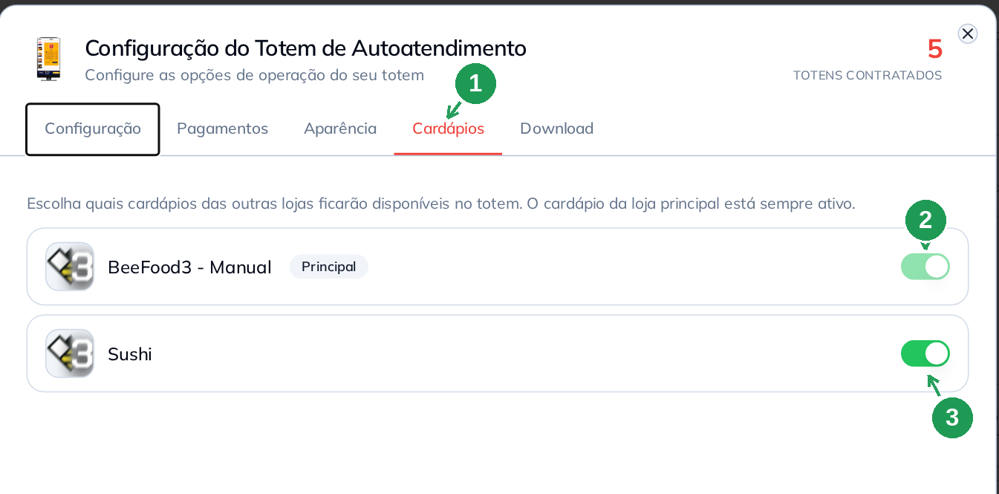
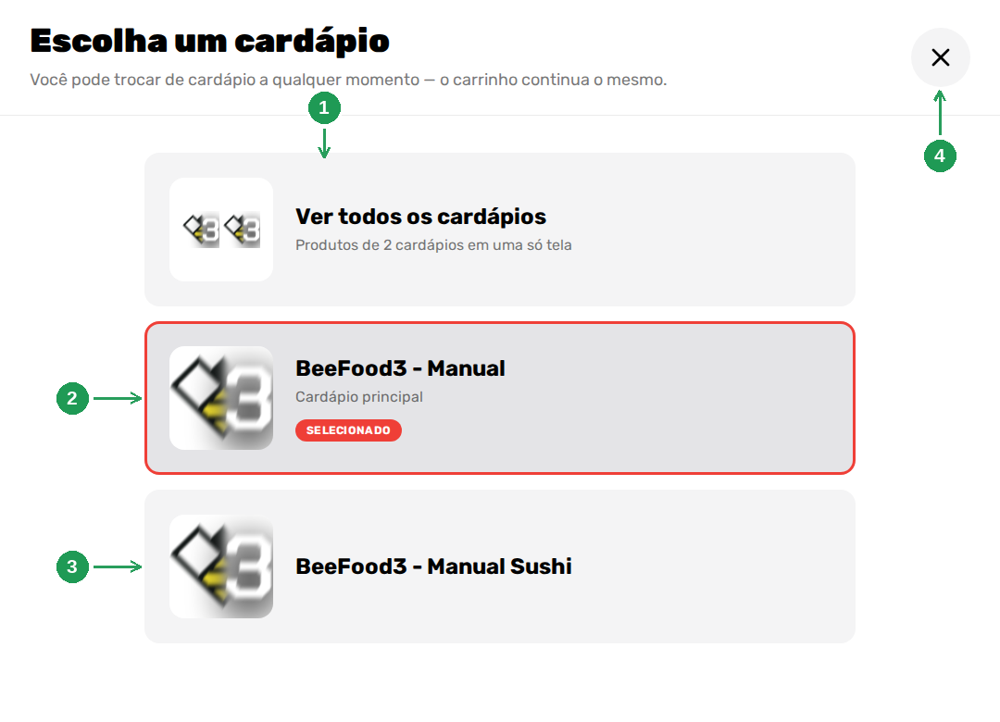
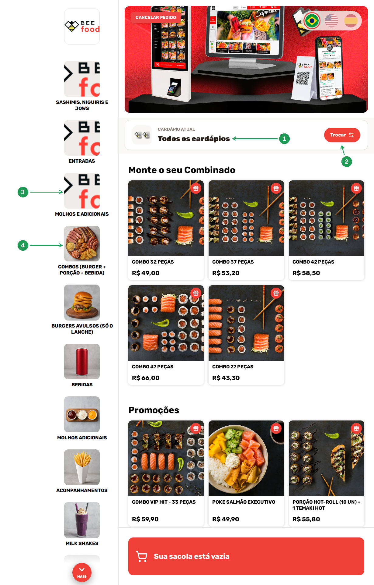
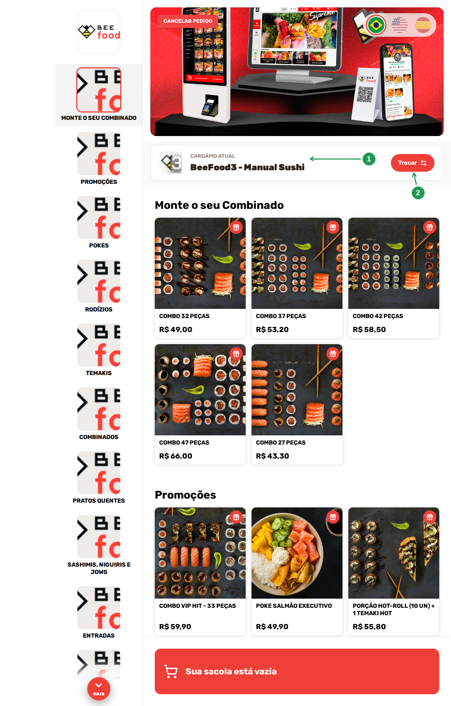
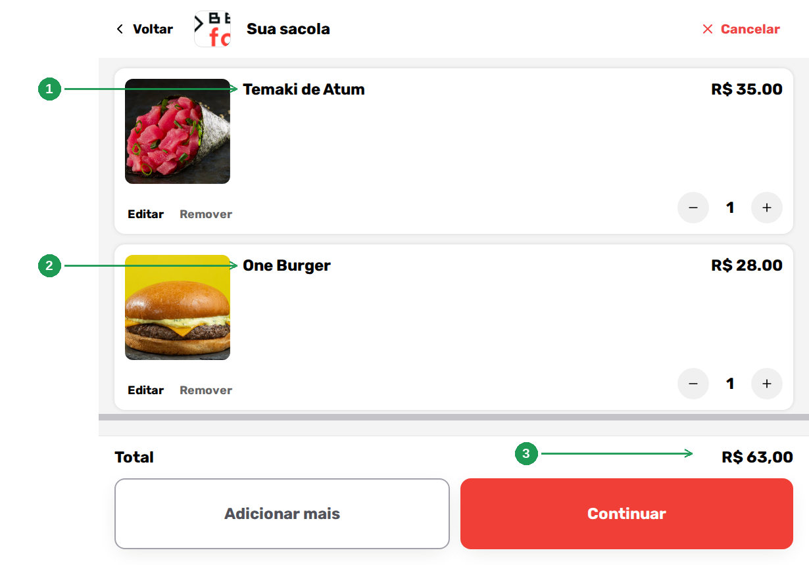
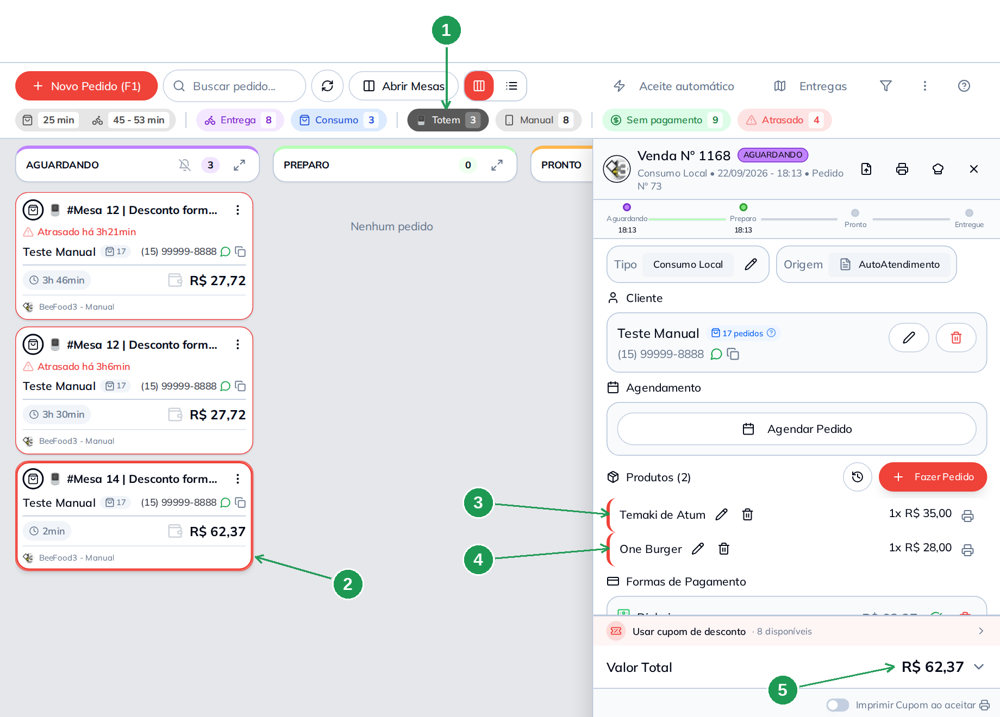
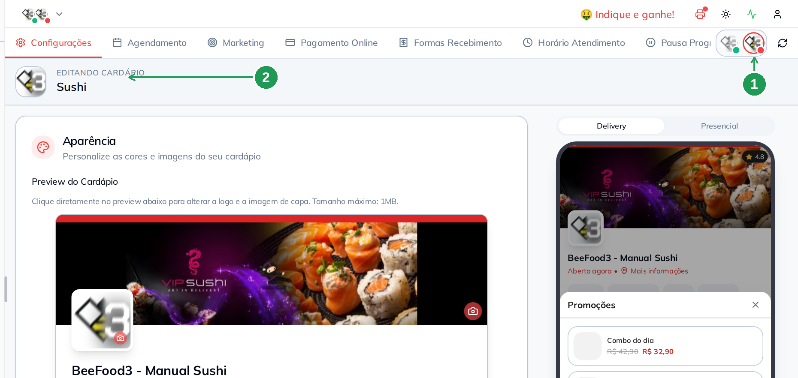

# Totem de Autoatendimento: mais de um cardápio no mesmo totem

Um totem pode mostrar **mais de um cardápio**. É o caso de quem opera duas
marcas no mesmo salão — a hamburgueria e o sushi, o café e a padaria — e quer um
aparelho só na porta.

Ligado o segundo cardápio, o cliente ganha uma tela nova: ao tocar em **FAÇA SEU
PEDIDO**, o totem pergunta **em qual cardápio ele quer pedir** — ou oferece os
dois juntos, numa tela só. E, escolha o que escolher, **o pedido continua sendo
um**: uma sacola, um pagamento, uma venda no painel.

Este manual mostra as duas pontas: a chave que liga o cardápio no painel e cada
tela que o cliente passa a ver no aparelho.

> As imagens têm **setas numeradas** (1, 2, 3…). Cada número indica o campo ou
> botão correspondente na tela.

---

## Antes de começar

- O totem precisa estar **no ar e configurado**. Se ainda não está, comece pelo
  manual **Como pôr o totem no ar e configurar**.
- O segundo cardápio é o **Cardápio Adicional**, um item do seu plano,
  contratado **por loja**. Ele não se cria na tela do totem: é contratado no
  **plano da sua conta** ou com o **suporte BeeFood**, e pode ser um cardápio
  novo ou um cardápio que você já tem em outra filial.
- Cada cardápio adicional é uma **loja** no BeeFood, com **Cardápio Digital
  habilitado**. Loja sem o cardápio liberado aparece na lista do totem apagada,
  e a chave dela não liga.
- Você precisa saber **o que vai em cada cardápio**: setor e produto têm, no
  cadastro, o campo que diz em quais cardápios eles entram (seção 7).

---

## 1. Ligar o cardápio adicional no totem

**Aplicativos → Totem de Autoatendimento → aba Cardápios** (1).

A aba lista as lojas da sua empresa. A **loja principal** vem com a etiqueta
*Principal* e a chave **marcada e travada** (2) — o cardápio da loja do totem
está sempre no aparelho e não se desliga. Nas outras lojas a chave é livre:
ligue a do cardápio que você quer no totem (3).

**Não existe botão Salvar.** A chave grava no clique, e o sistema confirma com o
aviso *Cardápios salvos*.

| Nº | Item | O que fazer |
|----|------|-------------|
| 1. | **Aba Cardápios** | A quarta aba da configuração do totem. É a única tela onde se decide quais cardápios o aparelho mostra. |
| 2. | **Loja principal** | Marcada e travada, com a etiqueta *Principal*. O cardápio da loja do totem está sempre ativo. |
| 3. | **Chave do cardápio adicional** | Ligue para o cardápio entrar no aparelho; desligue para tirá-lo. Grava na hora. |

> Numa loja só, a aba mostra apenas a linha *Principal* e a frase *"Nenhum outro
> cardápio disponível"* — não há nada a fazer nela.

Loja que ainda não tem cardápio liberado aparece **apagada**, com o selo
*Cardápio Digital não habilitado* e a chave travada. Nesse caso o caminho é
liberar o cardápio daquela loja, não mexer no totem.

**Feche e abra o totem** depois de ligar a chave: o aparelho lê a configuração
ao abrir.

---

## 2. O cliente escolhe o cardápio

Com dois cardápios ativos, o toque em **FAÇA SEU PEDIDO** não vai mais direto
para a grade de produtos: ele abre a tela **Escolha um cardápio**. Ela traz três
tipos de opção — **Ver todos os cardápios** (1), o **cardápio principal** (2) e
cada **cardápio adicional** ligado (3). O **X** (4) volta para a tela de espera.

O cardápio em uso recebe o selo **SELECIONADO** e a borda na cor principal do
seu totem.

| Nº | Item | O que faz |
|----|------|-----------|
| 1. | **Ver todos os cardápios** | Junta os produtos de todos os cardápios ligados numa tela só (seção 3). A miniatura mostra os logotipos dos cardápios. |
| 2. | **Cardápio principal** | O cardápio da loja do totem. Traz a legenda *Cardápio principal* e, aqui, o selo *SELECIONADO*. |
| 3. | **Cardápio adicional** | Um cartão por cardápio ligado na aba Cardápios. Toque para pedir só nele (seção 4). |
| 4. | **X** | Fecha a escolha e volta para a tela de espera, sem começar o pedido. |

O texto embaixo do título é a regra da tela, e vale a pena ler junto com o
cliente: *"Você pode trocar de cardápio a qualquer momento — o carrinho continua
o mesmo."*

> Esta tela **só existe a partir do segundo cardápio**. Com um cardápio só, o
> totem continua indo direto para os produtos, como sempre.

---

## 3. Ver todos os cardápios: os dois na mesma tela

É a opção que mais muda a experiência: o totem monta **uma grade com os produtos
de todos os cardápios** e uma coluna de setores com os setores de todos eles. O
cabeçalho passa a mostrar **CARDÁPIO ATUAL — Todos os cardápios** (1), e o botão
**Trocar** (2) reabre a escolha da seção 2.

A ordem da coluna é: primeiro os setores do cardápio adicional, depois os da
loja principal. Nesta foto a emenda está visível — os três primeiros setores (3)
são do cardápio de sushi e os de baixo (4) são da hamburgueria.

| Nº | Item | O que faz |
|----|------|-----------|
| 1. | **CARDÁPIO ATUAL** | Mostra *Todos os cardápios* quando o cliente juntou os dois. É o jeito de saber onde ele está. |
| 2. | **Trocar** | Reabre a tela *Escolha um cardápio*. Está sempre no cabeçalho, em qualquer cardápio. |
| 3. | **Setor sem foto** | Setor sem foto cadastrada entra com o **logotipo da loja** no lugar da miniatura. |
| 4. | **Setor com foto** | Setor com foto entra com a própria foto. É a regra do layout do totem (manual de configuração, seção 7). |

**Setor que está nos dois cardápios aparece uma vez só**, com os produtos dos
dois juntos. É o que acontece com setores de nome comum — *Bebidas*,
*Sobremesas* — quando o mesmo setor está marcado nos dois cardápios. Aqui, dos
19 setores dos dois cardápios, a tela mostra 17: *Bebidas* e *Sobremesas* são o
mesmo setor nos dois.

> **Confira os nomes dos setores antes de ligar a chave.** Dois setores
> parecidos, um de cada cardápio (*Molhos e Adicionais* e *Molhos adicionais*, na
> foto acima), aparecem os dois na mesma coluna e confundem o cliente. A tela
> junta o que você cadastrou; ela não adivinha que é a mesma coisa.

---

## 4. Um cardápio só — e a troca no meio do pedido

Escolhido um cardápio, o totem mostra **só ele**: os setores dele na coluna e os
produtos dele na grade. O cabeçalho mostra o nome do cardápio (1) e o botão
**Trocar** (2) continua ali.

| Nº | Item | O que faz |
|----|------|-----------|
| 1. | **CARDÁPIO ATUAL** | O nome do cardápio em que o cliente está pedindo. |
| 2. | **Trocar** | Volta para a escolha. **A sacola não se perde** na troca. |

Compare esta foto com a da seção 3: é o **mesmo cardápio de sushi**, mas aqui a
coluna tem só os setores dele — os da hamburgueria ficaram de fora.

> O nome que o cliente lê no aparelho é o **nome da loja** daquele cardápio. Na
> lista do painel pode aparecer um nome mais curto; se o que o cliente vê não
> está bom, ajuste o nome da loja do cardápio.

Um cardápio pode aparecer com o selo **INDISPONÍVEL** e sem aceitar toque:
significa que o aparelho **tentou baixar aquele cardápio e não conseguiu** —
geralmente rede instável. Feche e abra o totem.

---

## 5. A sacola é uma só

Esta é a parte que resolve a dúvida mais comum: o cliente **pode misturar** os
cardápios. Aqui ele pegou um temaki no cardápio de sushi (1), trocou de cardápio
e pegou um hambúrguer no principal (2). Os dois estão na mesma sacola, e o
**Total** (3) é a soma dos dois.

| Nº | Item | O que faz |
|----|------|-----------|
| 1. | **Item do cardápio adicional** | O temaki, pedido no cardápio de sushi. |
| 2. | **Item do cardápio principal** | O hambúrguer, pedido depois da troca de cardápio. |
| 3. | **Total** | Soma os itens dos dois cardápios. O pagamento é **um só**. |

Daqui para a frente **nada muda**: identificação do cliente, mesa ou pager, meio
de consumo e pagamento são os mesmos de sempre. O desconto da forma de pagamento
também vale para o pedido inteiro — neste, o 1% do Dinheiro levou os R$ 63,00
para R$ 62,37.

*(A foto junta duas partes da mesma tela — os itens no alto e o total no pé —
separadas pela faixa cinza.)*

---

## 6. No painel, o pedido é uma venda só

No **Delivery**, o pedido misto chega como qualquer pedido do totem: no filtro
**Totem** (1), num card só (2). Abrindo a ficha, os dois itens estão lado a lado
— o temaki do cardápio adicional (3) e o hambúrguer do principal (4) — com o
**Valor Total** (5) do pedido inteiro.

| Nº | Item | O que faz |
|----|------|-----------|
| 1. | **Filtro Totem** | Conta e filtra os pedidos feitos no aparelho, misturados ou não. |
| 2. | **Card do pedido** | Um card, um pedido. O rodapé do card mostra a loja da venda: a **loja do totem**, e não a do cardápio adicional. |
| 3. | **Item do cardápio adicional** | Entra na lista de produtos como qualquer outro item. |
| 4. | **Item do cardápio principal** | Mesma lista, mesmo pedido. |
| 5. | **Valor Total** | O total do pedido, com os itens dos dois cardápios. |

**A venda é lançada na loja do totem.** Item de cardápio adicional **não** gera
venda na outra loja: ele entra no pedido do aparelho. Quem centraliza pedidos na
matriz continua vendo a venda na matriz, como nos outros canais.

Isso vale para o resto do painel: **Histórico**, ficha da cozinha, relatórios e
**Desempenho por origem** tratam o pedido misto como um pedido de origem
*AutoAtendimento* — é o assunto do manual **O pedido do totem no painel**. Como
a venda é uma só, **cupom e cashback do totem valem para o pedido inteiro**, e
não por cardápio.

---

## 7. Onde se cadastra o que entra em cada cardápio

Com mais de um cardápio, o painel ganha um **seletor de cardápios**: os
logotipos no alto da barra de abas (1), com uma bolinha de status em cada um.
Clicando em um deles, a tela passa a editar **aquele** cardápio — e a faixa
**EDITANDO CARDÁPIO** (2) diz qual é.

| Nº | Item | O que fazer |
|----|------|-------------|
| 1. | **Seletor de cardápios** | Um logotipo por cardápio. Clique para trocar o cardápio que está sendo editado. A bolinha mostra se ele está aberto ou fechado. |
| 2. | **EDITANDO CARDÁPIO** | O nome do cardápio em edição. Confira antes de mexer em qualquer configuração. |

O seletor aparece nas telas de cardápio — **Cardápio Digital** (aparência,
horário, pagamento) e **Cardápio → Produtos** — e **cada cardápio tem as suas
próprias configurações**: horário de atendimento, aparência, formas de
recebimento e pagamento online.

Dois lugares decidem o que o cliente vê no totem de cada cardápio:

- **No setor** — o campo **Cardápios**, no cadastro do setor, marca em quais
  cardápios ele entra (*Todos os cardápios*, ou alguns). A chave **Presencial**
  continua sendo a que leva o setor para o totem. O passo a passo está no manual
  **Como pôr o totem no ar e configurar**, seção 7.2.
- **No produto** — a aba **Cardápios**, no cadastro do produto, tem **uma linha
  por cardápio**, cada uma com **Ativo**, **Delivery**, **Presencial**, **Totem**
  e **Promoção**. Ou seja: o mesmo produto pode ter **preço diferente** em cada
  cardápio, e entrar no totem de um e não no do outro. Produto desligado para um
  cardápio mostra *Produto inativo para este cardápio*, com o botão **Ativar**.

---

## Problemas comuns

| Sintoma | O que verificar |
|---------|-----------------|
| O totem não pergunta o cardápio, vai direto para os produtos | Só existe um cardápio ativo. Ligue a chave do outro na aba **Cardápios** (seção 1) |
| A loja aparece apagada na aba Cardápios e a chave não liga | Ela está com o selo *Cardápio Digital não habilitado*. Libere o cardápio daquela loja |
| Não aparece nenhuma outra loja na aba Cardápios | A empresa tem uma loja só, ou o **Cardápio Adicional** ainda não foi contratado. Fale com o suporte |
| Liguei a chave e o aparelho não mudou | Feche e abra o totem: ele lê a configuração ao abrir |
| O cardápio aparece com o selo **INDISPONÍVEL** | O aparelho não conseguiu baixar aquele cardápio. Confira a rede e reabra o totem |
| O cardápio abre sem nenhum setor | O aparelho avisa *Nenhum setor encontrado* e pede para validar se o cardápio presencial está ativo: falta setor com **Presencial** ligado naquele cardápio |
| Um produto do cardápio adicional não aparece no totem | Na aba **Cardápios** do produto, a linha daquele cardápio está inativa, ou a chave **Totem** dela está desligada |
| Setores repetidos, com nomes parecidos, na tela "Ver todos" | São setores diferentes, um de cada cardápio. Padronize os nomes ou marque o **mesmo** setor nos dois cardápios |
| Um setor sumiu da tela "Ver todos" | Setor marcado nos dois cardápios aparece **uma vez só**, com os produtos dos dois juntos (seção 3) |
| O nome do cardápio na tela do cliente não é o que eu queria | O aparelho mostra o nome da **loja** do cardápio. Ajuste o nome dela |
| A venda do cardápio adicional não apareceu na outra loja | Está correto: o pedido do totem é lançado na **loja do totem** (seção 6) |
| Mudei o preço e o totem continua com o antigo | Você editou outro cardápio. Confira a faixa **EDITANDO CARDÁPIO** (seção 7) |

---

## Perguntas frequentes

**Quantos cardápios cabem num totem?**
Quantos você tiver contratados. A aba **Cardápios** lista todas as lojas da
empresa, e você liga as que quiser.

**O cliente é obrigado a escolher um cardápio?**
Ele escolhe um cardápio ou toca em **Ver todos os cardápios** e pede nos dois na
mesma tela.

**Ele pode pedir de dois cardápios no mesmo pedido?**
Pode. A sacola é uma só, e a troca de cardápio não apaga o que já foi escolhido.

**O pedido se divide entre as duas lojas?**
Não. É **uma venda**, na loja do totem. Nada é lançado na loja do cardápio
adicional.

**Preciso cadastrar os produtos de novo no cardápio adicional?**
Não. Setor e produto dizem, no próprio cadastro, em quais cardápios entram — e o
produto pode ter preço próprio em cada um (seção 7).

**O cardápio adicional pode ter horário e formas de pagamento diferentes?**
Sim: cada cardápio tem as suas configurações. Troque o cardápio pelo seletor
antes de mexer (seção 7).

**Cupom e cashback funcionam no pedido misto?**
Funcionam como em qualquer pedido do totem: o pedido é um, e o cupom e o
cashback valem para ele inteiro. O manual **Cupom e cashback no totem** mostra a
configuração.

**Como eu tiro um cardápio do totem?**
Desligue a chave dele na aba **Cardápios** e reabra o aparelho. Com um cardápio
só sobrando, a tela de escolha deixa de aparecer.

**A tela de escolha atrasa o cliente?**
É um toque a mais. Se a operação não precisa de dois cardápios no mesmo
aparelho, deixe só um ligado.

---

## Manuais relacionados

| Manual | O que traz |
|--------|------------|
| **Como pôr o totem no ar e configurar** | As cinco abas do totem, a URL do aparelho e a regra da foto do setor |
| **Cupom e cashback no totem** | O canal *Totem* no cupom, o cashback e o que o cliente vê |
| **O pedido do totem no painel** | A venda do totem no Delivery, no Histórico e no Desempenho por origem |
| **Manual do Cardápio — Fundamentos** | Cadastro de setor e de produto, inclusive o campo Cardápios |

---

## Precisa de ajuda?

Fale com o **suporte BeeFood** informando: nome da loja, **CNPJ**, qual cardápio
adicional está envolvido e a **versão do totem** que aparece no pé da tela do
aparelho.

---

*Última atualização: setembro/2026 — BeeFood · Totem de Autoatendimento*
