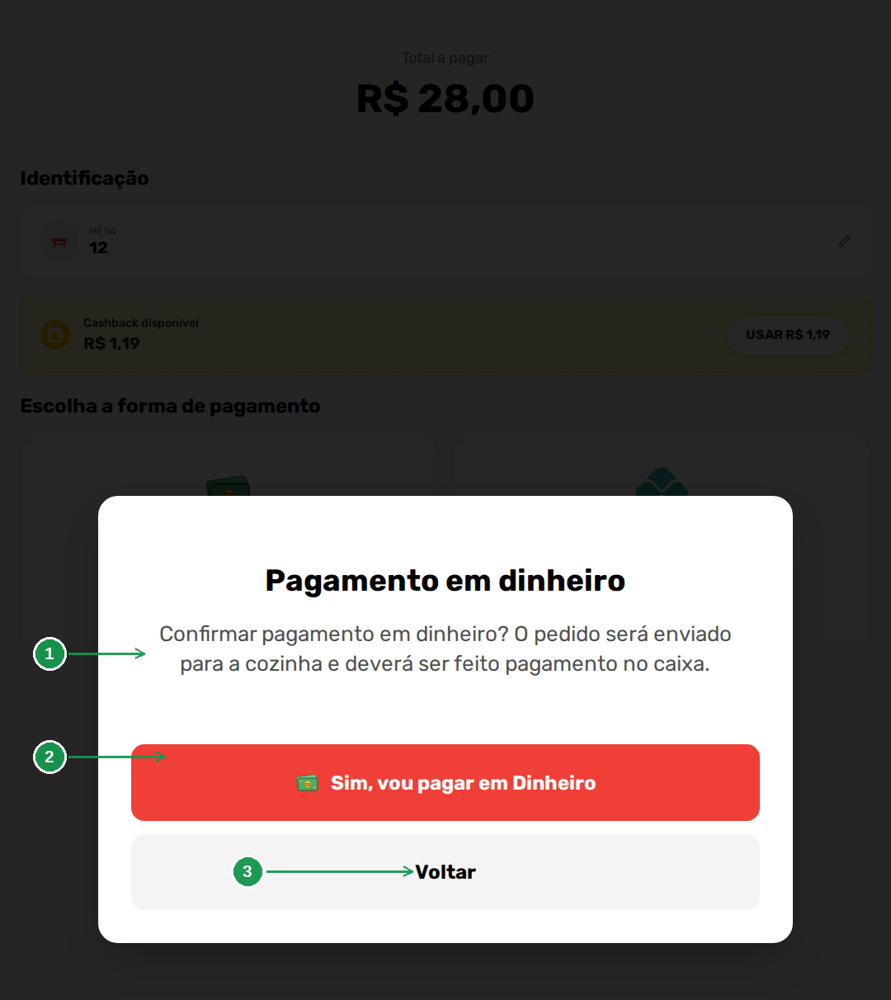
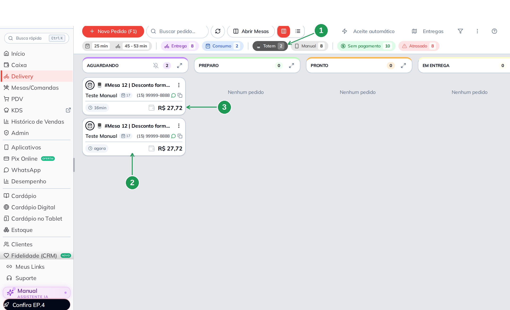
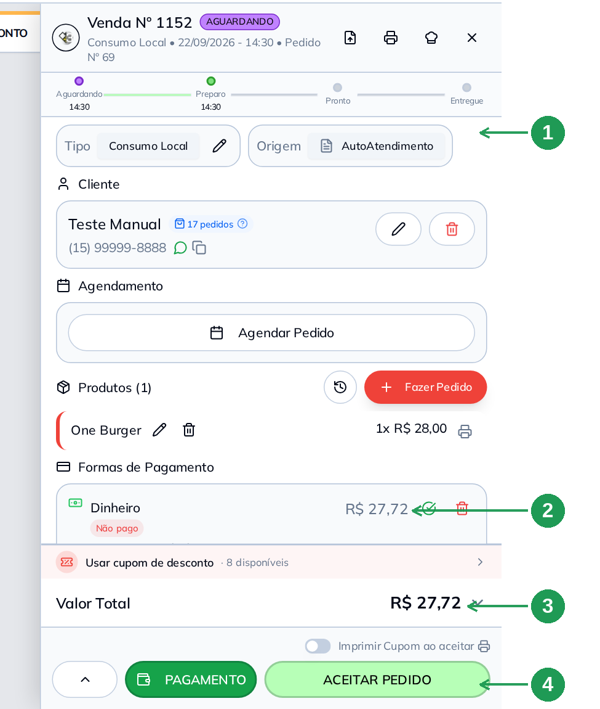
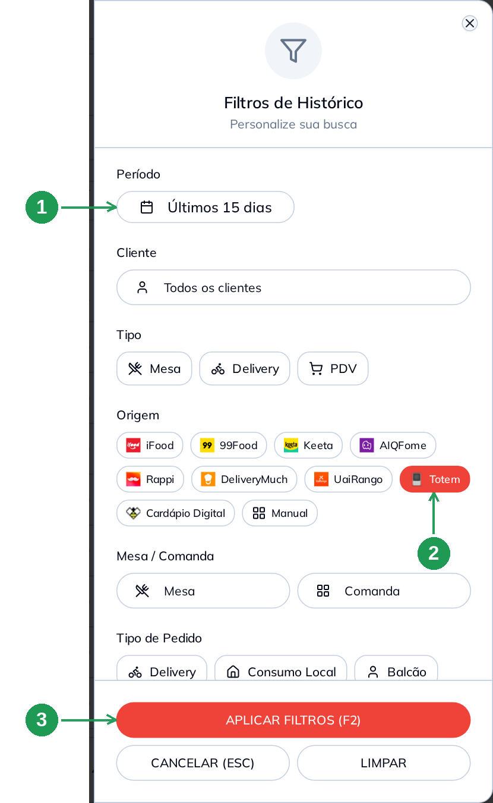
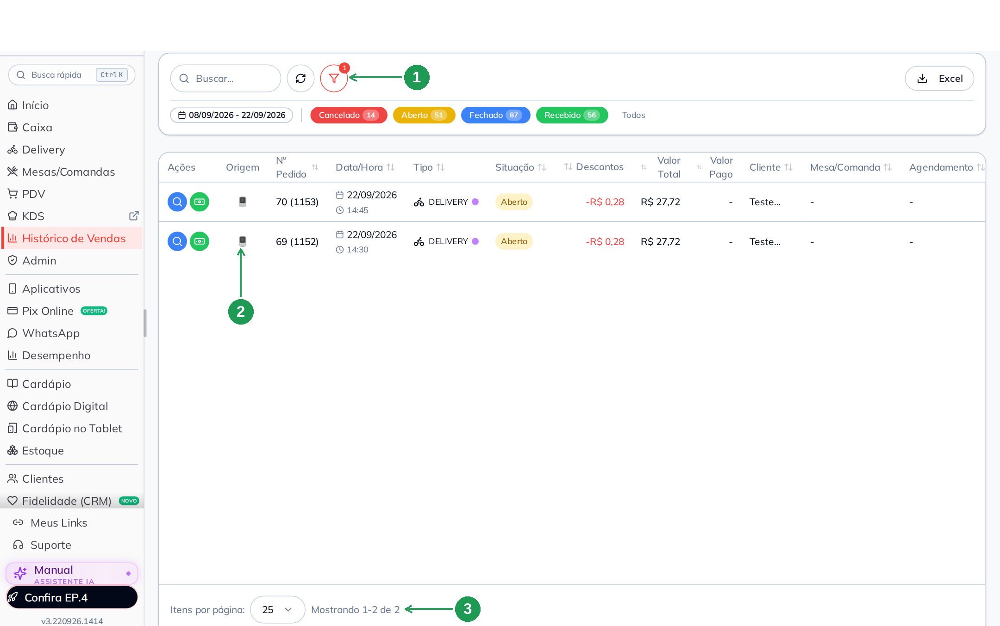
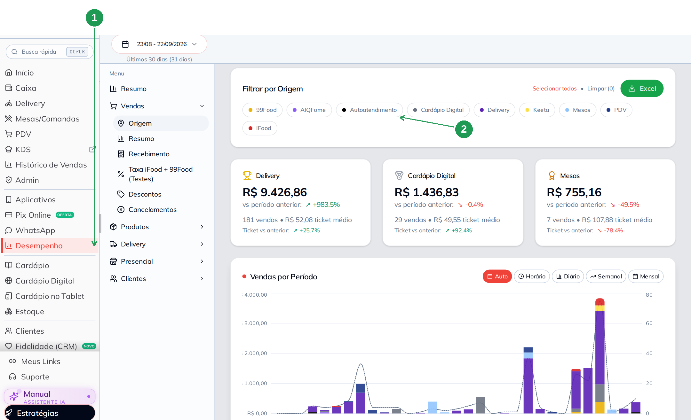
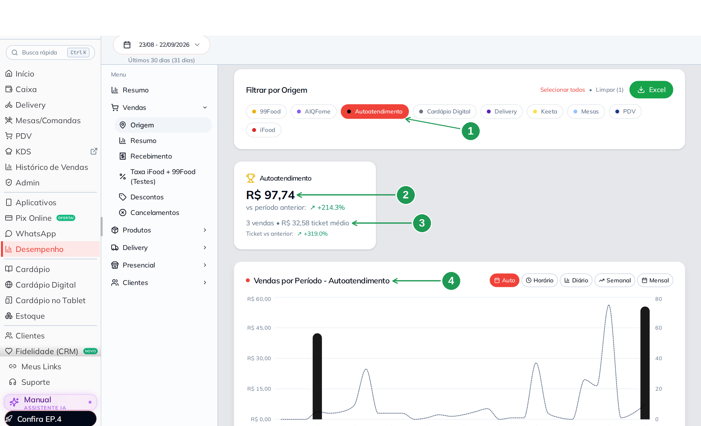

# O pedido do totem no painel: onde a venda do autoatendimento aparece

O cliente terminou no totem e levou a senha. Do lado de dentro, **a venda já
está no painel** — e é preciso saber onde, porque o pedido do totem tem duas
particularidades: ele nasce marcado com a origem **AutoAtendimento** e, quando o
cliente escolhe **Dinheiro**, ele nasce **sem pagamento registrado**.

Este manual segue uma venda real do totem por quatro telas: o **Delivery**, o
**card do pedido**, o **Histórico de Vendas** e o **Desempenho**. É o outro lado
do balcão do manual **Totem de Autoatendimento: pôr no ar e configurar**.

> As imagens têm **setas numeradas** (1, 2, 3…). Cada número indica o campo ou
> botão correspondente na tela.

---

## Antes de começar

- O totem precisa estar configurado e com pelo menos um meio de pagamento ligado
  (manual de configuração do totem).
- Quem opera o balcão precisa de acesso ao **Delivery** e ao **Caixa**: o pedido
  pago em dinheiro só fica quitado quando alguém registra o recebimento.
- O exemplo deste manual é um pedido de **R$ 28,00 pago em Dinheiro**, com a
  mesa 12 informada no aparelho.

---

## 1. O que acontece quando o cliente confirma

Escolhendo **Dinheiro**, o totem avisa em letras grandes o que vai acontecer (1)
e pede confirmação (2) — ou volta atrás (3). O texto é exato: *"O pedido será
enviado para a cozinha e deverá ser feito pagamento no caixa."*

| Nº | Item | O que faz |
|----|------|-----------|
| 1. | **Aviso** | O pedido vai para a produção **antes** de o dinheiro entrar. É a diferença entre Dinheiro e maquininha. |
| 2. | **Sim, vou pagar em Dinheiro** | Fecha o pedido no aparelho e manda para a cozinha. |
| 3. | **Voltar** | Volta para a escolha da forma de pagamento. |

Nos meios de maquininha (Pix, crédito, débito, vale) o pagamento acontece no
pinpad antes de o pedido ser enviado — nesses casos a venda já chega paga.

---

## 2. No Delivery: o pedido do totem no quadro

**Delivery.** Os pedidos do totem entram no quadro junto com os demais, na
coluna **AGUARDANDO**. Para ver só eles, use o chip **Totem** (1) — o número ao
lado é a contagem do dia.

Cada cartão mostra a identificação que veio do aparelho: **#Mesa 12** e o nome do
cliente (2), com o valor já com desconto (3).

| Nº | Item | O que faz |
|----|------|-----------|
| 1. | **Chip Totem** | Filtra o quadro pelos pedidos do autoatendimento. |
| 2. | **Cartão do pedido** | Traz **#Mesa** (ou pager), nome e telefone informados no totem, e o tempo desde a entrada. |
| 3. | **Valor** | R$ 27,72 — o desconto da forma de pagamento já está aplicado. |

Vale conhecer o vizinho: o chip **Sem pagamento** junta todos os pedidos ainda
não quitados, e é lá que os pedidos do totem pagos em dinheiro ficam até alguém
receber no caixa.

---

## 3. O card do pedido: origem, itens e o que fazer

Clique no cartão para abrir a venda. O campo **Origem** (1) mostra
**AutoAtendimento** — é a marca que o totem deixa no pedido. Em **Formas de
Pagamento** (2) aparece *Dinheiro* com a etiqueta **Não pago**, o **Valor Total**
(3) já com o desconto, e o botão **ACEITAR PEDIDO** (4) manda o pedido para a
produção.

| Nº | Item | O que fazer |
|----|------|-------------|
| 1. | **Origem** | *AutoAtendimento* identifica a venda do totem. Nos filtros e nos chips o mesmo pedido aparece como **Totem**. |
| 2. | **Formas de Pagamento** | *Dinheiro* com **Não pago**. Confirme o recebimento quando o cliente pagar no caixa — pelo botão **PAGAMENTO**. |
| 3. | **Valor Total** | R$ 27,72: os R$ 28,00 do produto menos o 1% da forma *Dinheiro*. |
| 4. | **ACEITAR PEDIDO** | Aceita e coloca em produção. A chave *Imprimir Cupom ao aceitar* imprime nesse momento. |

O card é o mesmo dos outros pedidos: dá para editar o tipo, trocar item, agendar,
aplicar cupom e emitir a nota. **Nada fica travado por ter vindo do totem.**

O pedido também segue para a cozinha como qualquer outro — no KDS, se você usa, e
na impressora da produção, se a ficha é impressa.

---

## 4. Histórico de Vendas: filtrar pela origem Totem

**Histórico de Vendas → filtro (ícone de funil).** Escolha o **Período** (1) e,
em **Origem**, o chip **Totem** (2). Confirme em **APLICAR FILTROS (F2)** (3).

| Nº | Item | O que fazer |
|----|------|-------------|
| 1. | **Período** | O padrão são os últimos 15 dias. Troque para o intervalo que você quer conferir. |
| 2. | **Origem → Totem** | Deixa na lista apenas as vendas do autoatendimento. Os outros chips são os demais canais. |
| 3. | **APLICAR FILTROS (F2)** | Aplica. **LIMPAR** volta ao padrão. |

Aplicado o filtro, a lista mostra só o totem. O funil fica marcado com o número
de filtros ativos (1) e a coluna **Origem** repete o ícone do autoatendimento em
cada linha (2). No pé, a contagem do que foi encontrado (3).

| Nº | Item | O que faz |
|----|------|-----------|
| 1. | **Funil com contador** | Lembra que a lista está filtrada — a causa mais comum de "minha venda desapareceu". |
| 2. | **Coluna Origem** | O ícone do autoatendimento. Duas vendas do totem, das 14:30 e das 14:45. |
| 3. | **Contagem** | *Mostrando 1-2 de 2*. As faixas coloridas em cima contam por situação (Cancelado, Aberto, Fechado, Recebido). |

A coluna **Descontos** mostra o abatimento da forma de pagamento (aqui, R$ 0,28
por linha) e o botão **Excel** exporta a lista filtrada — é o caminho para levar
as vendas do totem para uma planilha.

---

## 5. Desempenho: quanto o totem vendeu

**Desempenho → Vendas → Origem** (1). A tela abre com **Filtrar por Origem** e
um chip por canal — o do totem chama **Autoatendimento** (2). Sem filtro, os
cartões mostram os canais que mais venderam no período.

| Nº | Item | O que faz |
|----|------|-----------|
| 1. | **Vendas → Origem** | O relatório que separa o faturamento por canal. O período fica no alto da tela. |
| 2. | **Autoatendimento** | O chip do totem. Clique para ver só ele. |

Com o chip **Autoatendimento** marcado (1), a tela fica inteira sobre o totem: o
**faturamento** do período (2), a **quantidade de vendas e o ticket médio** (3) e
o gráfico **Vendas por Período — Autoatendimento** (4).

| Nº | Item | O que faz |
|----|------|-----------|
| 1. | **Chip marcado** | *Limpar (1)* no alto mostra que há um filtro ativo. |
| 2. | **Faturamento** | R$ 97,74 no período, com a comparação com o período anterior. |
| 3. | **Vendas e ticket médio** | 3 vendas, ticket de R$ 32,58. É o número que diz se o totem está pegando. |
| 4. | **Vendas por Período** | O gráfico só do autoatendimento, por hora, dia, semana ou mês. |

Este é o relatório para responder a pergunta que justifica o aparelho: **o totem
está vendendo, e com que ticket?** Compare o ticket médio dele com o do balcão —
é comum o autoatendimento vender mais por pedido.

---

## 6. O que não se pode esquecer no fim do dia

- **Pedido em dinheiro não está pago.** Ele fica em *Sem pagamento* até alguém
  registrar o recebimento. Confira o chip antes de fechar o caixa.
- **Se a NFC-e está desligada no totem**, a venda saiu sem nota. Emita pelo
  painel, no card da venda ou na emissão em lote.
- **A senha é do cliente, o número do pedido é seu.** O card mostra o número da
  venda e o do pedido; a senha que o cliente carrega é a que saiu na tela e no
  papel.
- O **desconto da forma de pagamento** entra como desconto da venda, e aparece
  assim nos relatórios — não é preço diferente de produto.

---

## Problemas comuns

| Sintoma | O que verificar |
|---------|-----------------|
| O pedido do totem não apareceu no Delivery | Confira se o quadro está com algum filtro ativo (chips no alto) e atualize a tela |
| A venda do totem está como "Aberto" há horas | Pedido em dinheiro espera pagamento no caixa. Registre em **PAGAMENTO**, dentro do card |
| Não acho a venda no Histórico | O **funil** está filtrado (o contador aparece nele) ou o período não inclui o dia da venda |
| No card diz *AutoAtendimento* e no filtro diz *Totem* | É o mesmo pedido: o card mostra o nome de origem da venda; filtros e chips usam o rótulo *Totem* |
| O valor do pedido é menor do que a soma dos produtos | É o **desconto da forma de pagamento** (coluna *Descontos* no Histórico) |
| A venda do totem não saiu na nota | Emissão fiscal desligada na configuração do totem. Emita pelo painel |
| O Desempenho não tem "Totem" na lista de origens | Lá o rótulo é **Autoatendimento** |
| O Desempenho mostra mais vendas do que o Histórico | Os períodos são diferentes: o Desempenho abre com os últimos 30 dias |
| O pedido não apareceu na cozinha | Ele precisa ser **aceito**; e confira a impressora da produção ou o KDS |

---

## Perguntas frequentes

**Como eu sei que uma venda veio do totem?**
Pela origem: **AutoAtendimento** no card da venda, e o chip/filtro **Totem** no
Delivery e no Histórico. No Desempenho, o canal chama **Autoatendimento**.

**O pedido do totem chega pago?**
Nos meios de maquininha, sim. Em **Dinheiro**, não: o cliente paga no caixa e
alguém registra o recebimento no painel.

**Preciso aceitar o pedido do totem?**
Sim, como qualquer pedido — a não ser que a sua loja use o **aceite automático**.

**Dá para editar um pedido feito no totem?**
Dá. O card é o mesmo dos outros pedidos: itens, tipo, cupom, pagamento e nota.

**O número da mesa que o cliente digitou aparece?**
Sim, no cartão do Delivery e no card da venda, quando a identificação de entrega
está configurada como mesa (ou pager).

**Como exporto as vendas do totem?**
Filtre por origem **Totem** no Histórico de Vendas e use o botão **Excel**.

**Onde vejo o ticket médio do totem?**
Em **Desempenho → Vendas → Origem**, com o chip **Autoatendimento** marcado.

**O desconto que aparece na venda é do cupom?**
Pode ser da forma de pagamento (1% no dinheiro, por exemplo) ou de cupom. A
coluna **Descontos** soma os dois; o card da venda mostra a origem de cada um.

**A venda do totem entra no fechamento do caixa?**
Entra, pelo pagamento registrado. Em dinheiro, ela só entra quando o recebimento
é lançado.

---

## Manuais relacionados

| Manual | O que traz |
|--------|------------|
| **Totem de Autoatendimento: pôr no ar e configurar** | As cinco abas do painel e o que cada uma muda na tela do cliente |
| **Cupom e cashback no totem** | Cupom e cashback do CRM aparecendo no aparelho |
| **Histórico de Vendas** | Todos os filtros da tela e a exportação |
| **Desempenho** | Os relatórios de vendas, produtos e clientes |
| **Abrir e fechar caixa** | O registro do dinheiro que entra no balcão |

---

## Precisa de ajuda?

Fale com o **suporte BeeFood** informando: nome da loja, **CNPJ** e o **número da
venda** que você está procurando.

---

*Última atualização: setembro/2026 — BeeFood · O pedido do totem no painel*
