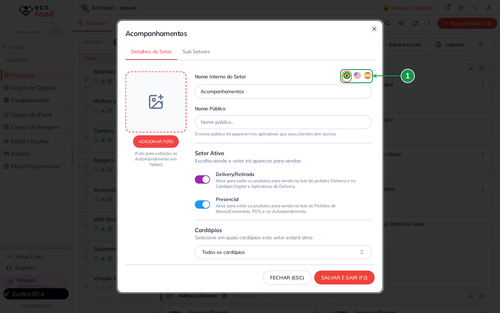
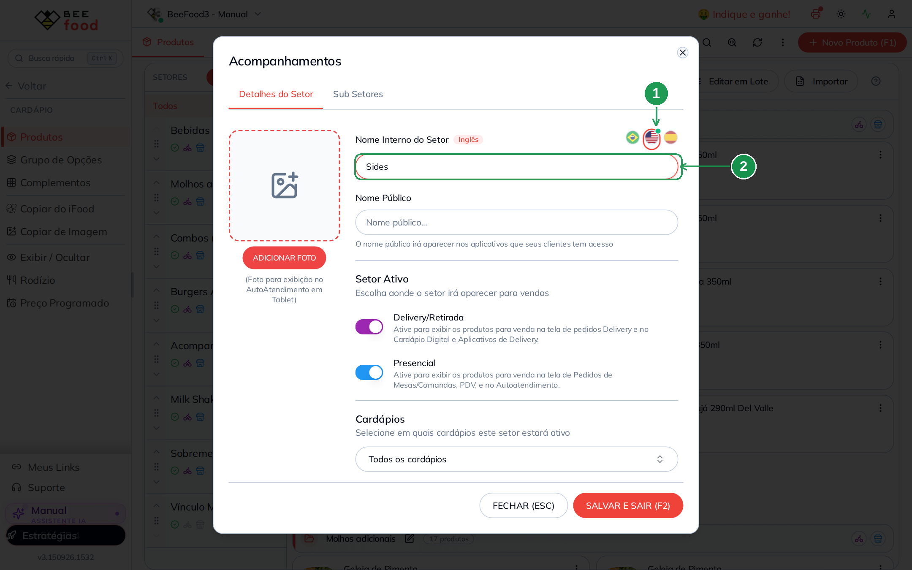
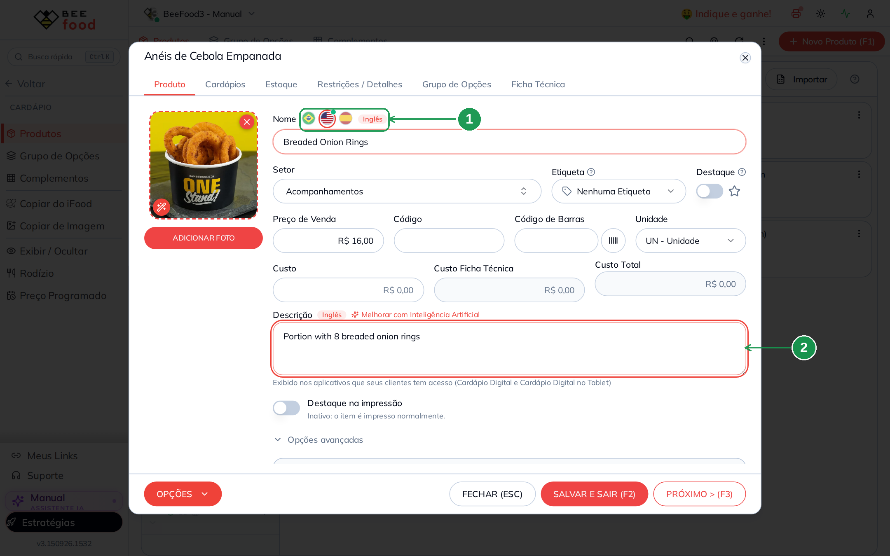
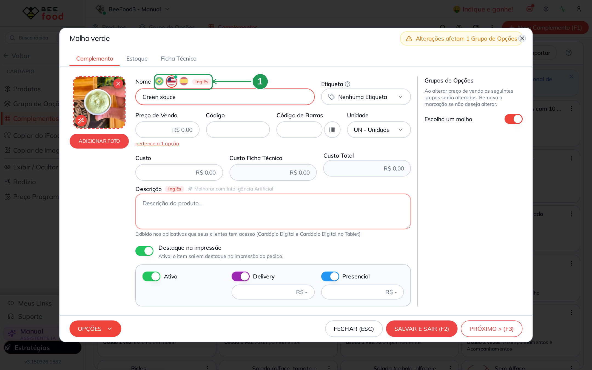
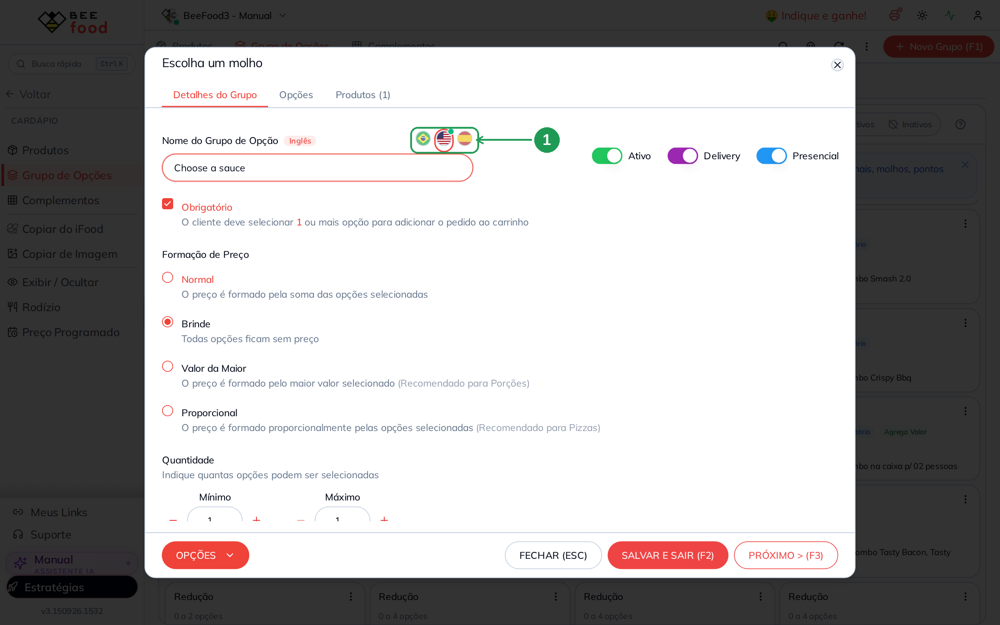
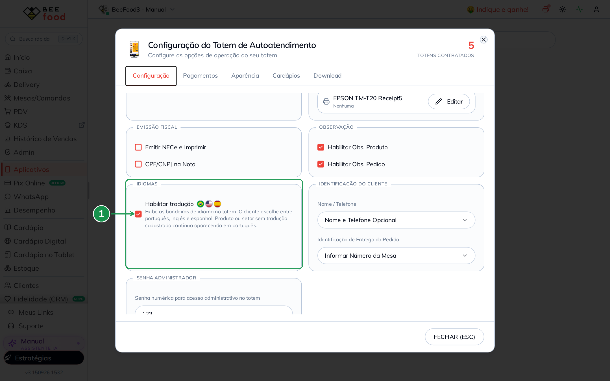
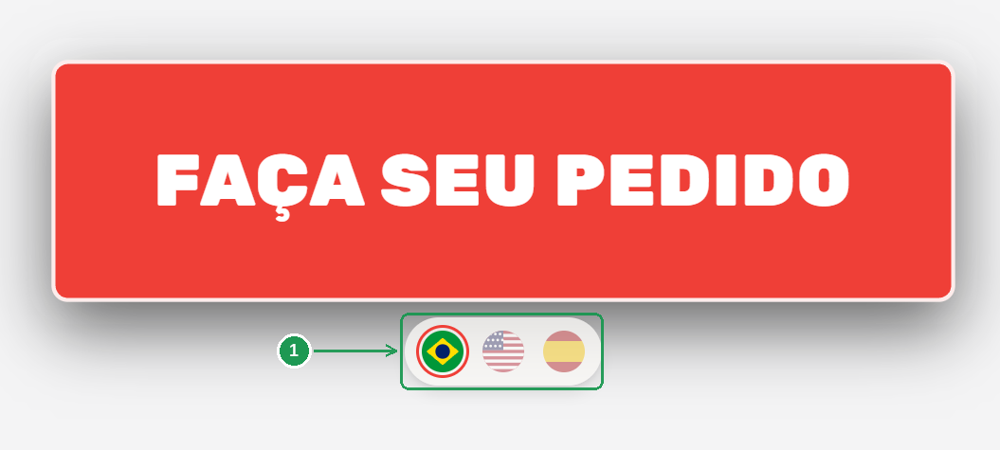
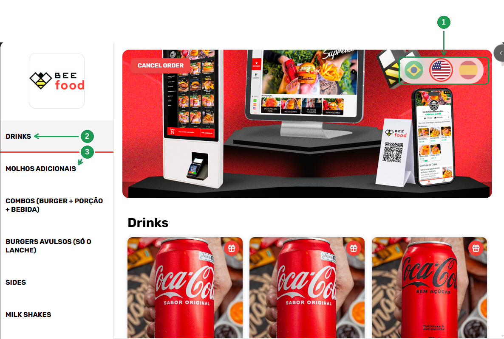
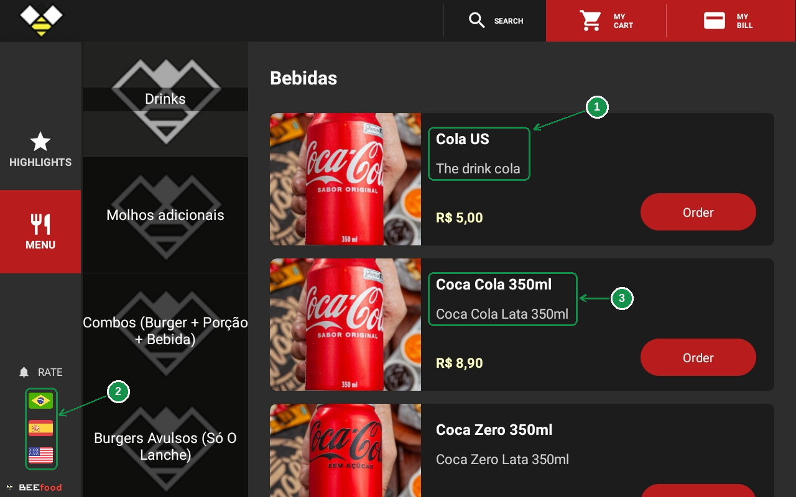

# Tradução do cardápio presencial: como traduzir o cardápio do tablet e do totem

Um turista para na frente do totem. O cardápio está todo em português:
*Anéis de Cebola Empanada*, *Porção com 8 cebolas empanadas*, *Escolha um
molho*. Ele desiste e chama alguém do salão.

O BeeFood resolve isso no próprio cadastro do cardápio: cada setor,
produto, complemento e grupo de opções pode ter uma versão em **inglês** e
em **espanhol**. No **Totem de Autoatendimento** e no **Cardápio Digital
no Tablet** o cliente escolhe a bandeira e o cardápio inteiro troca de
idioma. Item sem tradução cadastrada continua aparecendo em português —
nada quebra, nada fica em branco.

Nada é traduzido automaticamente: o texto em inglês e em espanhol é
escrito por você, no mesmo campo onde já está o nome em português.

> As imagens têm **setas numeradas** (1, 2, 3…). Cada número indica o
> campo ou botão correspondente na tela.

---

## O que pode ser traduzido

| Onde | Campo com bandeiras |
|------|---------------------|
| **Setor** (Cardápio → Produtos → menu do setor → Editar) | Nome Interno do Setor |
| **Produto** (Cardápio → Produtos) | Nome e Descrição |
| **Complemento** (Cardápio → Complementos) | Nome e Descrição |
| **Grupo de opções** (Cardápio → Grupo de Opções) | Nome do Grupo de Opção |

O que **não** muda de idioma: preço, foto, código, etiqueta, **Nome
Público** do setor, sub-setores, e o que sai no papel (Cupom Pedido e
ficha da cozinha continuam em português). A tradução é do que o cliente
lê na tela do tablet e do totem.

---

## Antes de começar

- As bandeiras só aparecem no cadastro de quem tem **Totem de
  Autoatendimento** ou **Cardápio Digital no Tablet** contratado. Sem
  nenhum dos dois, o campo continua sendo um campo comum.
- Os idiomas são três: **Português** (o cadastro de sempre), **Inglês** e
  **Espanhol**.
- Você não precisa traduzir tudo de uma vez. Comece pelos setores e pelos
  itens mais vendidos.

---

## 1. Onde ficam as bandeiras

Abra qualquer cadastro do cardápio. Na linha do **nome** aparecem três
bandeirinhas (1): Brasil, Estados Unidos e Espanha.

A bandeira com o **círculo em volta** é a que você está editando. Com o
Brasil selecionado, você está no cadastro normal — o mesmo de sempre.

| Nº | Item | O que fazer |
|----|------|-------------|
| 1. | **Bandeiras de idioma** | Clique na bandeira do idioma que você quer escrever. Brasil = cadastro em português. |

Trocar de bandeira **não salva e não apaga nada**: é só mudar a visão
sobre o mesmo cadastro. Quando um idioma já tem texto, a bandeira ganha
uma **bolinha verde** no canto — é assim que você vê, de relance, o que
já foi traduzido.

---

## 2. Traduzir um setor

**Cardápio → Produtos.** Na lista de setores, clique nos três pontinhos do
setor e escolha **Editar**. Neste exemplo, o setor **Acompanhamentos**.

Clique na bandeira dos **Estados Unidos** (1) e escreva o nome em inglês
no campo (2) — aqui, *Sides*. Três coisas mudam na tela: aparece a
etiqueta **Inglês** ao lado do rótulo, o campo ganha **borda destacada**
e, enquanto ele está vazio, o nome em português aparece apagado dentro
dele (para você saber o que está traduzindo).

Repita na bandeira da **Espanha**, se quiser o espanhol, e grave com
**SALVAR E SAIR (F2)**. Um único salvamento guarda o português e as duas
traduções.

| Nº | Item | O que fazer |
|----|------|-------------|
| 1. | **Bandeira do Inglês** | Selecione o idioma. A bolinha verde indica que ele já tem texto. |
| 2. | **Nome Interno do Setor** | Escreva o nome do setor em inglês. Só este campo tem bandeiras; o **Nome Público** não é traduzido. |

---

## 3. Traduzir um produto (nome e descrição)

**Cardápio → Produtos.** Filtre o setor e abra o produto — aqui, os
**Anéis de Cebola Empanada**.

As bandeiras ficam ao lado do **Nome** (1). Ao escolher o inglês, os
**dois** campos do produto passam a mostrar a versão em inglês: o **Nome**
e a **Descrição** (2), cada um com a etiqueta **Inglês** e a borda
destacada.

Grave com **SALVAR E SAIR (F2)**.

| Nº | Item | O que fazer |
|----|------|-------------|
| 1. | **Bandeiras ao lado do Nome** | Trocam o idioma do **Nome** e da **Descrição** ao mesmo tempo. |
| 2. | **Descrição** | Escreva a descrição no idioma escolhido. É o texto que o cliente lê ao abrir o produto. |

> O botão **Melhorar com Inteligência Artificial**, ao lado da Descrição,
> trabalha sempre no texto em **português** — ele reescreve o cadastro, não
> traduz. Para o inglês e o espanhol, escreva você mesmo.

---

## 4. Traduzir um complemento

**Cardápio → Complementos** e abra o item — neste exemplo, o
**Molho verde**.

Funciona igual ao produto: bandeiras ao lado do **Nome** (1), etiqueta do
idioma e borda destacada no campo. O complemento também tem **Descrição**
traduzível, quando você usa esse campo.

| Nº | Item | O que fazer |
|----|------|-------------|
| 1. | **Bandeiras ao lado do Nome** | Escreva o nome do complemento no idioma escolhido. |

Isso importa mais do que parece: dentro de um combo, a bebida, o molho e
a redução (*Sem cebola*, *Sem maionese*) entram como **opção**, e a opção
é um complemento. Sem traduzir o complemento, o produto aparece em inglês
mas a lista de opções continua em português.

---

## 5. Traduzir um grupo de opções

**Cardápio → Grupo de Opções** e abra o grupo — aqui, o
**Escolha um molho**.

As bandeiras ficam à direita do campo **Nome do Grupo de Opção** (1). É o
título que o cliente vê acima da lista de opções no tablet e no totem
(*Choose a sauce*).

| Nº | Item | O que fazer |
|----|------|-------------|
| 1. | **Bandeiras do grupo** | Escreva o título do grupo no idioma escolhido e salve com **SALVAR E SAIR (F2)**. |

---

## 6. Ligar as bandeiras no totem

Traduzir o cadastro não basta para o totem: o cliente só vê o seletor de
idioma quando a loja liga o recurso.

**Aplicativos → Totem de Autoatendimento → aba Configuração → grupo
Idiomas → Habilitar tradução** (1).

Ligado, o totem passa a exibir as bandeirinhas e o cliente escolhe entre
português, inglês e espanhol. Esta tela **salva sozinha**, sem botão de
confirmação.

| Nº | Item | O que fazer |
|----|------|-------------|
| 1. | **Habilitar tradução** | Marque para o totem mostrar as bandeiras ao cliente. Desmarcado, o totem fica só em português. |

No **Cardápio Digital no Tablet** não existe esse interruptor no painel: o
texto traduzido segue com o aplicativo do tablet (seção 8).

---

## 7. Como o cliente vê no totem

### 7.1 Na hora de iniciar o pedido

O seletor de idioma fica **embaixo do botão FAÇA SEU PEDIDO** (1), na tela
de espera do totem. É o primeiro toque do cliente: escolhe a bandeira e
só depois começa o pedido. Na foto, o **Brasil** está selecionado (o
círculo em volta mostra o idioma atual) e o totem segue em português.

| Nº | Item | O que faz |
|----|------|-----------|
| 1. | **Seletor de idioma** | Brasil, Estados Unidos e Espanha. O cliente toca na bandeira antes de iniciar o pedido. Só aparece com **Habilitar tradução** marcado (seção 6). |

### 7.2 No menu, com a listagem de produtos

Depois de iniciar o pedido, as bandeiras continuam à mão no **canto
superior direito** do cardápio (1) — o cliente troca de idioma a qualquer
momento, sem sair da tela.

Nesta foto o **inglês** está selecionado, e a lista de setores mostra
exatamente como a tradução funciona item por item: **DRINKS** (2) é o
setor *Bebidas* com tradução cadastrada, enquanto **MOLHOS ADICIONAIS**
(3) continua em português porque esse setor ainda não foi traduzido.

| Nº | Item | O que faz |
|----|------|-----------|
| 1. | **Bandeiras no topo** | Trocam o idioma durante o pedido. O círculo marca o idioma atual — aqui, o inglês. |
| 2. | **Setor traduzido** | *Bebidas* aparece como **Drinks**: é a tradução que você escreveu no cadastro do setor. |
| 3. | **Setor sem tradução** | *Molhos adicionais* continua em português. Nada quebra: o texto original entra no lugar. |

Os textos do próprio totem — *CANCEL ORDER*, carrinho, botões — já vêm
traduzidos com o aplicativo. Você cadastra só o cardápio.

---

## 8. Como o cliente vê no Cardápio Digital no Tablet

No tablet as bandeiras ficam na **coluna da esquerda** (2), embaixo de
*Avaliar*, e o cardápio troca de idioma na mesma tela.

O exemplo é a **Coca**: cadastrada em português como *Coca Cola 350ml*,
com a descrição *Coca Cola Lata 350ml*, ela aparece como **Cola US** com
a descrição **The drink cola** (1). São os dois campos da seção 3 — Nome e
Descrição do produto — do jeito que o cliente lê.

Logo abaixo está o outro lado da moeda (3): a segunda lata **não tem
tradução cadastrada**, então continua em português no meio de uma tela em
inglês. É o comportamento normal e é o que permite traduzir aos poucos.

| Nº | Item | O que faz |
|----|------|-----------|
| 1. | **Produto traduzido** | Nome e Descrição em inglês, vindos do cadastro do produto. |
| 2. | **Bandeiras do tablet** | O cliente troca entre português, inglês e espanhol. |
| 3. | **Produto sem tradução** | Continua com o nome e a descrição em português. |

Detalhes que costumam gerar dúvida nessa tela:

- **Preço, foto e o botão de pedir não mudam** com o idioma: a tradução é
  só do texto que você cadastrou.
- O título da faixa continua *Bebidas* porque é o cabeçalho da lista do
  tablet, que não acompanha o idioma. O nome traduzido do setor
  (*Drinks*) aparece na coluna de setores, à esquerda.
- *SEARCH*, *MY CART*, *MY BILL*, *Order* e os demais textos do
  aplicativo já vêm traduzidos — não são cadastro seu.

---

## Roteiro para traduzir um cardápio inteiro

Não existe **Editar em Lote** para tradução — é item por item. Uma ordem
que rende mais rápido:

1. **Setores** — são poucos e é o primeiro texto que o cliente lê.
2. **Grupos de opções** — *Escolha um molho*, *Adicionais*, *Redução*.
   Um grupo traduzido vale para todos os produtos que o usam.
3. **Produtos** mais vendidos, com nome e descrição.
4. **Complementos** que aparecem nesses produtos (bebidas, molhos,
   reduções, adicionais).

A **bolinha verde** na bandeira mostra o que já está pronto: abra o
cadastro e olhe a bandeira antes de digitar de novo.

---

## Problemas comuns

| Sintoma | O que verificar |
|---------|-----------------|
| Não vejo bandeira nenhuma no cadastro | O recurso aparece para lojas com **Totem** ou **Cardápio Digital no Tablet**. Sem um dos dois, não há bandeiras |
| O totem continua só em português | **Habilitar tradução** precisa estar marcado em Aplicativos → Totem de Autoatendimento → Configuração |
| Alguns itens aparecem em inglês e outros não | Item sem tradução cai para o português. Abra o cadastro e veja se a bandeira tem bolinha verde |
| Traduzi o setor, mas no tablet o título da faixa continua em português | Esse título é o cabeçalho da lista do tablet e não troca de idioma. O nome traduzido aparece na coluna de setores, à esquerda (seção 8) |
| Traduzi o produto, mas as opções ficaram em português | As opções são **complementos**. Traduza em Cardápio → Complementos, e o título da lista em Cardápio → Grupo de Opções |
| O nome em português mudou sozinho | O texto foi digitado com a **bandeira do Brasil** selecionada. Volte para o Brasil e corrija o cadastro |
| Escrevi a tradução e ela não ficou | Faltou **SALVAR E SAIR (F2)**. Trocar de bandeira ou fechar a janela não grava |
| Usei o **Melhorar com Inteligência Artificial** e a tradução não apareceu | Esse botão reescreve a **descrição em português**, não traduz |

---

## Perguntas frequentes

**Quais idiomas o cardápio presencial aceita?**
Português, **inglês** e **espanhol**. O português é o próprio cadastro; os
outros dois são escritos nas bandeiras.

**O sistema traduz sozinho?**
Não. Você escreve o texto em cada idioma. Não existe tradução automática
nem botão de IA para isso.

**Preciso traduzir o cardápio inteiro?**
Não. O que não tem tradução continua aparecendo em português, item por
item.

**Dá para traduzir vários produtos de uma vez?**
Não. O **Editar em Lote** não tem o campo de tradução; a tradução é feita
no cadastro de cada item.

**Onde o cliente troca o idioma?**
No totem, nas bandeiras **embaixo do FAÇA SEU PEDIDO** e no **canto
superior direito** do menu — depois de **Habilitar tradução** na
configuração do Totem de Autoatendimento. No tablet, nas bandeiras da
**coluna da esquerda**, embaixo de *Avaliar*.

**A tradução muda o cupom, a ficha da cozinha ou o PDV?**
Não. A impressão e as telas da operação continuam em português. A
tradução é do cardápio que o cliente vê.

**A tradução muda o preço?**
Não. Preço, foto, código e etiqueta são os mesmos em qualquer idioma.

**Traduzir o setor muda o Nome Público?**
Não. As bandeiras ficam no **Nome Interno do Setor**; o Nome Público não
tem tradução.

**Como apago uma tradução?**
Selecione a bandeira daquele idioma, apague o texto do campo e salve. O
idioma sai do cadastro e a bolinha verde da bandeira desaparece.

**Preciso preencher inglês e espanhol?**
Não. Pode cadastrar só um dos dois. O que faltar volta para o português.

**Perco a tradução se eu editar o produto depois?**
Não. O português e as traduções ficam no mesmo cadastro e são salvos
juntos, no **SALVAR E SAIR (F2)**.

---

## Manuais relacionados

| Manual | O que traz |
|--------|------------|
| **Manual do Cardápio — Fundamentos** | Cadastro de setor, produto, complemento e grupo de opções |
| **Cardápio Digital no Tablet** | O aplicativo do tablet no salão |
| **Cardápio digital presencial e QR Code** | O cardápio que o cliente abre no próprio celular |
| **Destaque na impressão** | O que sai no papel — que continua em português |

---

## Precisa de ajuda?

Fale com o **suporte BeeFood** informando: nome da loja e **CNPJ**.

---

*Última atualização: setembro/2026 — BeeFood · Tradução do cardápio presencial*
