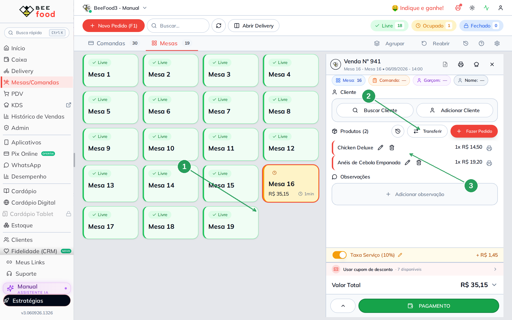
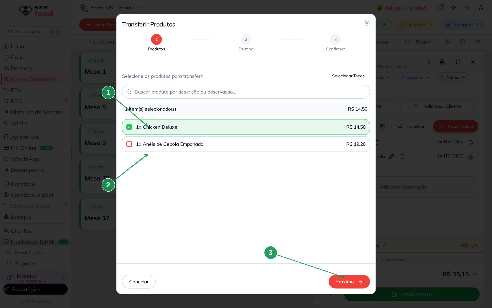
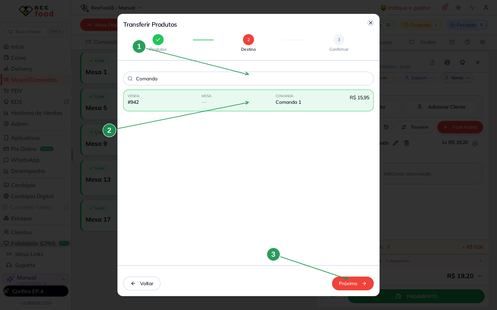
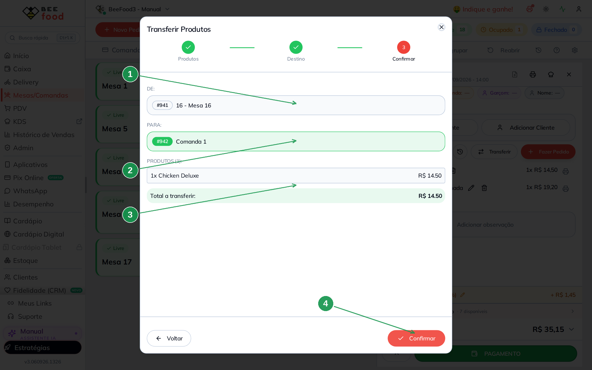
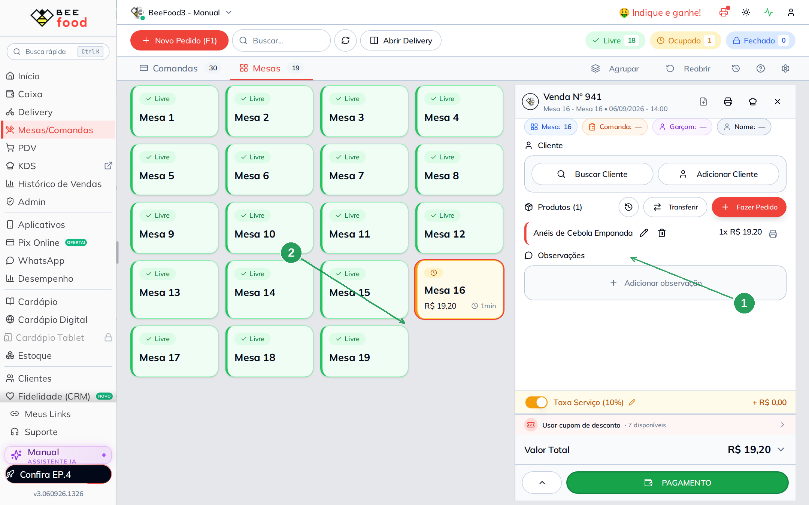
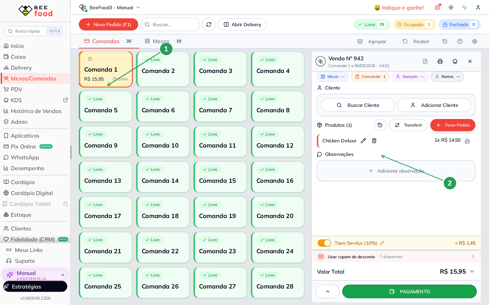

# Transferir item entre mesas e comandas

O cliente mudou de mesa, ou o item foi lançado na conta errada. O BeeFood move a
**linha inteira** de uma conta aberta para outra conta aberta — mesa para mesa,
mesa para comanda, comanda para mesa.

Isso **não** troca a mesa da conta inteira. Os chips azuis e laranja no painel da
venda (Mesa / Comanda) mudam o lugar daquela conta. **Transferir** tira o item de
uma venda e coloca em outra.

> As imagens têm **setas numeradas** (1, 2, 3…). Cada número indica o campo ou botão
> correspondente na tela.

---

## Onde fica

**Mesas/Comandas**. Clique na mesa ou comanda **ocupada** (1). O painel da venda
abre à direita. Em **Produtos**, o botão **Transferir** (2) fica ao lado de
**Fazer Pedido**.

A conta de origem deste exemplo é a **Mesa 16**, com dois itens: Chicken Deluxe
**R$ 14,50** e Anéis de Cebola Empanada **R$ 19,20** (3).

| Nº | Item | O que fazer |
|----|------|-------------|
| 1 | Mesa ou comanda **Ocupado** | Abre o painel da conta. Mesa Livre não tem Transferir — ainda não existe venda. |
| 2 | **Transferir** | Abre o assistente em 3 passos. Some se a conta já foi recebida, cancelada ou agrupada. |
| 3 | A lista de produtos | É de lá que saem as linhas. Sem item, o botão fica desabilitado. |

O destino precisa ser **outra conta já aberta**. Abrir a Comanda 1 (mesmo vazia)
basta: o sistema lista vendas com situação **ABERTO**, não mesas livres do mapa.

---

## 1. Escolher os produtos

O primeiro passo lista as linhas da origem. Marque o que vai embora. Aqui sai só
o **Chicken Deluxe** (1); os **Anéis** ficam na Mesa 16 (2). Depois, **Próximo** (3).

| Nº | Item | O que fazer |
|----|------|-------------|
| 1 | A linha marcada | A linha inteira vai — quantidade, valor e observação. Não dá para mandar “meia” linha. |
| 2 | A linha desmarcada | Continua na origem. |
| 3 | **Próximo** | Só libera com pelo menos um item marcado. |

**Selecionar Todos** marca a conta inteira. A busca filtra por nome ou observação.

---

## 2. Escolher o destino

O segundo passo lista as outras vendas **abertas**. A origem não aparece. Dá para
buscar por número, mesa, comanda ou nome.

Neste exemplo a busca **Comanda** (1) deixa só a **Comanda 1** (2), venda **#942**.
Clique nela e **Próximo** (3).

| Nº | Item | O que fazer |
|----|------|-------------|
| 1 | **Buscar por número, mesa, comanda...** | Enxuga a lista quando o salão tem várias contas abertas. |
| 2 | O card do destino | Mostra venda, mesa, comanda e o total atual. Fundo verde = selecionado. |
| 3 | **Próximo** | Só libera com um destino marcado. |

Se a lista vier vazia (*Nenhuma venda disponível para transferência*), não há
outra conta **ABERTO**. Abra a mesa ou a comanda de destino (Novo Pedido →
**Salvar**) e tente de novo.

---

## 3. Conferir e confirmar

O terceiro passo resume **DE**, **PARA** e o que vai andar. Confira antes de
gravar — não há tela de desfazer.

| Nº | Item | O que conferir |
|----|------|----------------|
| 1 | **DE** | A conta de origem. Aqui: venda **#941**, Mesa 16. |
| 2 | **PARA** | A conta de destino. Aqui: venda **#942**, Comanda 1. |
| 3 | **PRODUTOS** | O que vai sair. Aqui: **1x Chicken Deluxe**, R$ 14,50. |
| 4 | **Confirmar** | Grava. O toast avisa quantas linhas foram. |

---

## A prova nas duas contas

Na **Mesa 16** sobrou só o anel, **R$ 19,20** (1). O card da mesa no mapa baixa o
total (2). O Chicken Deluxe não está mais aqui.

| Nº | Item | O que conferir |
|----|------|----------------|
| 1 | **Anéis de Cebola Empanada** | O item que não foi marcado ficou. |
| 2 | Mesa 16 no mapa | Continua ocupada, agora com o valor menor. |

Na aba **Comandas**, a **Comanda 1** (1) passou a ter o **Chicken Deluxe** (2),
**R$ 14,50**, mais a taxa de serviço que acompanha o item.

| Nº | Item | O que conferir |
|----|------|----------------|
| 1 | Comanda 1 **Ocupado** | Era o destino. O total subiu para **R$ 15,95**. |
| 2 | **Chicken Deluxe** | A mesma linha que saiu da Mesa 16. |

A taxa de serviço recalcula nas duas pontas. Comissão do garçom, se houver, segue
o item — o cadastro do percentual está no manual
[Comissão do garçom](https://ajuda.beefood.com.br/comissao-garcom-cadastrar).

---

## O que Transferir não faz

- **Não parte quantidade.** Duas unidades na mesma linha vão juntas. Para mandar
  só uma, lance em duas linhas (ou tire uma e peça de novo no destino).
- **Não abre mesa livre.** Destino é conta **ABERTO**. Mesa verde no mapa não
  entra na lista.
- **Não substitui o chip da mesa.** Trocar a Mesa 16 pela Mesa 17 **sem** mover
  item é clicar no chip azul no painel — a venda continua a mesma.
- **Não é a transferência de caixa.** O botão TRANSFERIR do **Caixa** move
  operações entre terminais. Aqui o assunto é item de mesa/comanda.
- **Não aparece em delivery.** Só conta presencial (`tipo` mesa), no painel da
  venda aberta.

O botão some ou trava se a venda já foi **recebida**, **cancelada**, está
**agrupada** ou com **fechamento solicitado**.

---

## Perguntas frequentes

**Posso mandar da mesa para a comanda (e o contrário)?**
Sim. A lista de destino mistura os dois. O exemplo deste manual é Mesa 16 →
Comanda 1.

**A conta destino já tinha itens?**
Eles ficam. O que chega entra junto. Aqui a Comanda 1 estava vazia, então o
Chicken Deluxe foi o primeiro item.

**E se eu errei o destino?**
Transfira de novo, da conta que recebeu para a conta certa. Não existe botão
Desfazer.

**Preciso de permissão especial?**
Não há chave só para este botão no grupo de acesso. Quem abre **Mesas/Comandas**
e vê a conta em edição já consegue transferir.

Cadastro de mesas e de comandas: [Cadastrar mesas](https://ajuda.beefood.com.br/cadastro-mesas)
e [Cadastrar comandas](https://ajuda.beefood.com.br/cadastro-comandas).
