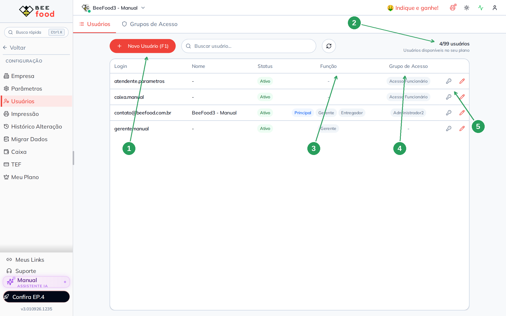
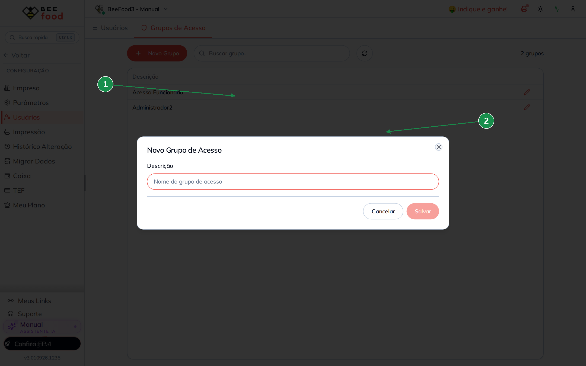
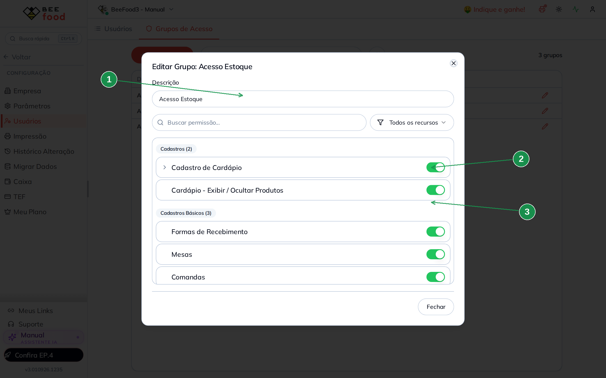
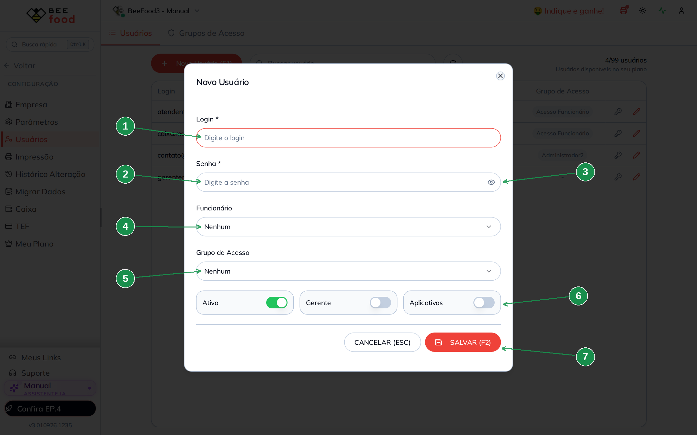
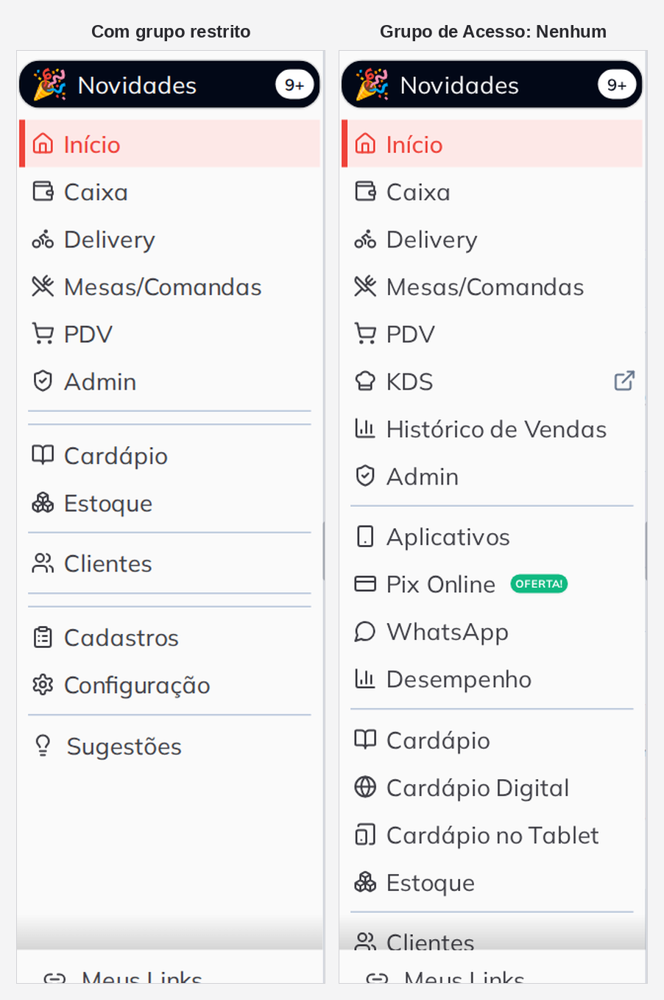
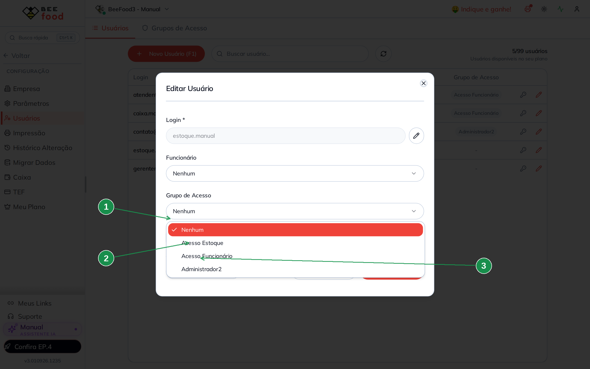
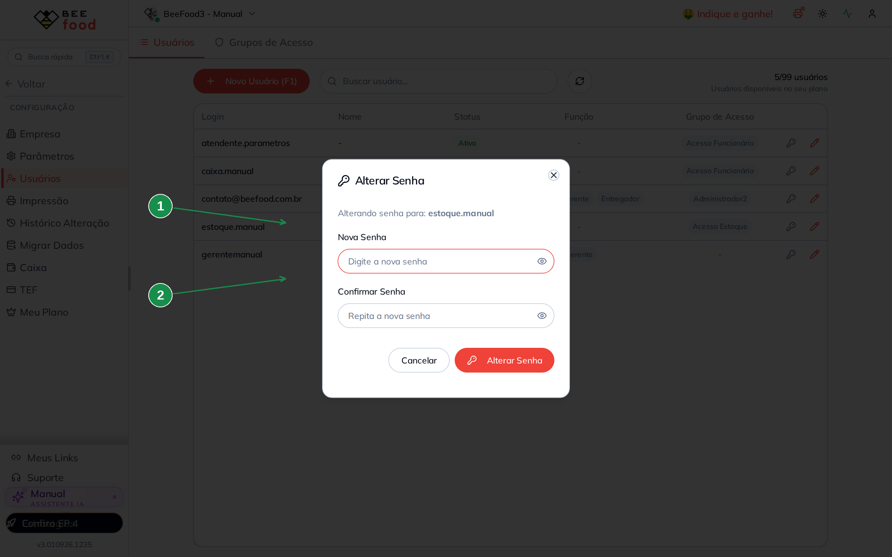
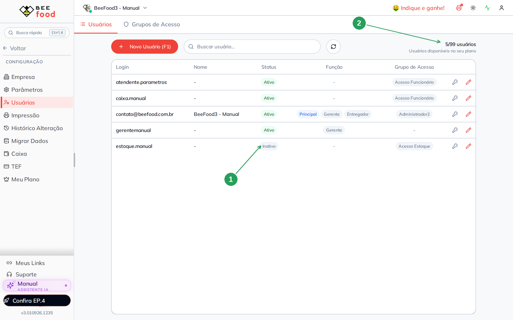
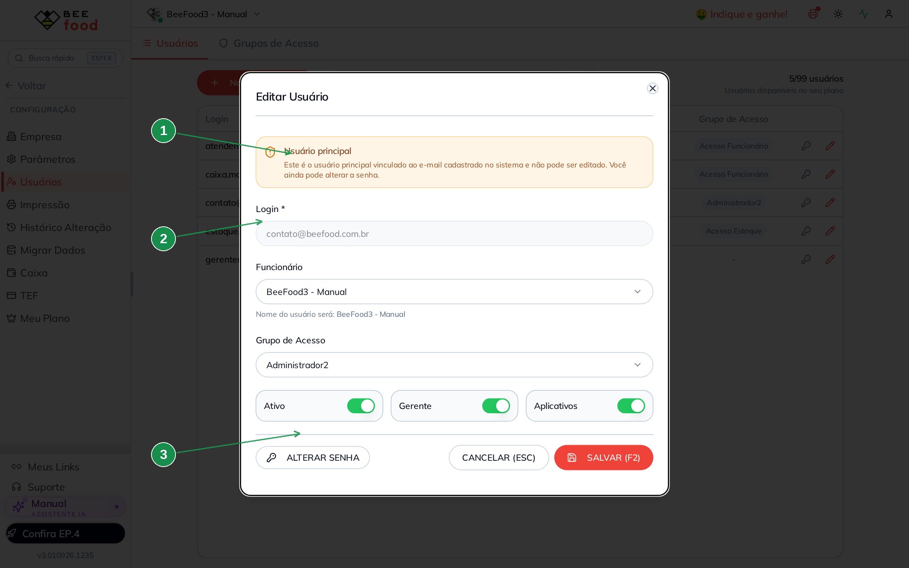

# Criar usuário e montar grupo de acesso

Este manual mostra o caminho completo para dar acesso ao BeeFood a uma pessoa nova da equipe:
criar o **grupo de acesso**, criar o **usuário**, ligar os dois e ajustar o que ela pode ver.

Tudo acontece em **Configuração → Usuários**.

> **A ordem importa.** Crie o **grupo** primeiro e o **usuário** depois. Fazendo ao contrário,
> você corre o risco de salvar o usuário com **Grupo de Acesso: Nenhum** — e quem fica sem
> grupo enxerga o sistema quase inteiro. A seção 4 mostra isso na prática.

> As imagens têm **setas com números** (1, 2, 3...). No texto, cada número indica exatamente o
> campo ou botão correspondente na tela.

---

## Índice

- [1. A tela de usuários](#1-a-tela-de-usuários)
- [2. Passo 1 — criar o grupo de acesso](#2-passo-1--criar-o-grupo-de-acesso)
- [3. Passo 2 — criar o usuário](#3-passo-2--criar-o-usuário)
- [4. O erro mais caro: deixar o grupo em "Nenhum"](#4-o-erro-mais-caro-deixar-o-grupo-em-nenhum)
- [5. Passo 3 — ajustar as permissões do grupo](#5-passo-3--ajustar-as-permissões-do-grupo)
- [6. Trocar o grupo de alguém](#6-trocar-o-grupo-de-alguém)
- [7. Alterar a senha](#7-alterar-a-senha)
- [8. Tirar o acesso de alguém](#8-tirar-o-acesso-de-alguém)
- [9. O usuário principal](#9-o-usuário-principal)
- [10. Perguntas rápidas](#10-perguntas-rápidas)

---

## 1. A tela de usuários

| Nº | Item | O que é |
|----|------|---------|
| 1 | **+ Novo Usuário (F1)** | Cria um usuário. Fica **apagado** quando o limite do plano é atingido. |
| 2 | O contador | `4/99 usuários` — quantos você já tem e quantos o seu plano permite. Ao chegar no limite, o texto fica vermelho e o botão para de funcionar. |
| 3 | Coluna **Função** | Mostra as marcações da pessoa: **Principal**, **Gerente**, **Entregador**. |
| 4 | Coluna **Grupo de Acesso** | O grupo de cada um. Um traço (`-`) significa **sem grupo** — veja a seção 4. |
| 5 | Os dois ícones da linha | A chave abre **Alterar Senha**; o lápis abre o cadastro. |

> **Não existe excluir usuário.** A tela só permite **desativar** (seção 8). Por isso, pense no
> login antes de criar: ele fica na lista para sempre.

---

## 2. Passo 1 — criar o grupo de acesso

Um grupo é um conjunto de permissões que várias pessoas compartilham. Se o cargo já existe na
empresa (caixa, estoquista, gerente de cardápio), o grupo dele provavelmente já está criado —
confira a aba **Grupos de Acesso** antes de criar mais um.

Na aba **Grupos de Acesso**, clique em **+ Novo Grupo**.

| Nº | Item | O que fazer |
|----|------|-------------|
| 1 | **Descrição** | O nome do grupo. Use o cargo, não o nome da pessoa: *Acesso Estoque*, não *João*. |
| 2 | O aviso | O sistema avisa que as permissões aparecem **depois** de salvar o grupo. |

Clique em **Salvar**. O grupo é criado e a lista de permissões aparece na mesma hora.

| Nº | Item | O que observar |
|----|------|----------------|
| 1 | O título | Mudou de *Novo Grupo de Acesso* para **Editar Grupo: Acesso Estoque**. |
| 2 e 3 | Os switches | **Todos verdes.** Grupo novo nasce com **as 93 permissões liberadas**. |

> **Grupo novo não restringe nada.** Ele nasce com tudo ligado, então criar o grupo é só o
> começo: quem restringe é você, desligando o que aquele cargo não precisa (seção 5).

---

## 3. Passo 2 — criar o usuário

Na aba **Usuários**, clique em **+ Novo Usuário (F1)**.

| Nº | Campo | O que fazer |
|----|-------|-------------|
| 1 | **Login \*** | **Obrigatório.** É o que a pessoa digita para entrar. Pode ser um e-mail ou um nome curto (`estoque.manual`). |
| 2 | **Senha \*** | **Obrigatória na criação** — o campo só existe aqui, ao criar. Depois, a troca é pelo botão Alterar Senha. |
| 3 | O olho | Mostra a senha digitada, para você conferir antes de salvar. |
| 4 | **Funcionário** | Opcional. Vincula o usuário a um funcionário já cadastrado, e o **nome do funcionário passa a aparecer** na coluna Nome da lista. Deixando **Nenhum**, a lista mostra só o login. |
| 5 | **Grupo de Acesso** | **Escolha um.** Tecnicamente é opcional, e é aqui que mora o problema da seção 4. |
| 6 | Os três switches | **Ativo** (já vem ligado) permite entrar; **Gerente** libera ações protegidas por senha de gerente; **Aplicativos** libera o acesso pelos aplicativos. |
| 7 | **SALVAR (F2)** | Grava. Se faltar login ou senha, o sistema avisa e não salva. |

> **Cuidado com o switch Gerente.** Ele não é uma permissão de grupo: além de liberar telas como
> *Copiar do iFood*, *Copiar de Imagem* e *Migrar Dados*, ele **dispensa a senha de gerente**
> nas ações protegidas em Configuração → Parâmetros (cancelar venda, estornar pagamento, dar
> desconto, mexer no estoque). Marque só quem realmente é gerente.

---

## 4. O erro mais caro: deixar o grupo em "Nenhum"

O campo **Grupo de Acesso** aceita a opção **Nenhum** — e ela é o valor inicial. Salvar assim
não dá erro nem aviso, e a pessoa entra no sistema normalmente. O problema é o que ela vê.

O BeeFood trabalha com uma regra simples: **permissão que não existe é permissão liberada**.
Sem grupo, não há nenhuma permissão para consultar, então **quase nada fica bloqueado**.

Estes são os dois menus, no mesmo sandbox, no mesmo momento: à esquerda um usuário com grupo
restrito; à direita um usuário criado com **Grupo de Acesso: Nenhum**.

Sem grupo aparecem, entre outros, **KDS**, **Histórico de Vendas**, **Aplicativos**,
**Pix Online**, **WhatsApp**, **Desempenho**, **Cardápio Digital** e **Cardápio no Tablet** —
tudo o que o grupo restrito escondia. Medindo pela resposta do servidor: o usuário com grupo
tinha **108** itens bloqueados; o usuário sem grupo, **7** — e esses 7 não são do grupo, são
itens que dependem da Função Gerente.

> **Regra prática:** todo usuário precisa de um grupo. Se a pessoa não se encaixa em nenhum
> grupo existente, crie um antes de criar o usuário — é o Passo 1 deste manual.

---

## 5. Passo 3 — ajustar as permissões do grupo

Com o grupo criado e o usuário dentro dele, sobra a parte que realmente restringe: desligar, no
grupo, o que aquele cargo não precisa.

Isso é assunto do estudo **Grupos de Acesso** (`manuais/grupos-acesso/`), que traz as **93
permissões** catalogadas por categoria, o que cada uma esconde e quatro perfis prontos (atendente
de caixa, gerente de cardápio, estoquista e consulta). Três avisos valem repetir aqui:

- **Cada switch salva na hora.** Não existe "salvar tudo no final".
- **A mudança leva até um minuto e meio para valer.** Espere cerca de 85 segundos e peça para a
  pessoa **sair e entrar de novo**.
- **Nunca desligue "Usuários" no seu próprio grupo.** É a permissão desta tela; desligando, você
  perde o caminho de volta.

---

## 6. Trocar o grupo de alguém

Abra a pessoa pelo lápis e use o campo **Grupo de Acesso**.

| Nº | Item | O que observar |
|----|------|----------------|
| 1 | **Grupo de Acesso** | O grupo atual da pessoa. |
| 2 | **Nenhum** | A opção que deixa o usuário sem grupo. Evite (seção 4). |
| 3 | A lista | Todos os grupos da empresa. |

Escolha o grupo e clique em **SALVAR (F2)**. A coluna **Grupo de Acesso** da lista passa a
mostrar o novo grupo.

> Trocar de grupo muda tudo o que a pessoa vê. Como qualquer mudança de permissão, ela pode
> levar até um minuto e meio para valer, e a pessoa precisa sair e entrar de novo.

---

## 7. Alterar a senha

A senha só é digitada no momento da criação. Depois, a troca fica no botão **ALTERAR SENHA**,
dentro do cadastro da pessoa — ou no ícone de chave, na linha da lista.

| Nº | Campo | O que fazer |
|----|-------|-------------|
| 1 | **Nova Senha** | Mínimo de **4 caracteres**. |
| 2 | **Confirmar Senha** | Repita. Se as duas não forem iguais, o sistema avisa e não salva. |

> Você não precisa saber a senha antiga para trocar. Quem tem acesso a esta tela pode redefinir
> a senha de qualquer usuário — mais um motivo para a permissão **Usuários** ficar só com quem
> deve.

---

## 8. Tirar o acesso de alguém

Não existe excluir usuário. Para tirar o acesso de quem saiu da empresa, abra o cadastro e
**desligue o switch Ativo**, depois **SALVAR (F2)**.

| Nº | Item | O que observar |
|----|------|----------------|
| 1 | Coluna **Status** | Passa de *Ativo* para **Inativo**, e a pessoa não consegue mais entrar. |
| 2 | O contador | Continua **o mesmo**: `5/99`. |

> **Desativar não libera vaga no plano.** O contador conta os usuários que existem, ativos ou
> não — comprovado: antes de desativar, `5/99`; depois de desativar, `5/99`. Se você está no
> limite e precisa de mais uma pessoa, é preciso ampliar o plano.

Vale saber a diferença entre os três caminhos:

| O que você quer | O que fazer |
|-----------------|-------------|
| A pessoa saiu da empresa | desligue **Ativo** |
| A pessoa mudou de função | troque o **Grupo de Acesso** |
| A pessoa continua, mas não pode mais ver uma tela | desligue a permissão **no grupo** (e lembre que isso vale para todos do grupo) |

---

## 9. O usuário principal

O usuário vinculado ao e-mail da conta é o **Principal** (na lista, ele tem a marcação
`Principal` na coluna Função). O cadastro dele é diferente.

| Nº | Item | O que observar |
|----|------|----------------|
| 1 | O aviso | *"Este é o usuário principal vinculado ao e-mail cadastrado no sistema e não pode ser editado. Você ainda pode alterar a senha."* |
| 2 | **Login** | Travado, sem o lápis de edição. |
| 3 | **ALTERAR SENHA** | Continua funcionando. |

> **O Principal não escapa das restrições do grupo.** Muita gente supõe que o dono da conta vê
> tudo. Não vê: se você desligar uma permissão no grupo dele (no sandbox, o Administrador2), a
> tela desaparece para você também.

---

## 10. Perguntas rápidas

**Posso mudar o login depois de criar?** Sim, para usuários comuns: abra o cadastro e clique no
**lápis** ao lado do campo Login. No usuário Principal, não.

**Duas pessoas podem usar o mesmo grupo?** Sim, e é o esperado. O grupo representa o cargo. Só
lembre que mexer no grupo afeta **todas** as pessoas dele.

**Uma pessoa pode ter dois grupos?** Não. Cada usuário pertence a um grupo só.

**O que acontece se eu não vincular um funcionário?** Nada de mais: a coluna **Nome** da lista
fica com um traço e o sistema usa o login como nome. Vincular serve para relatórios e para a
tela mostrar o nome da pessoa.

**Criei o usuário e ele não consegue entrar.** Confira o switch **Ativo** e a senha
(mínimo 4 caracteres). O login não é o e-mail da conta — é exatamente o que você digitou no
campo Login.

**Desliguei uma permissão e a tela dele continua igual.** Espere cerca de **85 segundos** e peça
para ele **sair e entrar de novo**. Recarregar a página não basta: o aplicativo guarda uma cópia
das permissões no navegador.

**Como eu sei o que cada permissão faz?** Está tudo no estudo **Grupos de Acesso**, com as 93
permissões, o que cada uma esconde e o efeito nas telas de produto e de caixa.

---

### Referências internas (não publicar)

Estado do sandbox, evidências e mapeamento técnico: `MEMORIA.md` e `fluxo-codigo.md` desta
pasta. O catálogo das permissões está em `manuais/grupos-acesso/`.
