# Venda Sugestiva (UpSell): sugerir produtos no cardápio digital e aumentar o ticket médio

O cliente colocou o hambúrguer na sacola. É exatamente ali que o garçom perguntaria
*"aceita uma batata? um milk-shake?"* — e é isso que a **Venda Sugestiva (UpSell)**
faz no cardápio digital.

Você escolhe, produto por produto, **até 6 itens** para oferecer. Quando o cliente
adiciona aquele produto ao carrinho, o cardápio abre a janela **Que tal levar junto?**
com os itens que você escolheu. Se ele toca em um deles, o produto abre normalmente e
entra na sacola. Se não quiser, ele toca em **CONTINUAR SEM ADICIONAR** e segue o
pedido.

A sugestão funciona no **cardápio digital de delivery**, no **cardápio digital
presencial** (mesa e comanda, pelo QR Code), no **cardápio do tablet** e no **totem de
autoatendimento** — sempre a partir da mesma configuração feita aqui no painel.

> **O recurso está em liberação.** Se a opção **Venda Sugestiva** ainda não aparece no
> seu Cardápio, fale com o suporte para liberar a sua conta.

---

## Antes de começar

1. **O produto que sugere e o produto sugerido precisam existir no cardápio.** Você não
   cadastra nada novo aqui: só aponta quais produtos já cadastrados serão oferecidos.
2. **Sugestão é por produto.** Cada produto tem a sua lista. Não existe uma sugestão
   "geral da loja".
3. **Até 6 produtos** por produto que sugere.
4. **A configuração é por cardápio.** Se você tem mais de um cardápio (mais de uma
   loja/filial), configure em cada um — troque o cardápio no seletor do topo antes de
   montar a lista.
5. **Permissão:** quem já pode editar produto no Cardápio consegue configurar a venda
   sugestiva. Não existe permissão nova.
6. **Só aparece para o cliente o produto que está no ar naquele cardápio.** Produto
   inativo, esgotado ou escondido daquele canal não é oferecido, mesmo estando marcado
   aqui (isso está explicado na seção 5).

---

## 1. Os três caminhos para configurar

A mesma janela é aberta de três lugares. Use o que for mais prático no momento:

| Caminho | Onde fica | Melhor para |
|---------|-----------|-------------|
| **Menu de ações da tela Cardápio** | *Cardápio → Produtos* → três pontinhos do topo → **Venda Sugestiva (UpSell)** | montar tudo de uma vez e **ver quais produtos já estão configurados** |
| **Três pontinhos do produto** | três pontinhos no card do produto → **Venda Sugestiva** | ajustar rapidinho **um** produto, sem abrir o cadastro |
| **Aba do cadastro do produto** | abrir o produto → aba **Venda Sugestiva** | configurar enquanto você já está cadastrando/editando o produto |

O resultado é o mesmo nos três: a lista de sugestões daquele produto, naquele cardápio.

---

## 2. Caminho 1 — pelo menu de ações da tela Cardápio

É o caminho recomendado para começar, porque mostra o cardápio inteiro e marca quais
produtos já têm sugestão.

Em **Cardápio → Produtos**, clique nos **três pontinhos** do canto superior direito (1)
e escolha **Venda Sugestiva (UpSell)** (2).

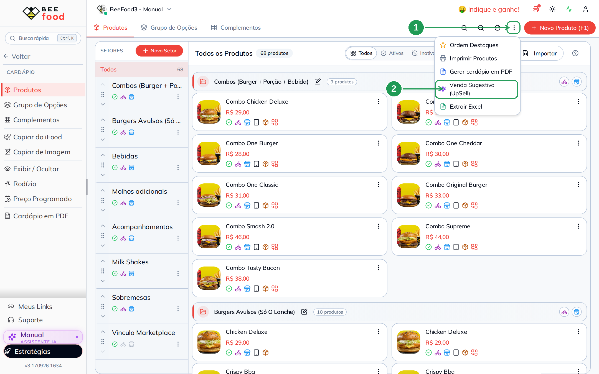

| Nº | Item | O que fazer |
|----|------|-------------|
| 1. | **Três pontinhos** | Menu de ações da tela, ao lado do botão *Novo Produto (F1)*. Ele só tem essa opção na aba **Produtos**. |
| 2. | **Venda Sugestiva (UpSell)** | Abre a janela com todos os produtos do cardápio. |

A janela lista os produtos na mesma ordem da tela Cardápio: setor por setor, na ordem
que você definiu.

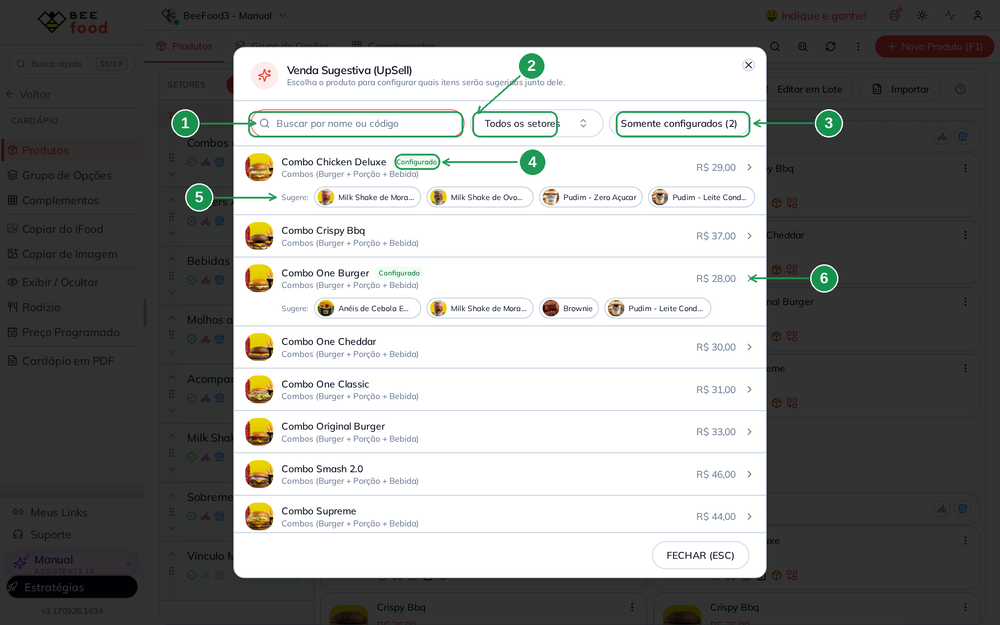

| Nº | Item | O que fazer |
|----|------|-------------|
| 1. | **Buscar por nome ou código** | Filtra a lista pelo nome do produto ou pelo código dele. |
| 2. | **Todos os setores** | Filtra por setor — útil em cardápio grande (por exemplo, ver só os *Combos*). |
| 3. | **Somente configurados (2)** | Mostra apenas os produtos que já têm sugestão. O número entre parênteses é quantos já estão configurados. |
| 4. | **Configurado** | Selo verde nos produtos que já têm lista de sugestão montada. |
| 5. | **Sugere:** | As fotos e os nomes do que já está configurado naquele produto, na ordem em que o cliente vai ver. |
| 6. | **A linha do produto** | Clique em qualquer lugar da linha para abrir a janela de escolha daquele produto. |

Para fechar a janela, use **FECHAR (ESC)** no rodapé.

### 2.1 Escolher os produtos que serão sugeridos

Ao clicar num produto, abre a janela de escolha. O subtítulo diz de qual produto se
trata: *"Escolha até 6 produtos para oferecer quando o cliente adicionar **Combo One
Burger** ao carrinho."*

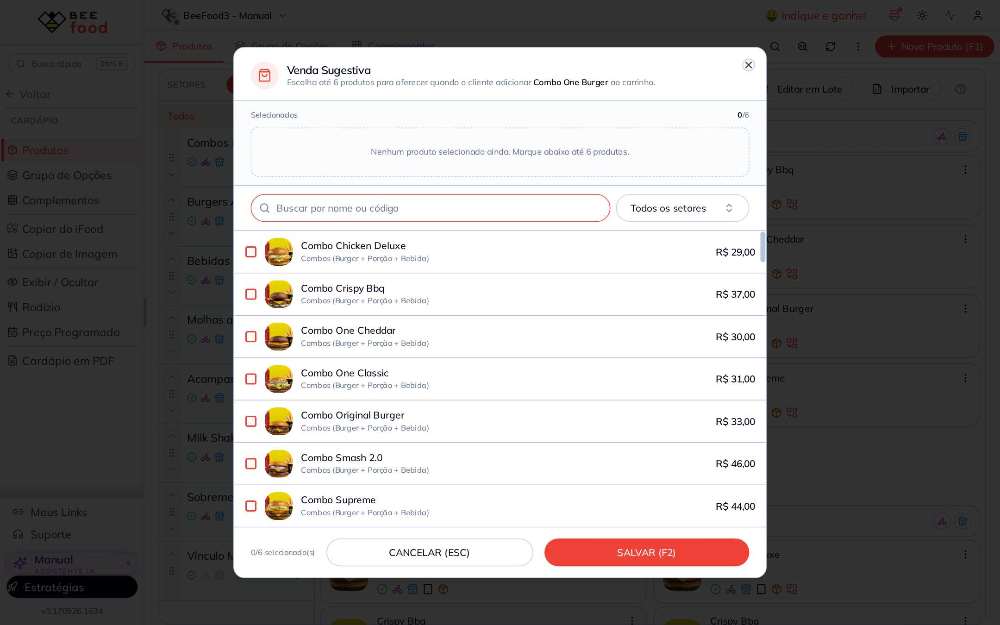

Enquanto nada está marcado, a faixa **Selecionados** mostra `0/6` e o aviso *"Nenhum
produto selecionado ainda. Marque abaixo até 6 produtos."*

Marque a caixinha (1) de cada produto que você quer oferecer. Os escolhidos sobem para
a faixa **Selecionados** (2), o contador mostra quantos já entraram (3) e, no fim,
**SALVAR (F2)** (4) grava.

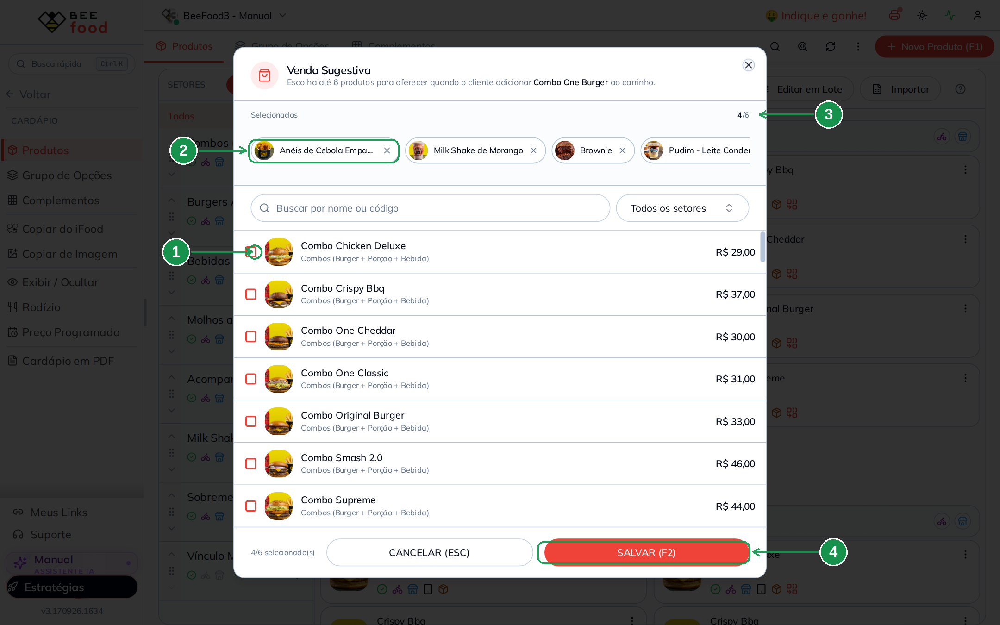

| Nº | Item | O que fazer |
|----|------|-------------|
| 1. | **Caixinha do produto** | Marque para incluir na sugestão; desmarque para tirar. A lista traz foto, nome, setor e preço, e **não** traz o próprio produto. |
| 2. | **Faixa Selecionados** | Os escolhidos, na ordem em que o cliente verá. Clique no **X** do item (ou no próprio item) para removê-lo. |
| 3. | **Contador** | Quantos você já escolheu, de 6 (na imagem, `4/6`). |
| 4. | **SALVAR (F2)** | Grava a lista. **CANCELAR (ESC)** descarta o que você mexeu, sem avisar. |

Use a **busca** e o **filtro de setores** dessa janela para achar rápido a sobremesa ou
a bebida que você quer oferecer — o filtro é o mesmo da tela Cardápio.

Ao salvar, aparece a confirmação **Venda sugestiva salva com N produtos** (1) e a lista
de trás é atualizada — a busca, o filtro e a rolagem ficam onde estavam, para você
seguir configurando o próximo produto.

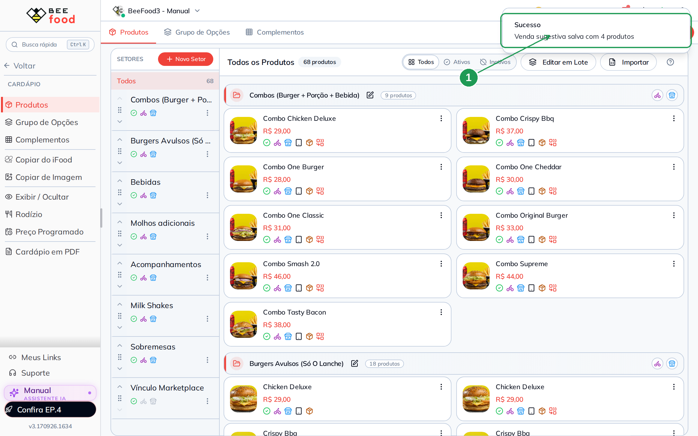

| Nº | Item | O que fazer |
|----|------|-------------|
| 1. | **Sucesso — Venda sugestiva salva com 4 produtos** | Confirma quantos produtos ficaram na lista daquele item. |

> **A ordem que você monta é a ordem que o cliente vê.** O primeiro da faixa
> *Selecionados* é o primeiro card da janela de sugestão. Coloque na frente o que você
> mais quer vender.

---

## 3. Caminho 2 — pelos três pontinhos do produto

Quando é só um produto, não precisa abrir a lista inteira. No card do produto, clique
nos **três pontinhos** (1) e escolha **Venda Sugestiva** (2).

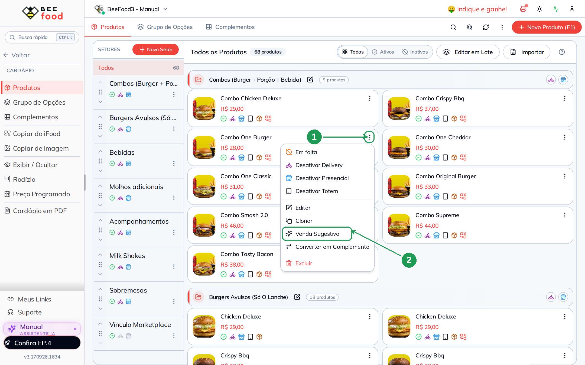

| Nº | Item | O que fazer |
|----|------|-------------|
| 1. | **Três pontinhos do card** | Menu do produto, no canto do card. |
| 2. | **Venda Sugestiva** | Abre direto a janela de escolha daquele produto (a mesma da seção 2.1), entre *Clonar* e *Converter em Complemento*. |

No celular o caminho é o mesmo: toque nos três pontinhos do produto e escolha **Venda
Sugestiva** no menu que sobe de baixo.

---

## 4. Caminho 3 — pela aba Venda Sugestiva do cadastro do produto

Se você já está com o produto aberto, não precisa fechar nada: a última aba do cadastro
é a **Venda Sugestiva** (1).

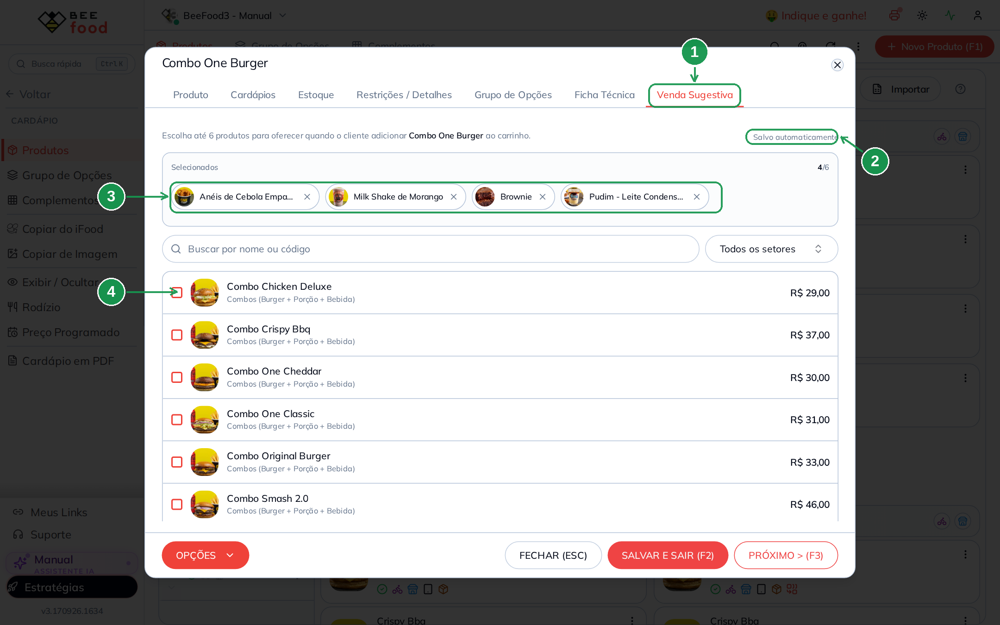

| Nº | Item | O que fazer |
|----|------|-------------|
| 1. | **Aba Venda Sugestiva** | Última aba do cadastro, depois de *Ficha Técnica*. |
| 2. | **Salvo automaticamente** | Esta aba **grava sozinha** a cada clique. Enquanto grava, a etiqueta muda para *Salvando...*. |
| 3. | **Selecionados** | Os produtos já escolhidos, com o **X** para remover. |
| 4. | **Caixinha do produto** | Marque/desmarque para incluir ou tirar da sugestão. |

Dois detalhes desta aba:

- **Ela salva sozinha.** Não existe botão de salvar da venda sugestiva: cada clique já
  vale. O **SALVAR E SAIR (F2)** do rodapé é do cadastro do produto (nome, preço,
  fotos), não desta lista.
- **Produto novo precisa ser salvo antes.** Em um produto que você está criando agora, a
  aba avisa *"Salve o produto antes de configurar a venda sugestiva."* Salve o cadastro
  e volte.

A aba **não existe em complemento**: a venda sugestiva é oferecida a partir de um
produto do cardápio.

---

## 5. As regras da lista

### Até 6 produtos

Com seis marcados, o contador mostra `6/6` e a mensagem **Limite de 6 atingido. Remova
um para escolher outro** (1). As caixinhas dos outros produtos ficam apagadas (2) até
você tirar alguém da lista.

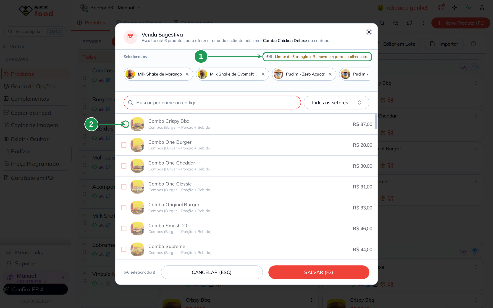

| Nº | Item | O que fazer |
|----|------|-------------|
| 1. | **Limite de 6 atingido** | Aviso de que a lista está cheia. |
| 2. | **Caixinhas apagadas** | Não dá para marcar mais nada; remova um item da faixa *Selecionados* para liberar. |

Seis é o teto, não a meta. **Três ou quatro sugestões bem escolhidas funcionam melhor**
do que seis: a janela fica curta, o cliente lê tudo de uma vez e decide rápido.

### Como desligar a sugestão de um produto

Desmarque todos os produtos e salve. A lista fica vazia, o selo **Configurado**
desaparece daquele item e o cliente deixa de ver a janela quando adiciona esse produto.

### Produto inativo ou oculto não aparece na sugestão

**Marcar o produto aqui não coloca ele no ar.** A venda sugestiva só oferece o que já
está disponível no cardápio naquele momento. Antes de montar a janela, o cardápio
digital confere a lista e tira automaticamente:

- produto **inativo** (desligado no cadastro);
- produto marcado como **Em falta**;
- produto **desativado naquele canal** — *Desativar Delivery*, *Desativar Presencial* ou
  *Desativar Totem* no menu do produto;
- produto **oculto** naquele cardápio por *Exibir / Ocultar* ou por tabela de preço;
- o produto que **já está na sacola** (não se oferece o que o cliente acabou de pegar).

**É exatamente o que acontece no exemplo deste manual.** O **Combo One Burger** foi
configurado com **quatro** produtos — e a janela geral da seção 2 mostra os quatro na
linha *Sugere:*: Anéis de Cebola Empanada, Milk Shake de Morango, **Brownie** e Pudim -
Leite Condensado. Mas o cliente vê **três** (imagem da seção 6): o **Brownie** está
oculto naquele cardápio, então ele é descartado da sugestão. Nada foi perdido — a
configuração continua salva, e no dia em que o Brownie voltar ao cardápio ele volta a
ser oferecido, sem você mexer em nada.

Por isso, se um item não aparece para o cliente, o lugar de olhar é o **produto**, não a
venda sugestiva: confira se ele está ativo, se não está em falta, se está ligado naquele
canal e se não está oculto.

Se todos os sugeridos forem descartados, a janela simplesmente **não abre** e o cliente
segue o pedido sem interrupção.

---

## 6. Como fica para o cliente — cardápio digital delivery

O cliente montou o **Combo One Burger** e tocou em *Adicionar*. A janela aparece na
mesma hora, por cima do cardápio, com o nome e a foto do que ele acabou de escolher.

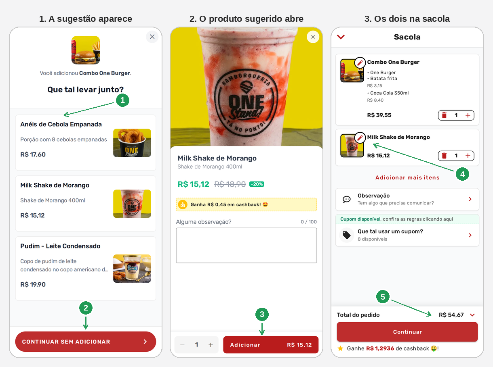

| Nº | Item | O que acontece |
|----|------|----------------|
| 1. | **Card do produto sugerido** | Nome, descrição, foto e preço. Tocar aqui **fecha a sugestão e abre o produto**. |
| 2. | **CONTINUAR SEM ADICIONAR** | O cliente segue sem levar nada. Nada é adicionado à sacola. |
| 3. | **Adicionar** | O produto sugerido abre como qualquer outro (observação, quantidade, cashback) e só entra na sacola quando o cliente confirma aqui. |
| 4. | **Item na sacola** | O sugerido fica na sacola como um produto normal: dá para mudar a quantidade e tirar. |
| 5. | **Total do pedido** | O ticket sobe. No exemplo, R$ 39,55 do combo + R$ 15,12 do milk-shake = **R$ 54,67**. |

Quatro coisas para reparar:

- O título é **Que tal levar junto?**, e acima dele aparece *"Você adicionou &lt;nome do
  produto&gt;."* — o cliente entende na hora por que a janela abriu.
- **O preço é o preço real daquele canal**, já com desconto e preço programado. No
  exemplo, o milk-shake aparece **R$ 15,12** com o *R$ 18,90* riscado e o selo *-20%*, e
  o cashback do item também é mostrado.
- **A sugestão nunca adiciona sozinha.** Ela leva o cliente ao produto; quem confirma é
  ele, no **Adicionar**.
- **São três cards, e não quatro.** O Combo One Burger tem quatro produtos configurados;
  o **Brownie** está oculto nesse cardápio e por isso não entra na janela — é a regra da
  seção 5. Produto inativo ou oculto nunca é oferecido.

### 6.1 Cardápio digital presencial (mesa e comanda)

No cardápio que o cliente abre pelo QR Code da mesa ou da comanda, a janela é a mesma —
com o **preço do presencial**.

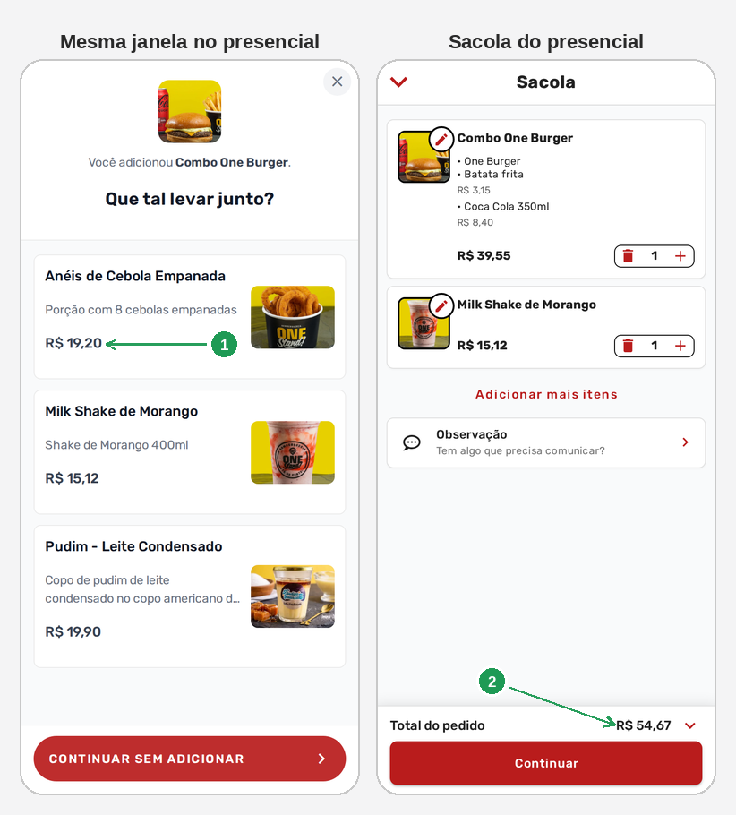

| Nº | Item | O que acontece |
|----|------|----------------|
| 1. | **Preço do canal** | O mesmo item que sai por R$ 17,60 no delivery aparece por **R$ 19,20** no presencial, porque cada canal tem o seu preço. |
| 2. | **Total do pedido** | O item sugerido entra na conta da mesa como qualquer outro pedido. |

Não existe configuração separada por canal: você monta a lista uma vez e ela vale para
o delivery e para o presencial daquele cardápio.

### 6.2 Cardápio no tablet e totem de autoatendimento

A venda sugestiva também aparece no **cardápio digital do tablet** (aquele que fica na
mesa) e no **totem de autoatendimento**, usando a mesma lista que você acabou de
montar. O comportamento é o mesmo: o cliente escolhe o produto, a tela oferece os itens
configurados e ele toca no que quiser levar ou segue sem adicionar.

No totem, vale lembrar que o produto **desativado no totem** (opção *Desativar Totem* no
menu do produto) não é oferecido ali, mesmo estando na lista.

---

## 7. O relatório: quanto a sugestão vendeu

Tudo o que o cliente aceitou por sugestão é somado em **Desempenho → Sugestões**, uma
tela para cada canal.

> **O relatório é processado uma vez por dia — leve até 24 horas.** O que o cliente
> aceitou hoje entra na conta no processamento seguinte. Então não estranhe se você
> configurar a venda sugestiva, vender pela sugestão e o relatório ainda mostrar zero:
> volte no dia seguinte. Para conferir a venda de hoje na hora, o caminho é o
> **Histórico de Vendas** ou o detalhe do pedido, não este relatório.

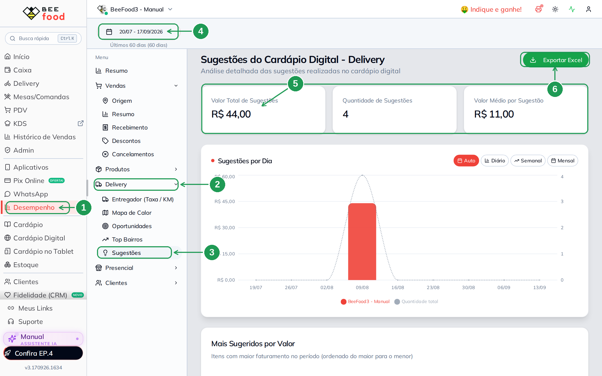

| Nº | Item | O que fazer |
|----|------|-------------|
| 1. | **Desempenho** | Menu lateral. |
| 2. | **Delivery** | Grupo de relatórios do delivery. |
| 3. | **Sugestões** | Abre *Sugestões do Cardápio Digital - Delivery*. |
| 4. | **Período** | O intervalo analisado. Clique para trocar por um atalho (*Hoje*, *Ontem*, *Últimos 7/15/30/60/90 dias*, *Esta semana*, *Este mês*, *Mês passado*) ou escolher as datas no calendário. |
| 5. | **Os três números** | **Valor Total de Sugestões** (quanto entrou), **Quantidade de Sugestões** (quantos itens) e **Valor Médio por Sugestão**. Quando o período anterior de mesmo tamanho também tem sugestão, os dois primeiros mostram embaixo a variação (*% vs período anterior*, em verde ou vermelho). |
| 6. | **Exportar Excel** | Baixa a planilha item a item: data, hora, número da venda, produto, valor unitário, quantidade, total e origem. |

Abaixo dos números vem o gráfico **Sugestões por Dia** (com os botões *Auto*, *Diário*,
*Semanal* e *Mensal*) e, rolando a tela, os dois rankings:

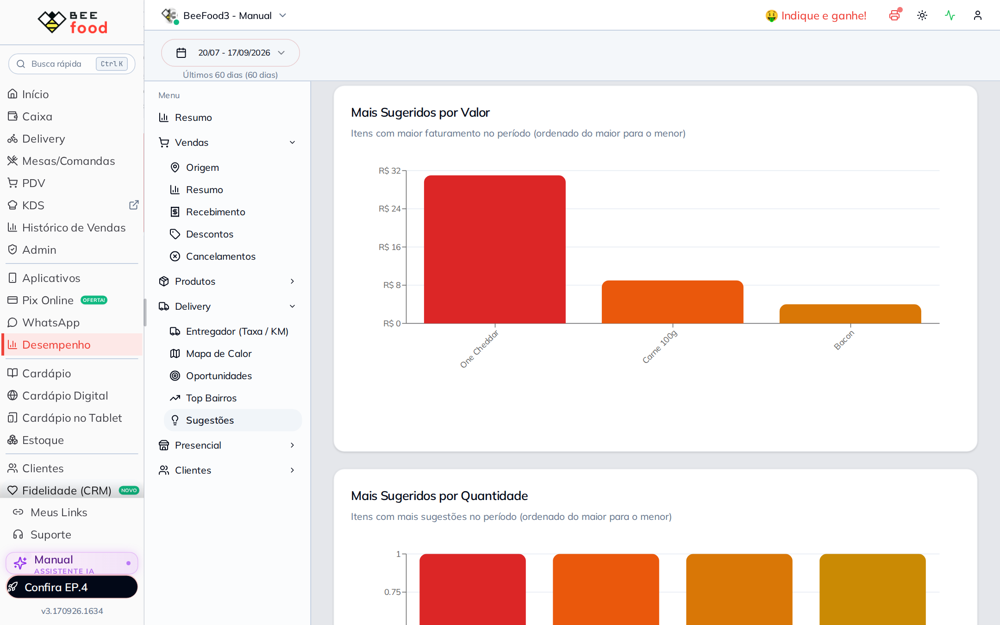

- **Mais Sugeridos por Valor** — os itens que mais faturaram como sugestão.
- **Mais Sugeridos por Quantidade** — os itens que mais saíram como sugestão.

É por esses dois rankings que você ajusta a lista: o que aparece no topo merece
continuar sendo oferecido; o que nunca aparece pode ser trocado por outra coisa.

### 7.1 O mesmo relatório no presencial

Para as vendas de mesa, comanda, tablet e totem, o caminho é **Desempenho →
Presencial → Sugestões**. A tela é idêntica, só muda o canal analisado.

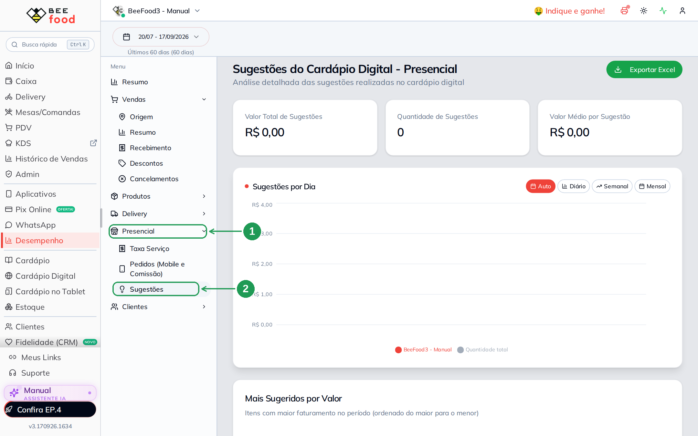

| Nº | Item | O que fazer |
|----|------|-------------|
| 1. | **Presencial** | Grupo de relatórios do presencial. |
| 2. | **Sugestões** | Abre *Sugestões do Cardápio Digital - Presencial*. Sem sugestão já processada no período, os cartões ficam em zero, como na imagem. |

Nos dois canais vale a mesma regra do processamento: os números do dia de hoje só ficam
completos depois de até 24 horas.

---

## 8. O que vale a pena sugerir

| Produto que o cliente escolheu | Boas sugestões |
|--------------------------------|----------------|
| **Hambúrguer ou combo** | batata frita, anéis de cebola, refrigerante, milk-shake |
| **Pizza** | borda recheada como produto, refrigerante 2 L, pizza doce |
| **Prato executivo** | suco natural, sobremesa individual, porção extra |
| **Bebida** | porção para dividir, sobremesa |
| **Sobremesa** | café, doce pequeno para levar |
| **Item promocional** | o adicional mais rentável da casa |

Três regras práticas que funcionam bem:

1. **Sugira coisa mais barata que o produto principal.** Item caro na janela parece
   propaganda; item barato parece cortesia.
2. **Comece pelo que tem mais margem.** A primeira posição é a mais vista.
3. **Configure os campeões primeiro.** Os 10 ou 15 produtos que mais saem cobrem a
   maior parte dos pedidos — não precisa configurar o cardápio inteiro no primeiro dia.

---

## Problemas comuns

| Sintoma | O que está acontecendo | O que fazer |
|---------|------------------------|-------------|
| Não encontro **Venda Sugestiva** no menu | o recurso está em liberação por conta | fale com o suporte; a opção fica nos três pontinhos da tela Cardápio, no menu do produto e na última aba do cadastro |
| A janela não abre para o cliente | aquele produto não tem sugestão configurada | confira o selo **Configurado** na janela geral, ou use **Somente configurados** |
| Configurei e o cliente ainda não vê | o cardápio público guarda a versão anterior por até um minuto | espere um instante e recarregue o cardápio |
| Um dos produtos escolhidos não aparece na janela do cliente | ele está **inativo**, em falta, desativado naquele canal ou **oculto** naquele cardápio — produto fora do ar nunca é sugerido | reveja o produto em *Cardápio* e em *Exibir / Ocultar*; assim que ele voltar, a sugestão volta sozinha |
| Nenhum produto aparece e a janela não abre | todos os sugeridos foram descartados (inativos, ocultos ou já na sacola) | escolha itens que estejam realmente no ar naquele cardápio |
| Não consigo marcar o sétimo produto | o limite é 6 | remova um item da faixa *Selecionados* |
| Configurei em um cardápio e o outro continua sem sugestão | a lista é por cardápio | troque o cardápio no seletor do topo e configure lá também |
| Sumiu a lista que eu tinha montado | a janela foi fechada em **CANCELAR (ESC)** antes de salvar | monte de novo e use **SALVAR (F2)**; na aba do cadastro, o salvamento é automático |
| Não acho a aba **Venda Sugestiva** no complemento | a venda sugestiva é do produto, não do complemento | configure no produto que o cliente escolhe |
| A aba não deixa escolher nada | o produto ainda não foi salvo | salve o cadastro e volte na aba |
| Aceitei uma sugestão e o relatório continua zerado | o relatório é processado uma vez por dia: leva **até 24 horas** para a venda entrar | confira no dia seguinte; para ver a venda de hoje na hora, use o **Histórico de Vendas** |
| O relatório mostra menos do que eu vendi hoje | as vendas do dia ainda estão em processamento | espere o processamento (até 24 horas) e confira o período no topo |
| O preço da sugestão está diferente do que eu esperava | a janela mostra o preço daquele canal, já com desconto e preço programado | confira o preço do produto no canal (delivery/presencial) e as promoções ativas |

---

## Perguntas frequentes

**O que é venda sugestiva (upsell) no cardápio digital?**
É a janela **Que tal levar junto?** que aparece depois que o cliente coloca um produto
na sacola, oferecendo até 6 itens que você escolheu para aquele produto.

**Como eu configuro a venda sugestiva?**
Por três caminhos: os três pontinhos da tela **Cardápio → Produtos**, os três pontinhos
do card do produto, ou a aba **Venda Sugestiva** dentro do cadastro do produto.

**Quantos produtos posso sugerir?**
Até **6** por produto. Na prática, três ou quatro funcionam melhor.

**A sugestão adiciona o produto sozinha na sacola?**
Não. Tocar na sugestão abre o produto; o cliente ainda precisa confirmar no
**Adicionar**.

**Onde a venda sugestiva aparece?**
No cardápio digital de **delivery**, no cardápio digital **presencial** (mesa e
comanda), no **tablet** e no **totem de autoatendimento**.

**Preciso configurar uma vez para cada canal?**
Não. Uma lista por produto vale para todos os canais daquele cardápio. Com mais de um
cardápio (mais de uma loja), configure em cada cardápio.

**Dá para escolher a ordem dos produtos sugeridos?**
Sim: a ordem em que eles aparecem na faixa *Selecionados* é a ordem que o cliente vê.

**Como eu vejo quais produtos já estão configurados?**
Abra a janela pelos três pontinhos da tela Cardápio: os configurados têm o selo
**Configurado**, mostram a linha *Sugere:* com as fotos e podem ser isolados pelo botão
**Somente configurados**.

**Como eu desligo a sugestão de um produto?**
Desmarque todos os itens e salve. O produto volta a não mostrar nada ao cliente.

**Posso sugerir um produto que está esgotado?**
Pode marcar, mas o cliente não vai vê-lo: o cardápio esconde da sugestão o que está
inativo, em falta ou oculto naquele canal.

**Marquei o produto e ele não aparece para o cliente. Por quê?**
Porque produto **inativo** ou **oculto** não é sugerido. A venda sugestiva só oferece o
que está no ar naquele cardápio: confira se o produto está ativo, se não está em falta,
se não foi desativado naquele canal e se não está oculto em *Exibir / Ocultar* ou em
tabela de preço. A configuração fica guardada — quando o produto voltar ao cardápio, ele
volta a ser oferecido.

**Posso sugerir um complemento (por exemplo, bacon extra)?**
A venda sugestiva oferece **produtos** do cardápio. Adicionais e opções continuam
dentro do próprio produto, nos grupos de opções.

**O preço da sugestão é o mesmo do cardápio?**
Sim, o do canal em que o cliente está — com desconto, preço programado e cashback
aplicados, igual à tela do produto.

**Onde eu vejo se está dando resultado?**
Em **Desempenho → Delivery → Sugestões** e **Desempenho → Presencial → Sugestões**:
valor total, quantidade, valor médio, gráfico por dia e os rankings de mais sugeridos,
com exportação para Excel.

**Vendi pela sugestão agora e o relatório está zerado. Está errado?**
Não. O relatório é processado uma vez por dia e leva **até 24 horas** para incluir a
venda. Confira no dia seguinte; a venda em si você acompanha na hora pelo **Histórico de
Vendas**.

**Preciso de permissão especial?**
Não. Quem já edita produto no Cardápio consegue configurar.

---

## Manuais relacionados

- **Cardápio — fundamentos** — cadastro de produtos, setores e grupos de opções.
- **Exibir / Ocultar** — o que fica visível em cada canal; produto oculto não é
  sugerido.
- **Preço Programado** — a promoção que aparece já aplicada no card da sugestão.
- **Cardápio digital presencial e QR Code** — o cardápio da mesa e da comanda.
- **Cashback — configurar o programa** — o selo de cashback que aparece no produto
  sugerido.
