# Manual — Vínculo Marketplace

Quando um pedido entra pelo iFood, Aiqfome, 99Food, Keeta, Rappi, Uai Rango ou Delivery Much, o
item chega com **o nome que está no cardápio do marketplace** — que quase nunca é igual ao nome
do produto no seu BeeFood. O **Vínculo Marketplace** é a tela onde você diz, **uma única vez**,
qual produto do seu cardápio corresponde a cada nome que vem de fora.

> As imagens têm **setas numeradas** (1, 2, 3…). Cada número indica o campo correspondente
> na tela.

    10|---

## Por que vincular

O pedido de marketplace **entra e é entregue** mesmo sem vínculo. O que falta é a ligação com o
seu cadastro — e ela é o que faz o resto funcionar:

| Com vínculo | Sem vínculo |
|-------------|-------------|
| O item sai na via da cozinha do **setor certo** | O item não tem setor: só imprime se você tiver configurado uma impressora de marketplace |
| A **nota fiscal** é emitida normalmente | A nota fiscal **não sai** enquanto houver produto sem vínculo |
    20|| O item entra nos relatórios como produto do seu cardápio | O item fica solto, com o nome do marketplace |
| Se o produto tem ficha técnica, o estoque é baixado | Não há produto, então não há ficha técnica para baixar |

Vincular é rápido e não tem volta atrás complicada: você escolhe o produto, confirma, e o
próximo pedido com aquele mesmo nome **já entra vinculado**.

---

## Onde fica a tela

Abra o **Delivery**, clique no botão de três pontinhos do topo (1) e escolha
    30|**Vínculo Marketplace** (2).

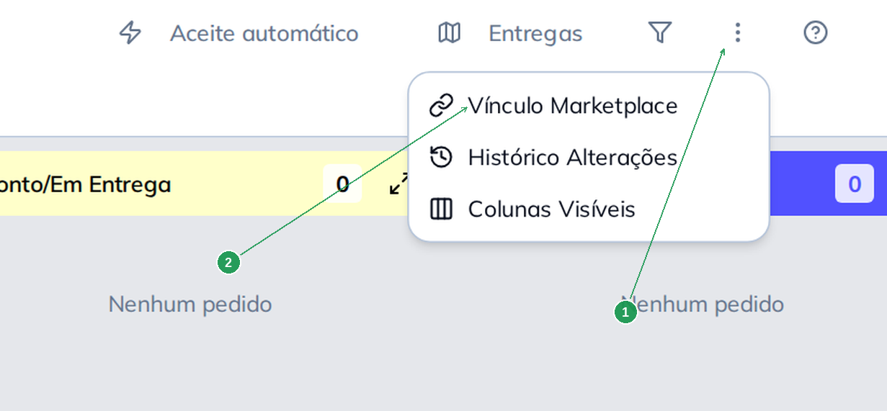

| Nº | Item | O que fazer |
|----|------|-------------|
| 1 | Botão **⋮** (três pontinhos) | Fica na barra de cima do Delivery, ao lado do filtro. |
| 2 | **Vínculo Marketplace** | Abre a lista com todos os nomes que os marketplaces já enviaram. |

> Existe um segundo caminho, **dentro de um pedido específico**, explicado na seção
> *Resolver pelo próprio pedido*.
    40|

---

## Entendendo a tela

A lista mostra **um nome de marketplace por linha**. Use a busca (1) para achar o item, o filtro
(2) para ver só o que falta e os dois contadores (3) para saber quanto já está pronto.

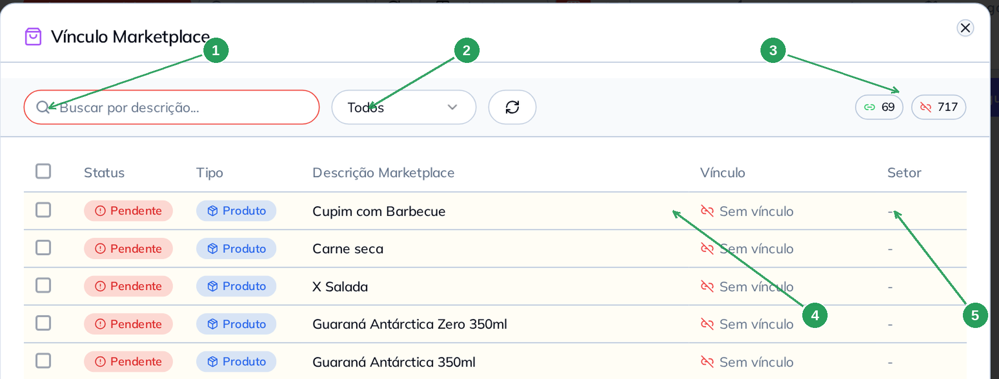

    50|| Nº | Item | O que é |
|----|------|---------|
| 1 | **Buscar por descrição** | Procura no nome do marketplace, no produto vinculado e no setor. É por aqui que se trabalha: a lista costuma ser longa. |
| 2 | **Todos / Vinculados / Pendentes** | Filtra pelo status. Em **Pendentes** ficam só os que ainda precisam de você. |
| 3 | Os dois contadores | O verde é quanto já está vinculado; o vermelho, quanto está pendente. |
| 4 | Coluna **Vínculo** | O produto do seu cardápio. Quando está vazia, aparece **Sem vínculo**. |
| 5 | Coluna **Setor** | O setor do produto vinculado — é ele que manda o item para a impressora certa. Fica com um traço enquanto não há vínculo. |

Duas colunas ajudam a decidir o que fazer:

| Coluna | Valores | O que significa |
    60||--------|---------|-----------------|
| **Status** | `Vinculado` / `Pendente` | Pendente é o que ainda não tem produto associado |
| **Tipo** | `Produto` / `Grupo Opção` | **Produto** é o item principal do pedido (o lanche, a bebida). **Grupo Opção** é um adicional dentro dele (bacon extra, sem cebola) |

O **Tipo** muda o que você pode escolher na hora de vincular — a seção *Vincular uma opção*
explica.

---

## Vincular um item

    70|**Exemplo:** o marketplace manda **Pudim - Tradicional**, e no seu cardápio o produto se chama
**Pudim - Leite Condensado**. São o mesmo pudim, com nomes diferentes.

Busque o nome, marque a caixa da linha (1). O rodapé mostra quantos itens estão selecionados (2)
e libera os botões de ação. Clique em **Vincular** (3).

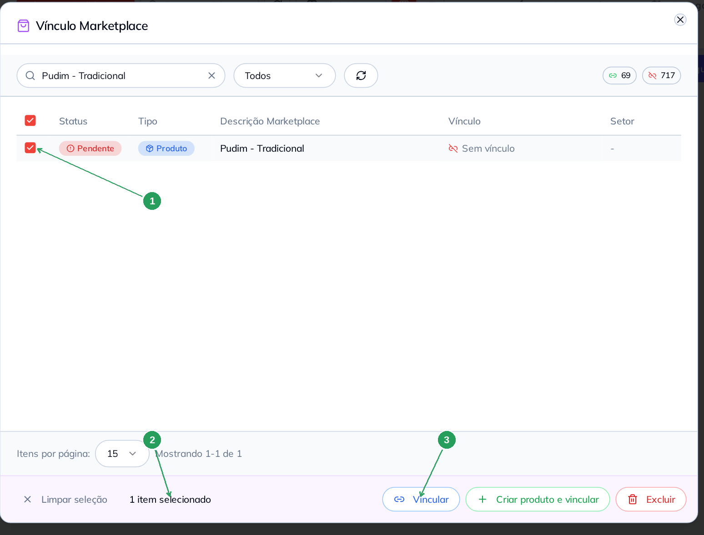

| Nº | Item | O que fazer |
|----|------|-------------|
| 1 | Caixa de seleção da linha | Marque o item que você quer vincular. |
    80|| 2 | **1 item selecionado** | Confere se você marcou o que queria antes de clicar em qualquer botão. |
| 3 | **Vincular** | Abre a lista do seu cardápio para escolher o produto. |

Abre a janela **Selecionar Vínculo**. No alto dela fica o nome que veio do marketplace (1) — é a
sua referência do que está sendo vinculado. Busque o produto do seu cardápio (2), clique nele
(3) e confirme em **Confirmar Vínculo** (4).

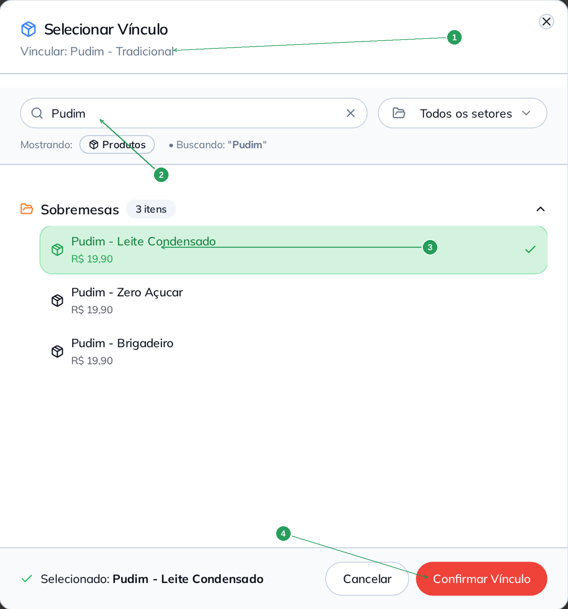

| Nº | Item | O que fazer |
|----|------|-------------|
    90|| 1 | **Vincular: Pudim - Tradicional** | O nome que veio do marketplace. Confira antes de escolher o produto. |
| 2 | Campo de busca | Digite parte do nome do produto. Dentro desta janela, **qualquer letra que você digitar cai na busca**, mesmo sem clicar no campo. |
| 3 | O produto escolhido | Fica verde, com um ✓ à direita. Os produtos vêm agrupados por **setor**, com o preço embaixo do nome — use os dois para não errar quando houver nomes parecidos. |
| 4 | **Confirmar Vínculo** | Grava. **Não há tela de confirmação depois deste botão.** |

Pronto. A linha volta para a lista já como **Vinculado** (1), com o produto na coluna
**Vínculo** (2) e o setor dele na coluna **Setor** (3). Os contadores mudam junto (4): um item
saiu de pendente e entrou em vinculado.

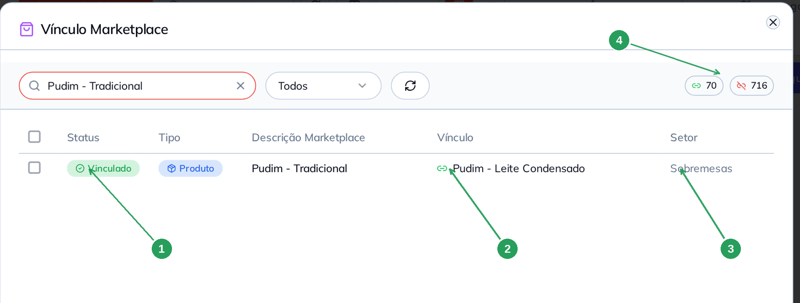

   100|| Nº | Item | O que conferir |
|----|------|----------------|
| 1 | **Vinculado** | O status mudou de Pendente para Vinculado. |
| 2 | **Pudim - Leite Condensado** | O produto do seu cardápio que vai receber os pedidos com esse nome. |
| 3 | **Sobremesas** | O setor apareceu sozinho: ele vem do produto, e é o que decide a impressora da cozinha. |
| 4 | Contadores | Um a mais no verde, um a menos no vermelho. |

---

## Vincular vários nomes no mesmo produto

   110|É comum o mesmo produto chegar com nomes diferentes — cada marketplace escreve do seu jeito, e
às vezes o mesmo cardápio tem duas variações. Você **não precisa** vincular um por um: pode
apontar vários nomes para o **mesmo** produto de uma vez.

**Exemplo:** **Sachê Maionese** e **Sachê Maionese Temperada** são, na sua loja, o produto
**Maionese Grill (Defumada/Tasty)**.

Busque, marque a caixa do cabeçalho (1) para selecionar tudo o que a busca trouxe, confira a
contagem (2) e clique em **Vincular** (3).

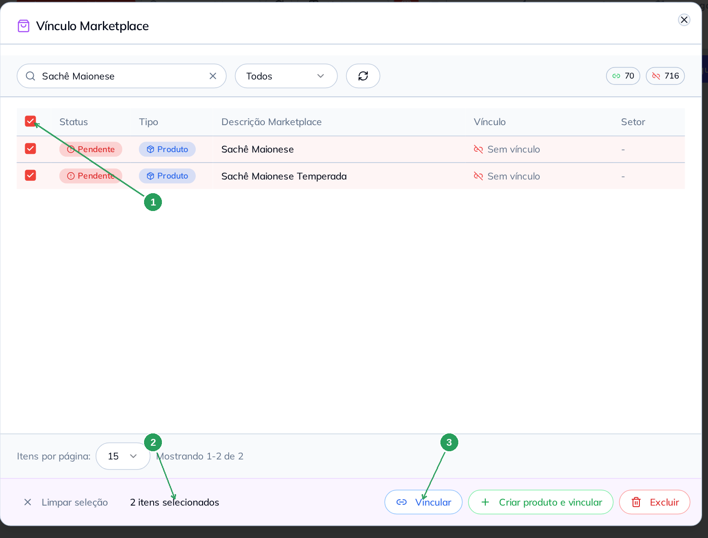
   120|
| Nº | Item | O que fazer |
|----|------|-------------|
| 1 | Caixa de seleção do cabeçalho | Marca todas as linhas da página. Combine com a busca para selecionar só o grupo que você quer. |
| 2 | **2 itens selecionados** | A contagem é sua conferência: ela conta o que está marcado, não o que está na tela. |
| 3 | **Vincular** | A janela seguinte é a mesma, e o produto que você escolher vale **para todos** os itens marcados. |

O resultado são dois nomes diferentes apontando para o mesmo produto (1).

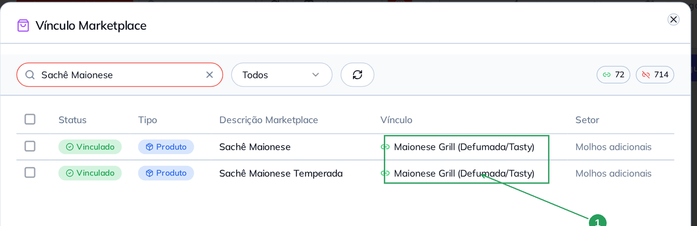

   130|| Nº | Item | O que conferir |
|----|------|----------------|
| 1 | Coluna **Vínculo** nas duas linhas | O mesmo produto nas duas. Isso é normal e é o objetivo: muitos nomes de fora, um produto seu. |

> A seleção vale **por página**. Se a busca trouxer mais itens do que cabem na página, ou você
> aumenta o **Itens por página** no rodapé, ou repete a operação na página seguinte.

---

## Vincular uma opção (adicional)

   140|Quando o item é do tipo **Grupo Opção**, a janela de escolha muda: além dos produtos, ela passa
a mostrar também as **opções de grupo** do seu cardápio (1) — bacon, queijo extra, "sem cebola"
e companhia.

**Exemplo:** o marketplace manda **Adicionar queijo cheddar**; no seu cardápio isso é a opção
**Fatia de queijo cheddar**, do grupo **Adicionais**.

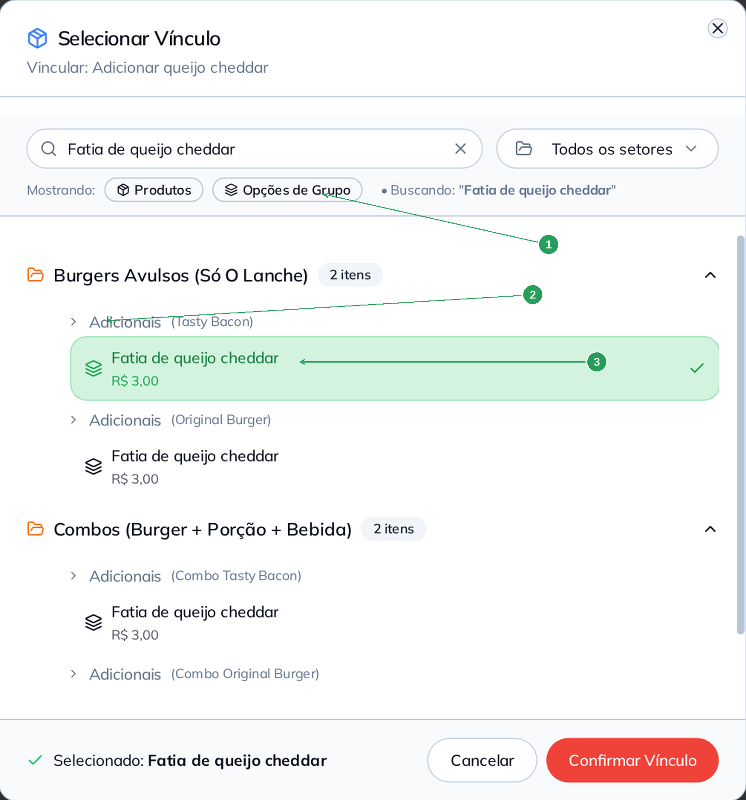

| Nº | Item | O que é |
|----|------|---------|
   150|| 1 | **Mostrando: Produtos / Opções de Grupo** | Com um item do tipo Grupo Opção selecionado, você pode escolher um produto **ou** uma opção. Se houver qualquer item do tipo **Produto** na seleção, a janela mostra **somente produtos**. |
| 2 | O grupo entre parênteses | A opção aparece **uma vez para cada produto que a usa** — aqui, *Adicionais (Tasty Bacon)* e *Adicionais (Original Burger)*. Escolha a do produto que o pedido de fora costuma trazer. |
| 3 | A opção escolhida | Mesmo comportamento do produto: fica verde e vai para o **Confirmar Vínculo**. |

> Não misture os dois tipos na mesma seleção. Se você marcar um produto junto com opções, a
> janela vai oferecer **só produtos** — e a opção acabaria vinculada a um produto.

Depois de confirmar, a linha fica **Vinculado** com a opção na coluna Vínculo. A coluna **Setor**
continua com um traço: ela só é preenchida quando o vínculo é com um **produto**.

   160|---

## Criar produto e vincular

Serve para o caso em que o item vendido no marketplace **não existe** no seu cardápio. O botão
**Criar produto e vincular** (1) cria o produto com o nome que veio de fora e já faz o vínculo.
O sistema pede confirmação (2).

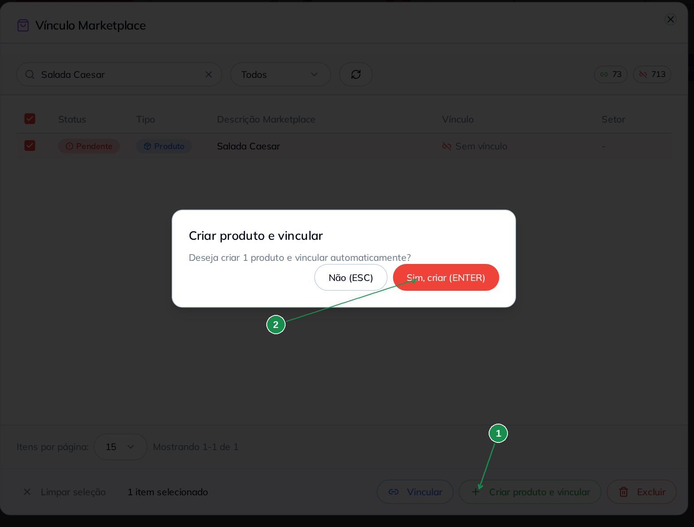

| Nº | Item | O que fazer |
   170||----|------|-------------|
| 1 | **Criar produto e vincular** | Só aparece nesta lista (não aparece quando você abre o vínculo por dentro de um pedido). |
| 2 | **Sim, criar (ENTER)** | Cria um produto por item selecionado. |

**Procure antes de criar.** Se o produto já existe com outro nome, o certo é **Vincular** — se
você criar, o cardápio fica com dois produtos para a mesma coisa, e os relatórios se dividem
entre eles.

O produto criado vai para o **Cardápio**, num setor novo chamado **Vínculo Marketplace** (1),
com o nome que veio do marketplace (2) e **sem preço** (3).

   180|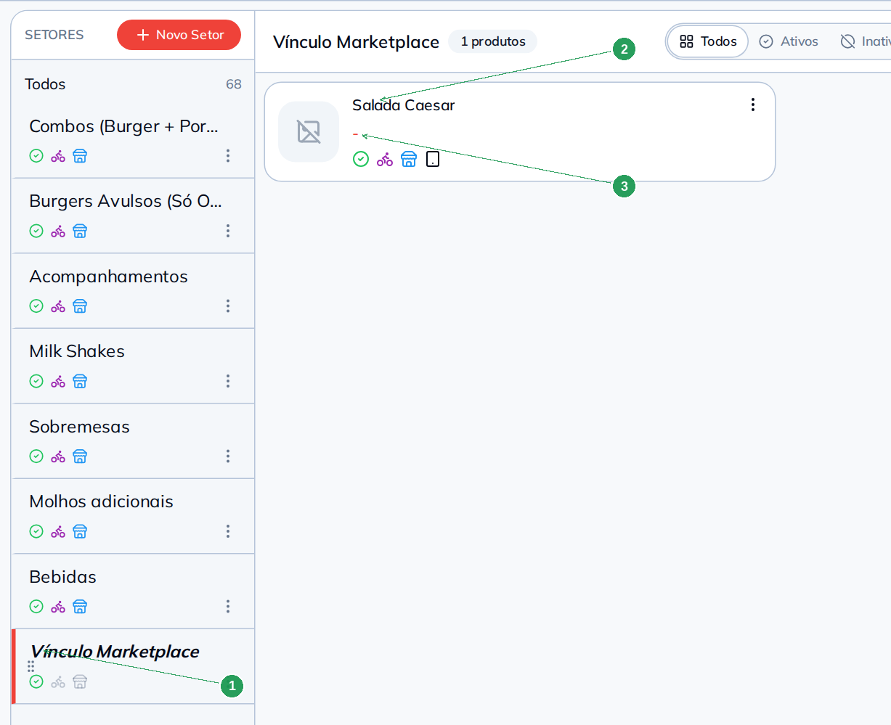

| Nº | Item | O que fazer |
|----|------|-------------|
| 1 | Setor **Vínculo Marketplace** | É criado automaticamente na primeira vez. Todos os produtos criados por aqui caem nele. |
| 2 | O produto criado | Nasce com o nome exato do marketplace, sem foto e sem descrição. |
| 3 | O preço, em branco | **Complete o cadastro:** preço, setor definitivo, foto e, se você usa, a ficha técnica. O produto já nasce ativo nos seus canais. |

> Enquanto o produto estiver sem preço e no setor **Vínculo Marketplace**, ele existe só para
> receber os pedidos daquele marketplace. Trate isso como uma pendência de cadastro, não como
> um cadastro pronto.
   190|
---

## Excluir um vínculo

Use quando o vínculo foi feito no produto errado. Marque a linha, clique em **Excluir** (1) e
confirme (2).

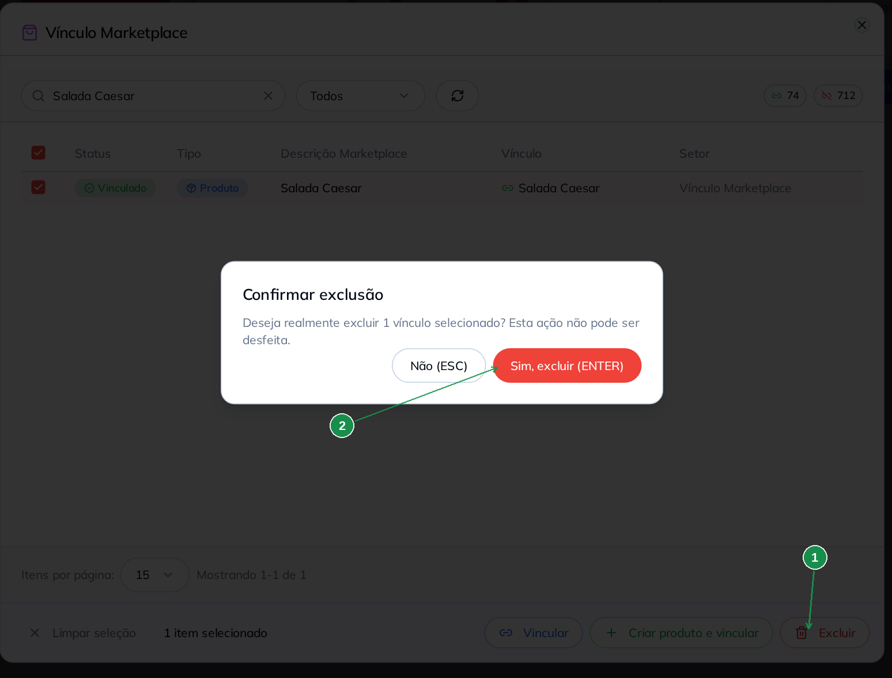

| Nº | Item | O que fazer |
   200||----|------|-------------|
| 1 | **Excluir** | Apaga **a ligação**, não o produto do cardápio. O nome do marketplace volta para **Pendente**. |
| 2 | **Sim, excluir (ENTER)** | Confirma. Como o próprio aviso diz, **não tem como desfazer** — para voltar atrás, é refazer o vínculo. |

> Excluir não apaga produto, não apaga venda e não mexe em pedido antigo. O que muda é o
> reconhecimento dos **próximos** pedidos com aquele nome.

---

## Resolver pelo próprio pedido

   210|Quando um pedido chega com item que ninguém vinculou ainda, o próprio pedido avisa. Abra o
pedido: o item aparece com o nome que veio do marketplace (1) e, embaixo dele, a faixa
**Produto não associado no pedido - sem vínculo marketplace** (2).

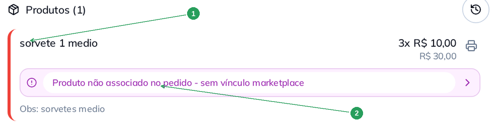

| Nº | Item | O que é |
|----|------|---------|
| 1 | O nome do item | É o nome do cardápio do marketplace — no seu cadastro ele não existe ainda. |
| 2 | A faixa de aviso | **É um atalho:** clique nela e a janela **Selecionar Vínculo** abre já com esse item preenchido. |

   220|Para ver todos os itens do pedido de uma vez, use o menu do próprio pedido: o botão **^** ao
lado de **PAGAMENTO** → **Vínculo Marketplace**. A tela é a mesma, com duas diferenças.

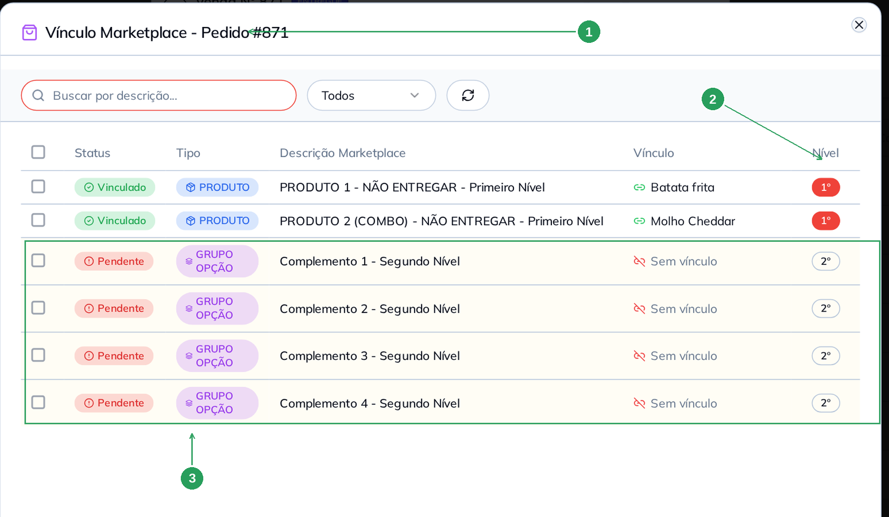

| Nº | Item | O que é |
|----|------|---------|
| 1 | **Vínculo Marketplace - Pedido #871** | O título mostra o número do pedido: aqui você vê **só** os itens dele. |
| 2 | Coluna **Nível** | `1º` é o produto do pedido; `2º` é uma opção que veio dentro dele. |
| 3 | As linhas `2º` pendentes | Os dois produtos deste pedido estão vinculados, mas as **quatro opções** não. Repare que não há nenhum aviso na tela do pedido para opção pendente — **só produto** ganha a faixa vermelha. |

   230|Neste modo, o rodapé só oferece **Vincular**: criar produto e excluir são ações da lista geral.

> Vincular por aqui resolve o pedido aberto **e** registra o nome na lista geral. Testado: um
> item vinculado por dentro do pedido passa a aparecer como **Vinculado** na tela do Delivery,
> com o setor preenchido.

---

## O bloqueio da nota fiscal

Se você tentar emitir a NFC-e de um pedido de marketplace que tem produto sem vínculo, o sistema
   240|**não emite** e abre esta janela:

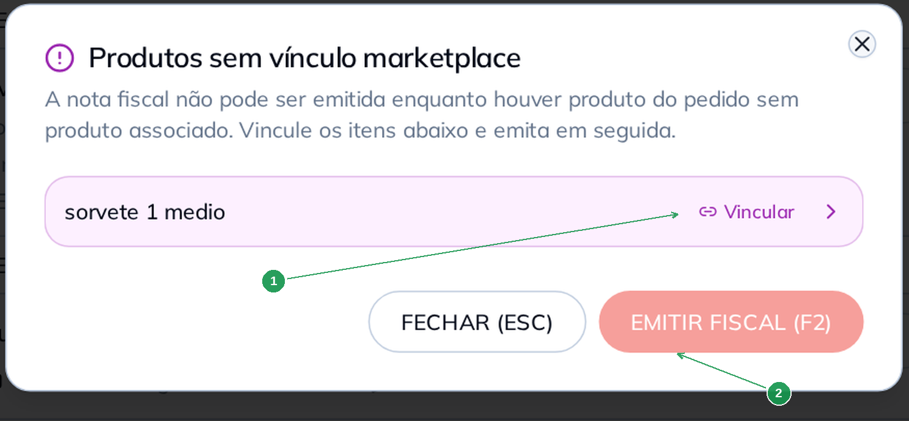

| Nº | Item | O que fazer |
|----|------|-------------|
| 1 | O item pendente, com **Vincular** | Clique na linha para abrir a janela de escolha e vincular na hora. Resolvido, a linha fica verde com **Vinculado**. |
| 2 | **EMITIR FISCAL (F2)** | Fica **desabilitado** enquanto sobrar pendência. Quando não sobrar nenhuma, ele libera e emite a nota sem precisar começar de novo. |

Para sair sem emitir, use **FECHAR (ESC)**.

   250|> A trava olha apenas os **produtos** do pedido. Opção pendente não impede a emissão — mas
> continua sem setor e fora dos relatórios, então vale resolver do mesmo jeito.

---

## Resumo

1. Marketplace manda **o nome dele**; o vínculo diz qual é o **seu produto**.
2. Trabalhe pela lista: **Delivery → ⋮ → Vínculo Marketplace**, filtro em **Pendentes**.
3. **Vincular** grava direto, sem segunda confirmação. Confira o item antes.
   260|4. Vários nomes de fora podem apontar para **um** produto seu — selecione todos e vincule de uma vez.
5. **Criar produto e vincular** só quando o produto realmente não existe — e complete o cadastro depois (preço, setor, foto).
6. Item do tipo **Grupo Opção** pode ser vinculado a produto **ou** a opção; item do tipo **Produto**, só a produto.
7. Produto sem vínculo **trava a nota fiscal**; opção sem vínculo passa em silêncio.

---

## Perguntas frequentes

**Preciso vincular antes de aceitar o pedido?**
   270|Não. O pedido entra, é preparado e entregue normalmente. O vínculo é o que organiza cozinha,
nota fiscal e relatórios — e o que evita repetir o problema no próximo pedido.

**Vinculei. Preciso fazer de novo no próximo pedido com esse item?**
Não. O vínculo vale para os próximos pedidos com aquele mesmo nome.

**O nome aparece mais de uma vez na lista. Vinculo qual?**
Vincule as linhas que estiverem **Pendentes** — pode marcar todas de uma vez e apontar para o
mesmo produto. Elas correspondem a nomes que chegaram dos marketplaces, e ter mais de uma não é
erro.

   280|**Vinculei no produto errado. Como corrijo?**
Marque a linha, clique em **Excluir** e faça o vínculo de novo no produto certo.

**Excluir o vínculo apaga meu produto?**
Não. Apaga só a ligação. O produto continua no cardápio.

**Criei um produto sem querer pelo botão Criar produto e vincular. E agora?**
O produto está no **Cardápio**, no setor **Vínculo Marketplace**. Você pode completar o cadastro
dele ou desativá-lo/excluí-lo por lá; e, na lista de vínculos, apagar a ligação e vincular no
produto certo.
   290|
**A nota não emite e a janela de pendência abriu. Posso emitir sem vincular?**
Não. O **EMITIR FISCAL (F2)** só habilita quando nenhum produto do pedido está pendente. Vincule
pela própria janela e emita em seguida.

**O item do marketplace não imprime na cozinha.**
Sem vínculo ele não tem setor, e a impressão por setor não sabe para onde mandar. Vincule o
item; se você recebe muitos pedidos de marketplace, vale também configurar o **Local de
Impressão padrão para Marketplace** em Configuração → Impressão → Cozinha.

   300|**Abri o vínculo de um pedido cancelado e a lista veio vazia.**
É o esperado: pedido cancelado não lista itens para vincular.

**Onde vejo o que ainda falta?**
No contador vermelho do topo da lista, e no filtro **Pendentes**.

---

## Manuais relacionados

   310|- **Ativação Aiqfome V2**, **Uai Rango** e as demais integrações de marketplace — como conectar
  a loja
- **Cardápio — fundamentos** — produto, grupo de opções e complementos, que são o outro lado do
  vínculo
- **Ficha técnica** — o custo e a baixa de estoque que só acontecem quando o item tem produto
