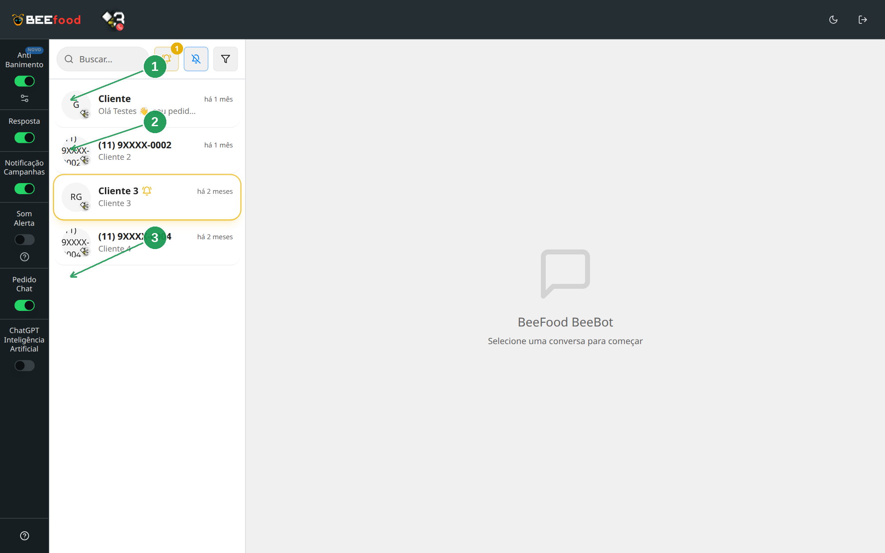
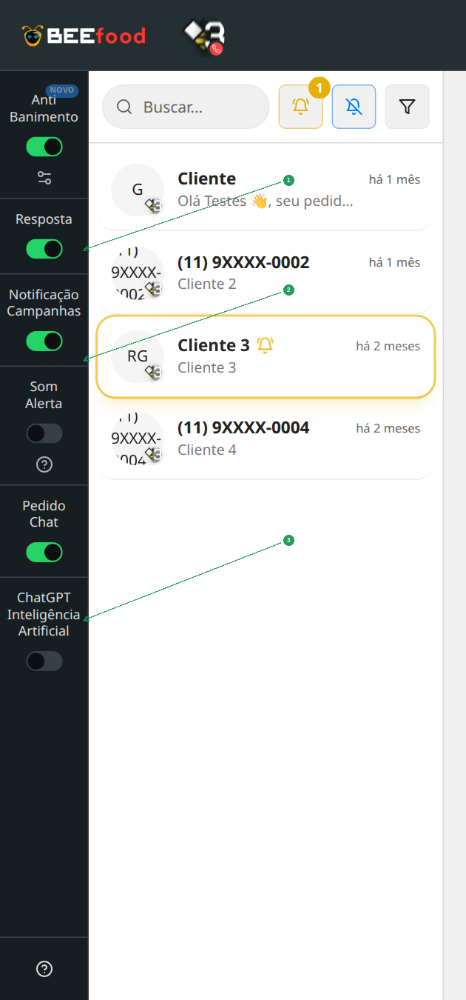
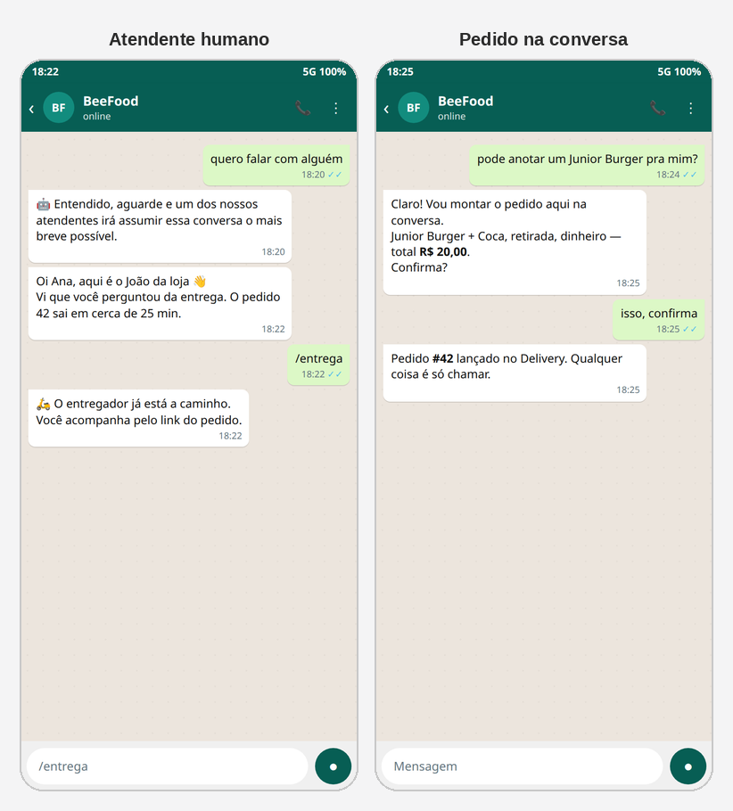

# Atender no BeeBot

O BeeBot é a caixa de entrada do WhatsApp da loja: lista de conversas,
interruptores e o chat. Fica em [bot.beefood.com.br](https://bot.beefood.com.br)
(mesmo login do BeeFood) ou pelo botão **Abrir Conversas WhatsApp**.

Aqui o assunto é o **atendente humano**: respostas rápidas com `/`, assumir
a conversa e **montar o pedido na conversa**. O cliente pedindo sozinho pelo
bot é o manual do **Pedido Chat**.

Os prints de conversa deste manual são **simulação**. A lista real foi
ofuscada (repositório público).

> As imagens do painel têm **setas numeradas** (1, 2, 3…).

---

## Abrir o painel

Pelo BeeFood: **WhatsApp → Conexão → Abrir Conversas WhatsApp**.
Ou entre direto em bot.beefood.com.br.

| Nº | Item | O que faz |
|----|--------|-----------|
| 1. | **Anti Banimento** | Só dispara campanha/notificação para quem falou com a loja há pouco |
| 2. | **Resposta** | Liga as respostas por palavra-chave |
| 3. | **Pedido Chat** | O cliente monta o pedido sozinho (manual próprio) |

Os outros interruptores: **Notificação Campanhas**, **Som Alerta**,
**ChatGPT**. Som toca quando a conversa precisa de gente. ChatGPT é a IA
(#58).

A coluna do meio é a lista de conversas. Clique numa para abrir o chat à
direita.

| Nº | Item | O que faz |
|----|--------|-----------|
| 1. | **Anti Banimento** | Proteção do número (também existe nas Campanhas Inteligentes) |
| 2. | **Resposta** | Palavra-chave |
| 3. | **Pedido Chat** | Fluxo de pedido do cliente |

---

## Respostas rápidas (`/`)

No campo da mensagem, digite **/**. Abre os atalhos cadastrados. Dá para
criar, editar e apagar o atalho **sem sair do chat**.

Use para frases do dia a dia: taxa, horário, “já saiu para entrega”.

---

## Atendente humano

Se o cliente escreve uma palavra da resposta **Atendente** (ou o Pedido Chat
recebe **Atendente**), o bot avisa que um humano vai assumir. O selo **Alerta**
naquela resposta faz a conversa piscar na lista.

Simulação: o bot entrega a conversa e o atendente responde. O `/entrega` é um
atalho.

---

## Pedido assistido (cardápio na conversa)

No chat do BeeBot dá para **abrir o cardápio numa janela** e lançar o pedido
do cliente sem sair da conversa. É o “Novo pedido pelo BeeBot”: quem monta é
o **atendente**, não o fluxo automático do Pedido Chat.

O pedido cai no **Delivery** igual aos outros.

---

## Perguntas frequentes

**A lista está vazia.**
Ainda não houve conversa nesse número, ou o WhatsApp está desconectado.

**Anti Banimento desligado.**
Campanhas e notificações passam a ir também para quem nunca respondeu. O
#16 mostra o alerta de risco. Não desligue sem motivo.

**Pedido Chat ligado atrapalha o atendente?**
O cliente pode escrever **Atendente** no meio do pedido para sair do fluxo e
falar com gente.

---

## Referências internas (não publicar)

Painel `bot.beefood.com.br`. Switches `beeBotBeeChatPedido`, `beebotResponder`,
`beebotAlertaSom`. Changelog *Respostas rápidas, detalhes do cliente e novo
pedido pelo BeeBot*. Pasta `manuais/whatsapp-atendimento-beebot/`.

*Última atualização: setembro/2026 — BeeFood · Atendimento BeeBot*
