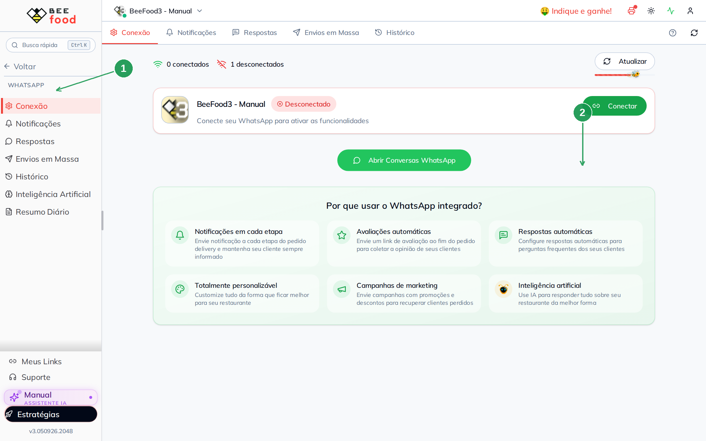
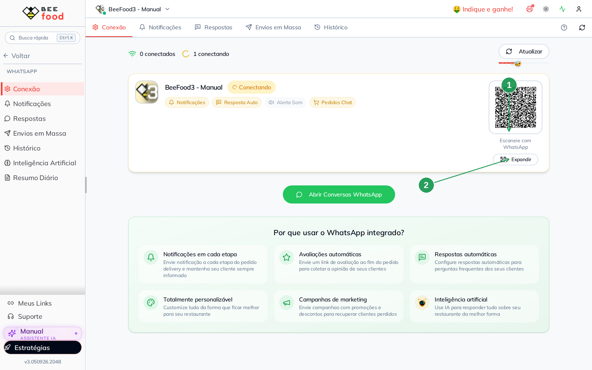
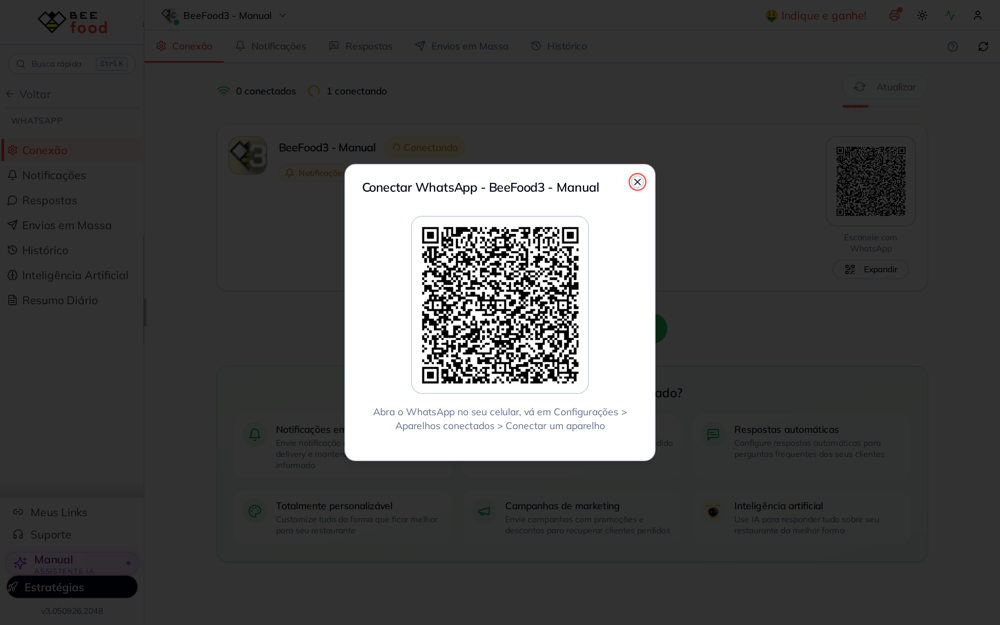

# Conectar o WhatsApp (QR Code)

O BeeBot usa o **número da loja**. Para ligar esse número, o BeeFood gera um
**QR Code**. Você abre o WhatsApp no celular, aponta a câmera e a conexão
entra.

Este manual mostra **só a geração do QR**. Não precisa confirmar o pareamento
aqui: o código aparece na tela, você amplia se quiser e lê no aparelho.

> As imagens têm **setas numeradas** (1, 2, 3…). Cada número indica o botão
> correspondente na tela.

---

## Onde encontrar

No BeeFood, abra **WhatsApp → Conexão** (1).

| Nº | Item | O que faz |
|----|--------|-----------|
| 1. | **Conexão** | Aba do status do número |
| 2. | **Conectar** | Gera o QR Code |

O card mostra **Desconectado** enquanto não houver sessão. O botão verde
**Abrir Conversas WhatsApp** abre o painel do BeeBot; ele **não** gera o QR.

---

## Como gerar o QR Code

1. Clique em **Conectar** (seta 2).
2. O card muda para **Conectando** e aparece *Gerando QR Code…*.
3. Em alguns segundos o QR pequeno surge à direita, com **Escaneie com WhatsApp**.
4. Clique em **Expandir** (1) para ver o código grande.

| Nº | Item | O que faz |
|----|--------|-----------|
| 1. | QR no card | Código pequeno, ao lado do status **Conectando** |
| 2. | **Expandir** | Abre o QR em tamanho de leitura |

No celular, abra o **WhatsApp → Configurações → Aparelhos conectados → Conectar
um aparelho** e aponte para o código. O BeeFood não pede senha nessa etapa: o
pareamento é o próprio QR.

O código **expira**. Se a tela voltar a *Gerando* ou o QR sumir, clique de novo
em **Conectar** (ou **Atualizar** no topo).

---

## O que o QR não faz

- Não liga sozinho o **Pedido Chat**, a **IA** nem as **campanhas**.
- Sem escanear, o número continua **Desconectado**: notificações, respostas e
  boletim ficam configurados, mas **não saem** para o cliente.
- Contratar o BeeBot em outra filial é outro botão (*Contratar BeeBot*), não é
  este QR.

Manuais da mesma série: notificações, respostas, resumo diário, campanhas e
atendimento no BeeBot.

---

## Perguntas frequentes

**O QR não aparece.**
Espere a faixa *Gerando QR Code…* terminar (pode levar até meio minuto). Se
travar, **Atualizar** e clique em **Conectar** outra vez.

**Posso usar WhatsApp Business?**
Sim. O caminho *Aparelhos conectados* existe no aplicativo comum e no Business.

**Preciso deixar o computador ligado?**
A sessão fica no BeeBot. Se desconectar, o card volta a vermelho e é preciso
gerar o QR de novo.

---

## Referências internas (não publicar)

Código: `WhatsAppConexaoCard` (`POST …/whatsapp/instancia/{empresa}/{filial}`),
polling em `WhatsAppConexaoContent`. Pasta `manuais/whatsapp-conectar/`.

*Última atualização: setembro/2026 — BeeFood · Conectar WhatsApp*
