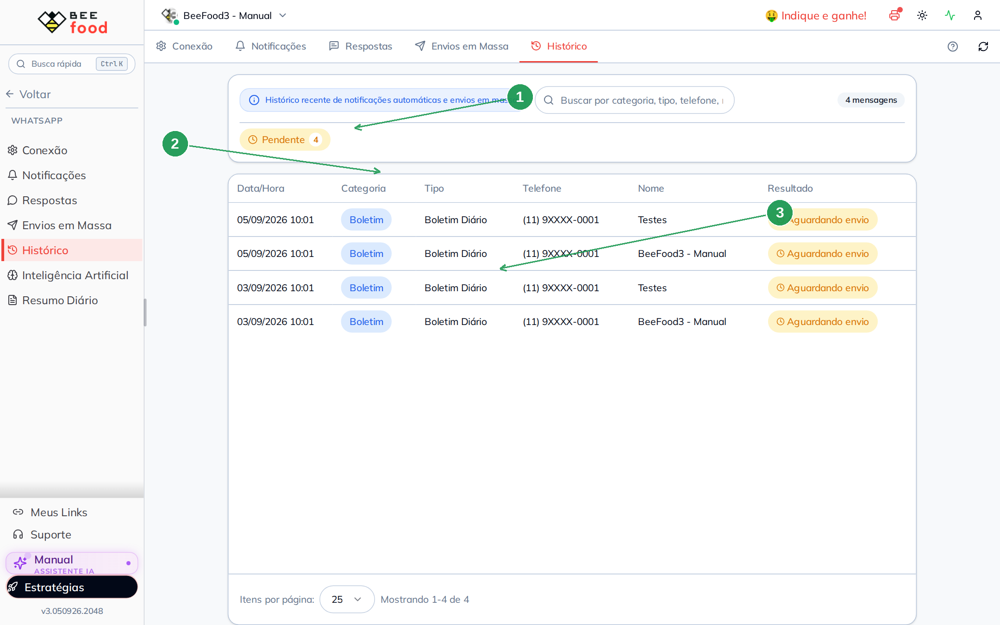

# Histórico de mensagens do WhatsApp

A aba **Histórico** lista o que o BeeBot **tentou enviar**: notificação de
pedido, campanha e boletim. Não é o chat. Para conversar, use o painel
**Abrir Conversas WhatsApp**.

> As imagens têm **setas numeradas** (1, 2, 3…).

---

## Onde encontrar

**WhatsApp → Histórico**.

| Nº | Item | O que faz |
|----|--------|-----------|
| 1. | Aba **Histórico** | Envios recentes |
| 2. | Filtro **Pendente** | Só o que ainda não saiu |
| 3. | Resultado | *Aguardando envio*, enviado, falha |

A busca cobre categoria, tipo, telefone, nome e número do pedido.

Colunas: data, **Categoria** (Delivery, Campanha, Boletim), tipo, telefone,
nome e resultado.

---

## Como ler o resultado

| Situação | Significa |
|----------|-----------|
| **Aguardando envio** | A mensagem foi gerada, mas o número **não estava conectado** (ou a fila ainda não processou) |
| **Enviado** | Saiu pelo WhatsApp da loja |
| **Falha** | Recusa da API ou número inválido |

Nesta conta de teste o histórico mostra só **Boletim Diário** pendente: o
resumo das 07h foi montado, mas o WhatsApp da loja está desconectado. Quando
conectar, o BeeBot tenta mandar.

Notificação de pedido só aparece aqui depois que um pedido **real** passa
pela etapa. Campanha publicada aparece como categoria **Campanha**.

Telefones neste print estão mascarados.

---

## Perguntas frequentes

**Não achei a conversa do cliente.**
Esta aba não guarda o bate-papo. Abra o BeeBot.

**O boletim está pendente todo dia.**
Conecte o número **antes das 07h**, ou deixe conectado. O Resumo Diário
explica o horário.

---

## Referências internas (não publicar)

`WhatsAppHistoricoTab`, `useWhatsAppMensagens`. Pasta
`manuais/whatsapp-historico/`.

*Última atualização: setembro/2026 — BeeFood · Histórico WhatsApp*
