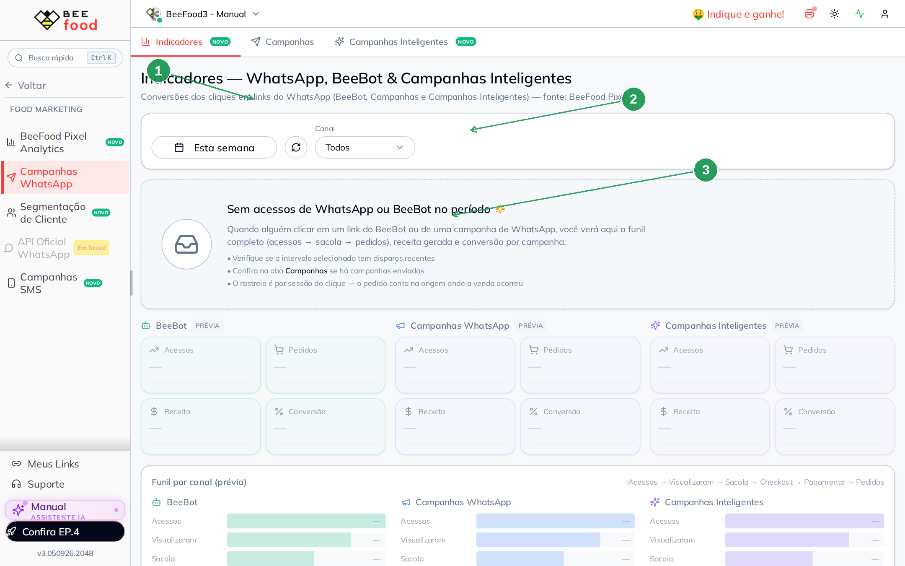

# Indicadores de WhatsApp e BeeBot

A aba **Indicadores** mostra se o clique no link do WhatsApp virou visita,
sacola e pedido. A fonte é o **BeeFood Pixel** — o mesmo do manual de Pixel
Analytics.

Ela é a primeira aba de **Food Marketing → Campanhas WhatsApp**. Sem clique
rastreado no período, a tela mostra uma **prévia vazia** (é o caso desta
conta de teste, sem disparo publicado).

> As imagens têm **setas numeradas** (1, 2, 3…).

---

## Onde encontrar

**Food Marketing → Campanhas WhatsApp → Indicadores**.

| Nº | Item | O que faz |
|----|--------|-----------|
| 1. | Aba **Indicadores** | Funil do WhatsApp |
| 2. | Período e **Canal** | Semana, mês; Todos / BeeBot / Campanha / Inteligente |
| 3. | Aviso vazio | Não houve acesso com o rastreio no intervalo |

Quando há dado, a tela parte em três blocos:

| Canal | De onde vem o clique |
|-------|----------------------|
| **BeeBot** | Link mandado no chat (resposta, pedido, atendente) |
| **Campanhas WhatsApp** | Link com `?whatsc=` da campanha publicada |
| **Campanhas Inteligentes** | Link das automações (#16) |

Cada bloco traz **Acessos**, **Pedidos**, **Receita** e **Conversão**
(pedidos ÷ acessos). Embaixo, o funil: Acessos → Visualizaram → Sacola →
Checkout → Pagamento → Pedidos.

O pedido conta na origem em que a venda fechou. Mudar o período e não ver
nada costuma ser: ainda não publicou campanha, o link foi colado **sem** o
parâmetro de rastreio, ou o Pixel está fora.

---

## Como gerar número aqui

1. Publique uma campanha com o link do cardápio (manual de Campanhas).
2. Ou mande `**MEU_LINK**` numa resposta automática.
3. Alguém abre o cardápio por esse link e fecha um pedido.

Sem isso, a prévia cinza é o estado correto — não é erro de tela.

---

## Perguntas frequentes

**Por que não uso o Pixel Analytics?**
Pode. O Pixel é o funil geral (Google, Instagram, cardápio). Esta aba
**corta só WhatsApp / BeeBot / Inteligente**.

**Campanha em rascunho aparece?**
Não. Rascunho não envia link. Conversão 0% na lista de campanhas combina com
esta prévia vazia.

---

## Referências internas (não publicar)

`WhatsAppIndicadoresTab`, `useWhatsAppConversoes`, `DATA_MIN` 01/06/2026.
Pasta `manuais/whatsapp-indicadores/`.

*Última atualização: setembro/2026 — BeeFood · Indicadores WhatsApp*
