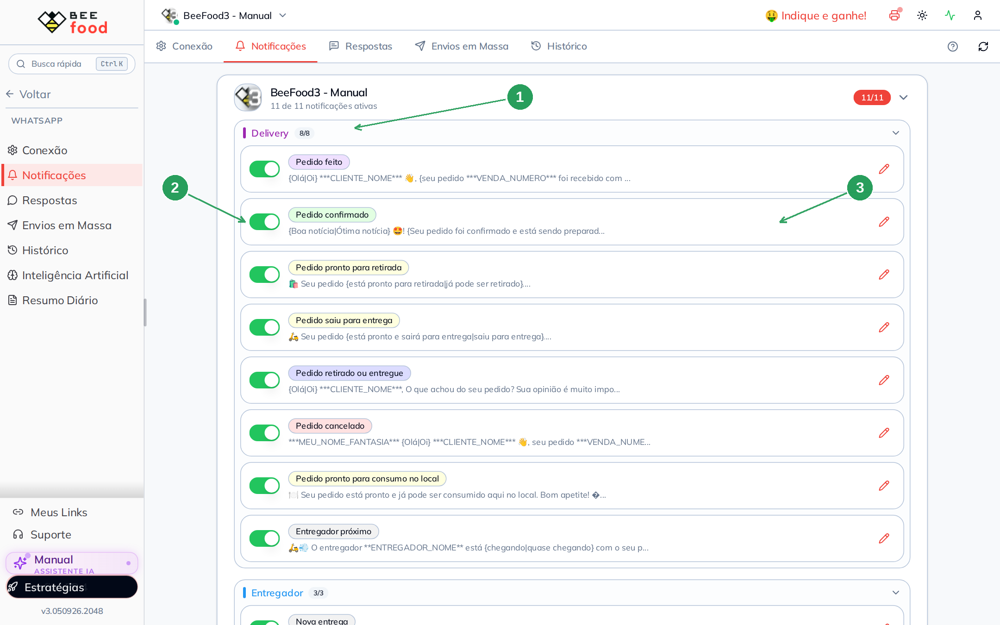
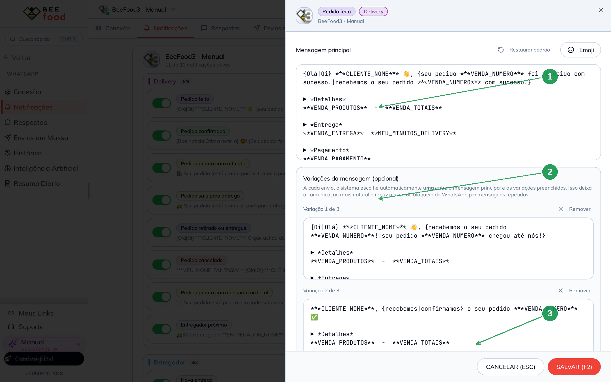
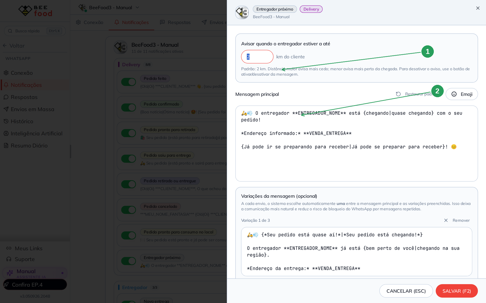
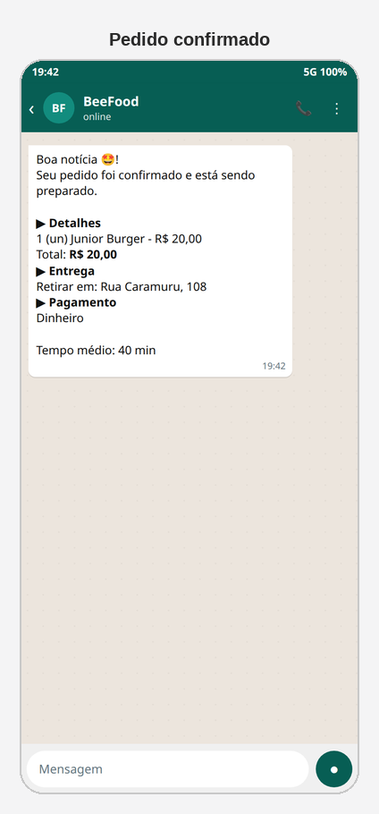

# Notificações de cada etapa do pedido

Cada vez que o pedido muda de situação no Delivery, o BeeBot pode mandar um
WhatsApp para o cliente: recebido, em preparo, saiu, chegou, cancelado.

Você liga, desliga e **edita o texto** em **WhatsApp → Notificações**. O envio
só acontece com o número **conectado**.

> As imagens têm **setas numeradas** (1, 2, 3…). Cada número indica o campo
> correspondente na tela.

---

## Onde encontrar

Abra **WhatsApp → Notificações**.

| Nº | Item | O que faz |
|----|--------|-----------|
| 1. | Grupo **Delivery** | As mensagens do pedido (8 tipos) |
| 2. | Interruptor | Liga ou desliga aquele aviso |
| 3. | Lápis | Abre o texto para editar |

Há um segundo grupo, **Entregador**: avisos para o motoboy (nova entrega,
cancelada, relatório diário). O cliente não recebe esses três.

No BeeBot, o interruptor **Notificação Campanhas** / o selo **Notificações**
do card precisa estar ligado. Senão a aba grava o texto, mas nada sai.

---

## Os avisos do Delivery

| Tipo | Quando dispara |
|------|----------------|
| **Pedido feito** | O pedido entrou |
| **Pedido confirmado** | A loja confirmou / começou o preparo |
| **Pedido pronto para retirada** | Retirada no balcão |
| **Pedido saiu para entrega** | Saiu com o entregador |
| **Pedido retirado ou entregue** | Fim do ciclo (costuma pedir avaliação) |
| **Pedido cancelado** | Cancelamento |
| **Pedido pronto para consumo no local** | Consumo no salão |
| **Entregador próximo** | O motoboy está a X km do cliente |

Todos nascem **ligados** na conta. Desligue o que a loja não usa (por exemplo
consumo no local, se não tiver salão).

---

## Como editar o texto

Clique no lápis de **Pedido feito**.

| Nº | Item | O que faz |
|----|--------|-----------|
| 1. | **Mensagem principal** | O texto padrão, com variáveis e `{Olá\|Oi}` |
| 2. | **Variações** | Até 3 textos extras; o sistema escolhe um a cada envio |
| 3. | **SALVAR (F2)** | Grava. **CANCELAR (ESC)** descarta |

**Restaurar padrão** devolve o texto de fábrica.

### Variáveis que mais aparecem

`**CLIENTE_NOME**`, `**VENDA_NUMERO**`, `**VENDA_PRODUTOS**`, `**VENDA_TOTAIS**`,
`**VENDA_ENTREGA**`, `**VENDA_PAGAMENTO**`, `**MEU_NOME_FANTASIA**`,
`**MEU_MINUTOS_DELIVERY**`, `**MEU_LINK_CONSULTA**`, `**VENDA_LINK_AVALIACAO**`.

Chaves com barra — `{Olá|Oi}` — sorteiam uma palavra a cada envio. Isso reduz
mensagem idêntica em sequência (mesmo cuidado das campanhas).

---

## Entregador próximo (raio)

Esse tipo tem um campo a mais: a distância em km.

| Nº | Item | O que faz |
|----|--------|-----------|
| 1. | **km do cliente** | Padrão **2 km**. Maior = avisa mais cedo |
| 2. | Mensagem | Usa `**ENTREGADOR_NOME**` e `**VENDA_ENTREGA**` |

O intervalo aceito é de **0,1 a 50 km**. Para não avisar, desligue o
interruptor na lista — não zere o km.

---

## O que o cliente vê

Com o WhatsApp conectado, o aviso chega como conversa normal da loja.
Exemplo do **Pedido confirmado** (simulação — o sandbox desta conta está
desconectado):

---

## Perguntas frequentes

**Editei e o cliente não recebeu.**
O número está **conectado**? O interruptor daquela linha está verde? O pedido
passou mesmo por aquela situação no Delivery?

**Posso mandar a mesma frase em todas as etapas?**
Pode, mas o WhatsApp trata texto repetido como risco. Use variação `{a|b}` e
as 4 caixas.

**O boletim das 07h entra aqui?**
Não. O boletim da loja (faturamento) é o **Resumo Diário**. O *Relatório diário*
desta tela é aviso **para o entregador**.

---

## Referências internas (não publicar)

`WhatsAppNotificacaoAutomaticaTab`, `ModalEditarNotificacao`, tipo 33 =
entregador próximo. Pasta `manuais/whatsapp-notificacoes/`.

*Última atualização: setembro/2026 — BeeFood · Notificações WhatsApp*
