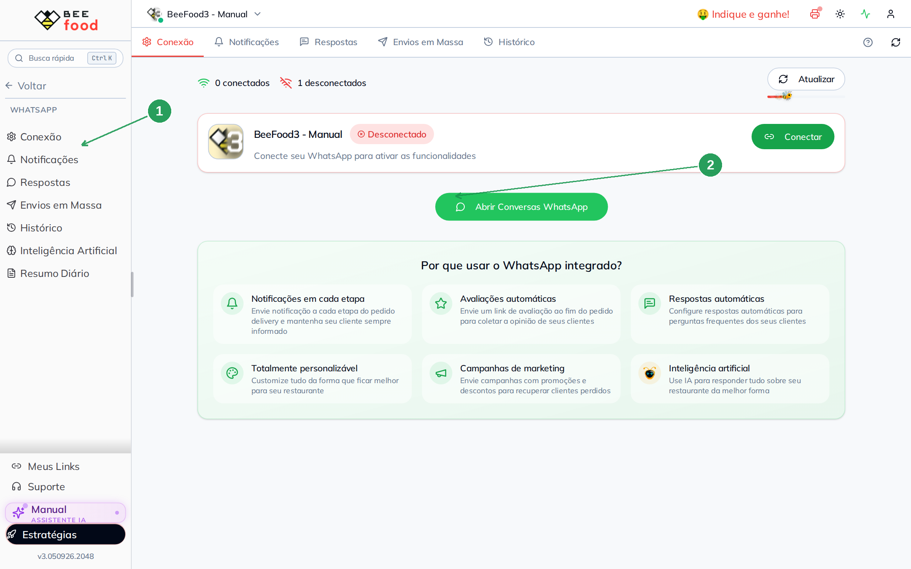
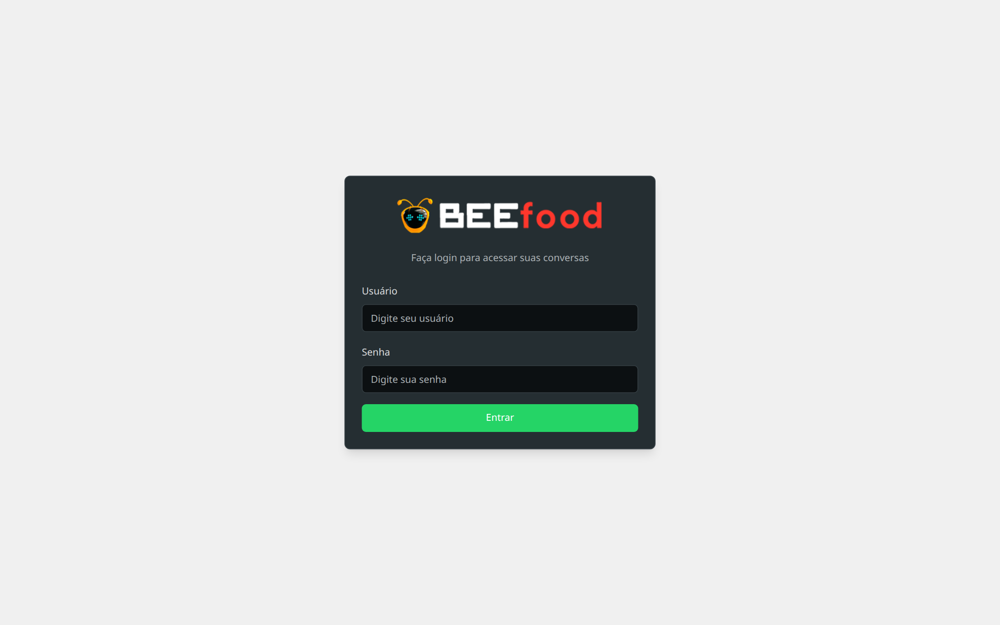
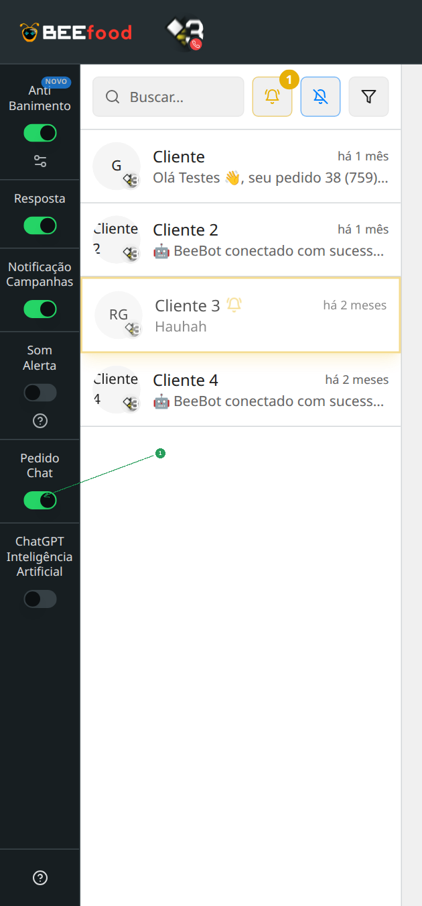
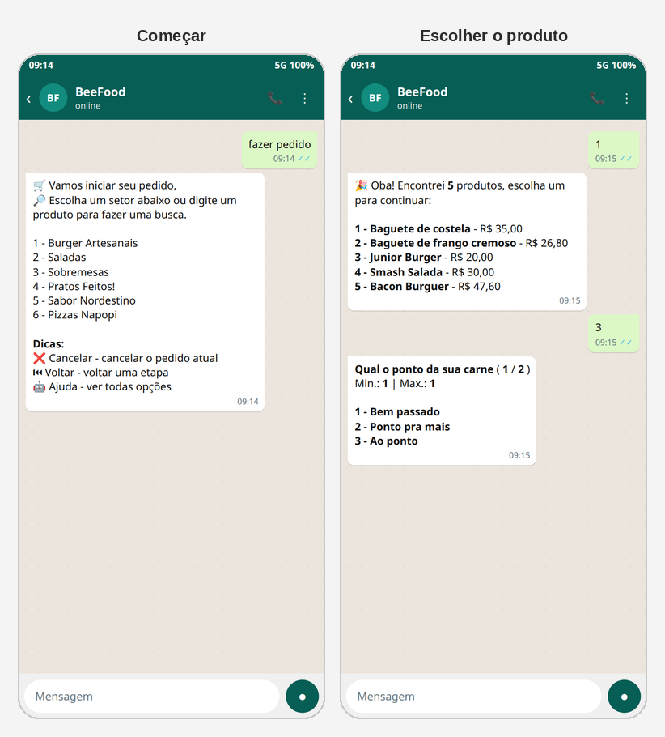
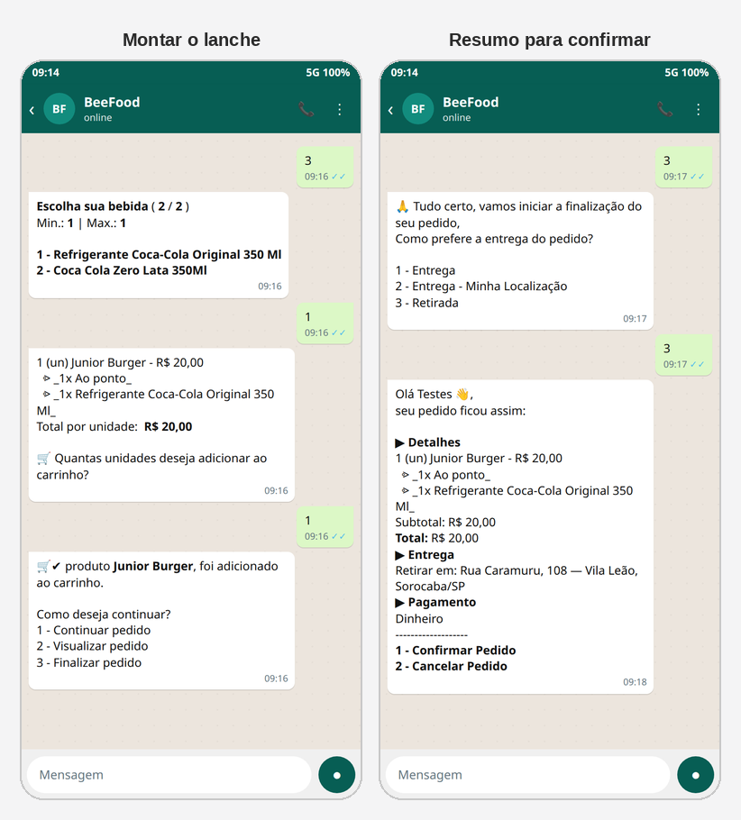

# Pedidos pelo chat no WhatsApp

Com o **Pedido Chat** ligado, o BeeBot tira o pedido **inteiro** no WhatsApp: setor,
produto, grupos de opção, quantidade, entrega ou retirada, pagamento e confirmação.
O cliente não precisa abrir o cardápio digital.

O interruptor mora no painel do BeeBot (`bot.beefood.com.br`), não no cardápio.

> As imagens do BeeFood e do BeeBot têm **setas numeradas** (1, 2, 3…). Cada
> número indica o campo ou botão correspondente na tela.

---

## Antes de começar

1. BeeBot contratado na loja.
2. Acesso ao menu **WhatsApp** (ou ao site [bot.beefood.com.br](https://bot.beefood.com.br)).
3. Cardápio com produtos, grupos de opção, formas de pagamento e área de entrega
   (ou retirada) já cadastrados — o bot usa o mesmo cardápio da loja.
4. Para o **cliente** conversar de verdade, o WhatsApp da loja precisa estar
   **conectado**. Mesmo desconectado, você já consegue ligar o Pedido Chat.

O Pedido Chat **não** é a IA do ChatGPT. São interruptores diferentes: um monta o
pedido; o outro responde pergunta em texto livre. A IA tem manual próprio.

---

## Parte 1 — Abrir o BeeBot

No BeeFood, abra **WhatsApp** (1). A aba **Conexão** mostra se o número está
ligado. Clique em **Abrir Conversas WhatsApp** (2).

| Nº | Item | O que faz |
|----|--------|-----------|
| 1. | **Conexão** | Status do número. *Desconectado* não impede abrir o painel |
| 2. | **Abrir Conversas WhatsApp** | Abre o painel do BeeBot numa nova aba |

O botão verde **Conectar** desta tela é outra coisa: ele gera o QR Code do
número. O Pedido Chat não fica aqui.

Também dá para ir direto em [bot.beefood.com.br](https://bot.beefood.com.br), com o
**mesmo usuário e senha** do BeeFood.

---

## Parte 2 — Ligar Pedido Chat

No BeeBot, a coluna da esquerda tem os interruptores da loja. Ligue **Pedido Chat**
(1). O sistema grava na hora: aparece *Pedido via Chat ativado com sucesso.*

| Nº | Item | O que faz |
|----|--------|-----------|
| 1. | **Pedido Chat** | Ligado, o bot monta o pedido pela conversa. Desligado, ele não entra nesse fluxo |

Os outros interruptores desta coluna (**Resposta**, **Notificação Campanhas**,
**Som Alerta**, **ChatGPT**) são assuntos à parte. Para este manual, o que importa
é o **Pedido Chat** verde.

> Sem o WhatsApp **conectado**, o cliente não recebe as mensagens. O interruptor
> pode estar ligado e o chat da loja, não: os dois precisam estar ok.

---

## Parte 3 — Como o cliente pede

O cliente manda **fazer pedido** (ou escolhe a opção equivalente). O bot lista os
**setores** do cardápio. Dá para responder com o **número** ou **digitar o nome**
de um produto para buscar.

No exemplo: o cliente escolhe o setor **1**, depois o **Junior Burger**. Se o
produto tem grupo de opção (ponto da carne, bebida…), o bot pergunta **um grupo
por vez**, com mínimo e máximo.

Em seguida vem a quantidade, o item entra no carrinho e o bot pergunta como
continuar:

- **1** — Continuar pedido (outro item)
- **2** — Visualizar pedido
- **3** — Finalizar pedido

Na finalização: entrega, localização ou **retirada**; observação do pedido;
forma de pagamento; e o **resumo** para confirmar.

No resumo, **1** confirma e o pedido entra no Delivery da loja. **2** cancela.
**V** volta uma etapa.

---

## Palavras que funcionam no meio do pedido

O cliente pode escrever isto a qualquer momento:

| O que escrever | O que acontece |
|----------------|----------------|
| **Cancelar** | Sai do pedido atual |
| **Voltar** ou **V** | Volta uma etapa |
| **Ajuda** | Mostra o que já está no carrinho e as ações (setores, finalizar, atendente, cancelar) |
| **Atendente** | Cancela o pedido em andamento e chama um humano |

Também vale **digitar o nome do produto** em vez de escolher o setor: se achar,
lista os resultados; se não achar, volta a mostrar os setores.

---

## O que o bot pergunta, na ordem

1. Setor ou busca de produto
2. Produto (e confirmação, se precisar)
3. Grupos de opção, um de cada vez
4. Observação do item (ou **1** para seguir)
5. Quantidade
6. Continuar, visualizar ou finalizar
7. Entrega, localização ou retirada
8. Endereço (se for entrega: bairro/CEP, número, complemento)
9. Observação do pedido
10. Forma de pagamento
11. Resumo → confirmar

A retirada usa o endereço da loja. A entrega só segue se o endereço estiver na
área cadastrada; fora da área, o bot oferece de novo as opções de entrega.

---

## Problemas comuns

| Sintoma | O que verificar |
|---------|-----------------|
| O cliente pede e o bot não monta o pedido | **Pedido Chat** está ligado? WhatsApp está **conectado**? |
| Não aparece setor / produto | O item está ativo no cardápio e liberado no canal Delivery? |
| Endereço fora da área | Confira a área de entrega da loja. Fora dela, só resta retirada |
| Forma de pagamento não entra | A forma precisa estar ativa no **cardápio digital** (é essa lista que o bot usa) |
| Pedido não chega no painel | No resumo, o cliente clicou em **1 - Confirmar Pedido**? Caixa de delivery aberto? |

---

## Precisa de ajuda?

Fale com o **suporte BeeFood** informando: nome da loja e **CNPJ**.

---

*Última atualização: setembro/2026 — BeeFood · Pedidos pelo chat no WhatsApp*
