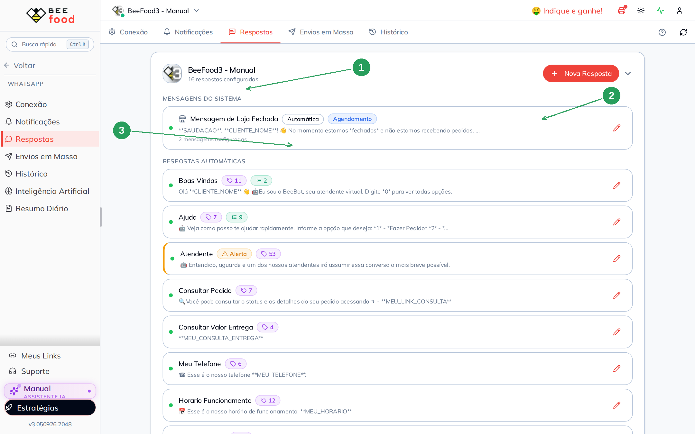
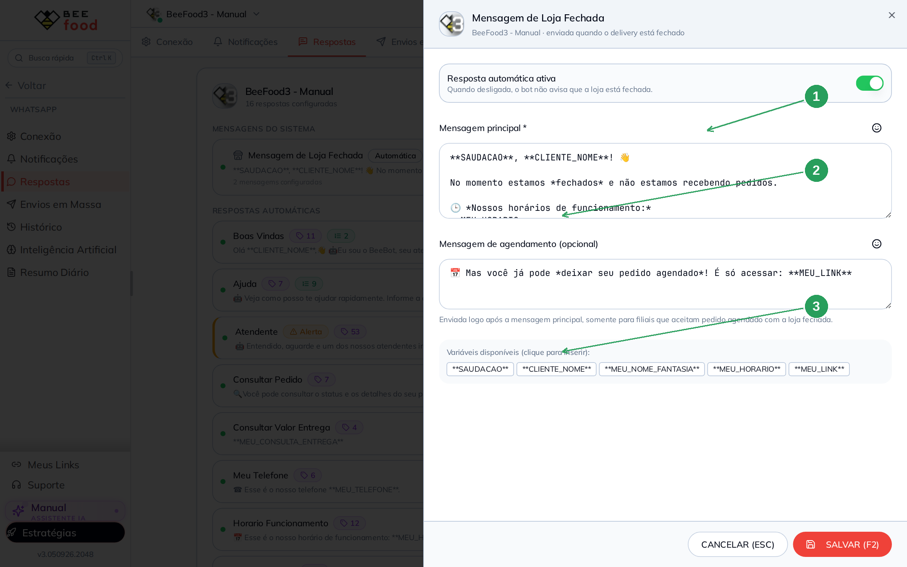
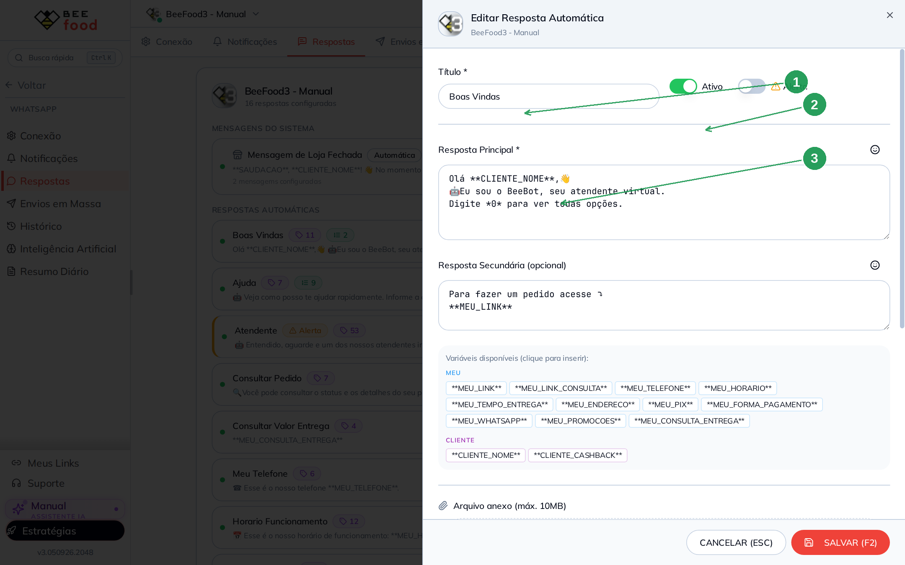
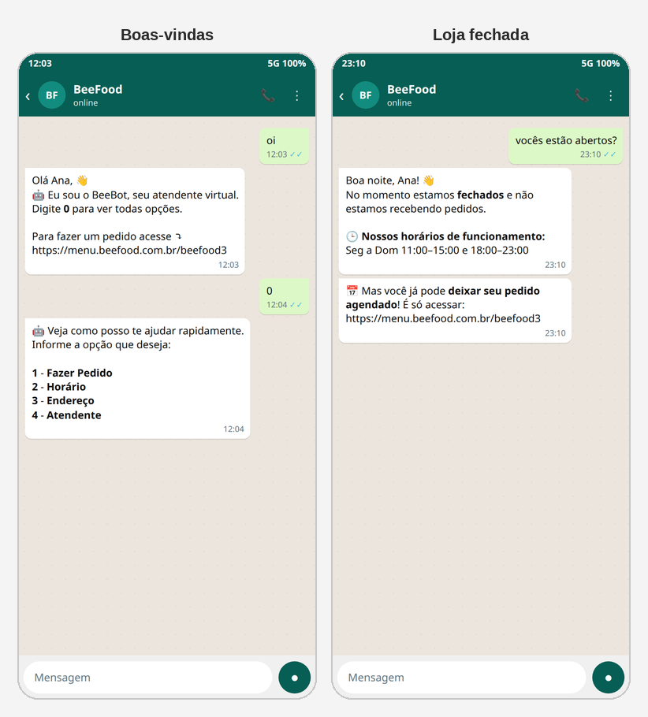

# Respostas automáticas no WhatsApp

Quando o cliente manda uma palavra (*horário*, *cardápio*, *pix*…), o BeeBot
responde sozinho. Isso é **WhatsApp → Respostas**.

Não confundir com o **Pedido Chat** (o bot monta o pedido) nem com a **IA**
(texto livre). Aqui o gatilho é a **palavra-chave** que você cadastrou.

> As imagens têm **setas numeradas** (1, 2, 3…). Cada número indica o campo
> correspondente na tela.

---

## Onde encontrar

Abra **WhatsApp → Respostas**.

| Nº | Item | O que faz |
|----|--------|-----------|
| 1. | Aba **Respostas** | Lista da filial |
| 2. | **Nova Resposta** | Cria um gatilho novo |
| 3. | **Mensagem de Loja Fechada** | Aviso automático fora do horário |

A conta já vem com várias respostas de fábrica (**Boas Vindas**, **Ajuda**,
**Atendente**, **Horario Funcionamento**, **PIX**…). O ponto verde à esquerda
está ativo; cinza, parado. O selo **Alerta** no **Atendente** faz o BeeBot
destacar a conversa para um humano assumir.

No BeeBot, o interruptor **Resposta** precisa estar ligado.

---

## Loja fechada (mensagem do sistema)

Não usa palavra-chave. O BeeBot envia quando o cliente chama e o **delivery
está fechado** (grade da semana + pausas do #33).

| Nº | Item | O que faz |
|----|--------|-----------|
| 1. | **Resposta automática ativa** | Liga ou desliga o aviso de fechado |
| 2. | **Mensagem principal** | Texto + `**MEU_HORARIO**` |
| 3. | **Mensagem de agendamento** | Só se a loja aceita encomenda com o cardápio fechado |

`**SAUDACAO**` vira Bom dia / Boa tarde / Boa noite. `**MEU_HORARIO**` lê a
grade do cardápio digital — você não precisa redigitar o horário.

---

## Como editar uma resposta (Boas Vindas)

Clique no lápis da linha.

| Nº | Item | O que faz |
|----|--------|-----------|
| 1. | **Título** | Nome interno (o cliente não vê) |
| 2. | **Ativo** / **Alerta** | Ativo envia; Alerta chama atenção no BeeBot |
| 3. | **Resposta principal** | O texto. `**CLIENTE_NOME**` e `**MEU_LINK**` entram no clique |

Mais abaixo no mesmo painel (role a ficha):

- **Palavras-chave** — o que o cliente precisa escrever (oi, cardápio, cardapio…).
- **Opções numeradas** — menu *1*, *2*, *3* que o bot oferece depois.
- **Arquivo anexo** — imagem, PDF ou vídeo (máx. 10 MB).

**SALVAR (F2)** grava. Não existe auto-save.

### Variáveis úteis

`**MEU_LINK**`, `**MEU_LINK_CONSULTA**`, `**MEU_TELEFONE**`, `**MEU_HORARIO**`,
`**MEU_TEMPO_ENTREGA**`, `**MEU_ENDERECO**`, `**MEU_PIX**`,
`**MEU_FORMA_PAGAMENTO**`, `**CLIENTE_NOME**`, `**CLIENTE_CASHBACK**`.

---

## O que o cliente vê

Simulação (o sandbox está desconectado). À esquerda, a primeira mensagem e o
menu *0*. À direita, a loja fechada com o horário e o convite de agendar.

---

## Perguntas frequentes

**O cliente digitou “horario” e nada aconteceu.**
A palavra está cadastrada nessa resposta? O interruptor **Resposta** do BeeBot
está verde? O WhatsApp está conectado?

**Pedido Chat e resposta automática juntos.**
Se o cliente está no meio de um pedido pelo chat, o fluxo do pedido manda.
Fora disso, vale a palavra-chave.

**A IA responde no lugar da palavra-chave?**
São interruptores diferentes. A IA cobre pergunta fora da lista; a resposta
automática cobre o que você cadastrou.

---

## Referências internas (não publicar)

`WhatsAppRespostaAutomaticaTab`, `ModalEditarRespostaAutomatica`,
`LinhaLojaFechada`. Pasta `manuais/whatsapp-respostas/`.

*Última atualização: setembro/2026 — BeeFood · Respostas WhatsApp*
