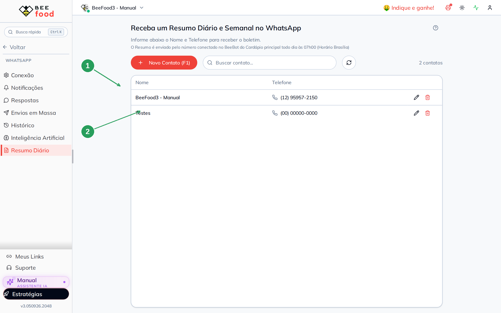
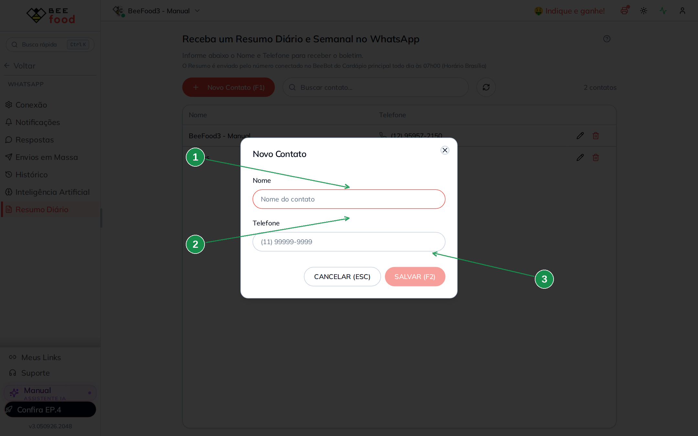
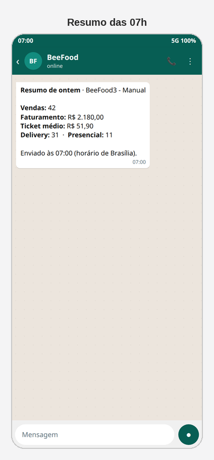

# Resumo diário e semanal no WhatsApp

Todo dia **às 07h** (horário de Brasília) o BeeBot manda um boletim de vendas
no WhatsApp das pessoas que você cadastrar. Na **segunda-feira** vai também o
resumo da semana, com comparativo da semana anterior.

O recado sai pelo número conectado no BeeBot do **cardápio principal**.

> As imagens têm **setas numeradas** (1, 2, 3…). Cada número indica o campo
> correspondente na tela.

---

## Onde encontrar

No menu **WhatsApp**, abra **Resumo Diário**.

| Nº | Item | O que faz |
|----|--------|-----------|
| 1. | Texto das **07h00** | Lembra o horário e que o envio é do cardápio principal |
| 2. | **Novo Contato (F1)** | Abre o cadastro de nome + telefone |

A lista mostra só nome e telefone. Lápis edita; lixeira exclui.

---

## Como cadastrar quem recebe

Clique em **Novo Contato (F1)**.

| Nº | Item | O que faz |
|----|--------|-----------|
| 1. | **Nome** | Como a pessoa aparece na lista |
| 2. | **Telefone** | WhatsApp com DDD (10 ou 11 dígitos) |
| 3. | **SALVAR (F2)** | Grava o contato |

Pode cadastrar o dono, o gerente e o contador. Não precisa ser cliente da
loja.

---

## Como o boletim funciona

- **Diário:** gerado às 07h, cobre o dia anterior (exemplo: no dia 22 sai o
  movimento do dia 21, da madrugada até a virada).
- **Semanal:** toda segunda, com a semana que passou e a comparação com a
  semana retrasada.
- Se o WhatsApp **não estiver conectado às 07h**, o envio fica **aguardando**
  (veja o **Histórico**). Quando conectar, o BeeBot tenta mandar.

Simulação do recado no celular:

---

## Perguntas frequentes

**Cadastrei e não chegou nada.**
Confira o número (DDD + 9), o cardápio **principal** e se o BeeBot estava
conectado às 07h. O Histórico mostra *Aguardando envio* quando a sessão está
fora.

**Dá para mudar o horário?**
Não. O horário é fixo: 07h de Brasília.

**Isso substitui as notificações do pedido?**
Não. Notificação é para o **cliente**, a cada etapa. O boletim é para a
**equipe** da loja.

---

## Referências internas (não publicar)

`WhatsAppBoletim` (`/whatsapp-boletim`), API `/api/whatsapp2/boletim`. Pasta
`manuais/whatsapp-resumo-diario/`.

*Última atualização: setembro/2026 — BeeFood · Resumo diário*
